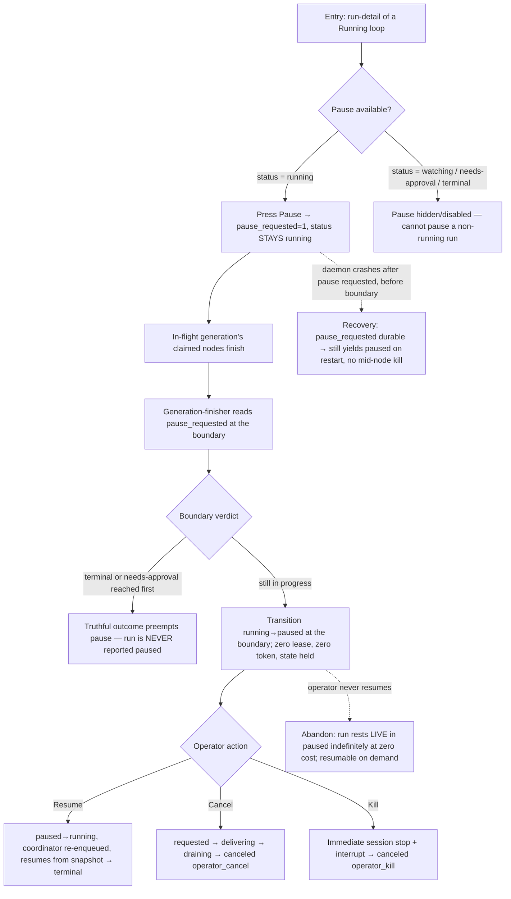

# J-04 — Operator pause, resume, cancel, or kill a running Loop

The operator control journey (ADR-016/017, PRD "Observing"). An operator suspends a running Loop
at a generation boundary (`paused` — a live, resumable state distinct from system attention), resumes
it later, cooperatively cancels it with a visible drain, or immediately kills it. Pause is
**intent-decoupled from status**: it never flips to `paused` while a node is still executing.



```yaml
journey:
  id: J-04
  name: "Pause, resume, cancel, or kill a running Loop"
  value_statement: "An operator can suspend work safely, drain it cooperatively, or stop it immediately, with status and cause always telling the truth."
  personas: [Bruno]
  entry_points:
    - url: "web /loops/:name/runs/:id (run-detail) Pause / Resume / Cancel / Kill controls"
      origin: in-app-nav
    - url: "CLI: compozy loop pause|resume|cancel|kill <run>"
      origin: direct
    - url: "native tool: compozy__loop_pause / compozy__loop_resume / compozy__loop_cancel / compozy__loop_kill"
      origin: in-app-nav
  actions:
    - step: 1
      verb: "Press Pause on a running run"
      expected_observable: "pause_requested set; status STAYS running while a node executes; Pause is only offered from running"
    - step: 2
      verb: "Wait for the generation boundary"
      expected_observable: "Claimed nodes finish; at the boundary the run transitions running→paused (or a terminal/needs-approval verdict preempts the pause)"
    - step: 3
      verb: "Resume, Cancel, or Kill"
      expected_observable: "Resume continues from the snapshot; Cancel exposes cooperative draining before canceled(operator_cancel); Kill interrupts immediately and ends canceled(operator_kill)"
  goal:
    observable: "A paused run resumes to a truthful terminal, or Cancel/Kill ends canceled with the exact operator cause — never coerced to done or failed"
    side_effects: [pause-requested, cancellation-ledger, prompt-cancel, interrupt-ladder, status-change-events]
  true_end_state: "After resume, the run reaches its genuine terminal outcome from where it paused; after Cancel or Kill, fresh reads show canceled with the exact cause, cleanup is complete, and no node-trigger effect leaked from Kill."
  exit:
    natural: "Operator lands on a resumed terminal run or a canceled run with the chosen cause."
  abandonment:
    - at_step: 2
      how: "Operator pauses and never resumes."
      resume: "Run rests LIVE in paused at zero cost; the durable loop_run row holds full state and resumes on demand."
    - at_step: 1
      how: "Daemon crashes after pause is requested but before the boundary."
      resume: "pause_requested is durable — recovery still yields paused at the next boundary, never a mid-node kill."
  crosses: [run-detail-controls, loop.Service.Pause/Resume/Cancel/Kill, node-control-ledger, generation-finisher-tx, crash-recovery]

design_reference:
  screens:
    - "docs/design/opendesign/run-detail.html (LOOPS-DESIGN-SPEC §4.4 — Pause + Stop run controls; ADR-017 §9.3)"
  truthful_ui_checks:
    - "Status stays running while a node executes; it flips to paused ONLY at the generation boundary (ADR-013 inv5: running = a node is executing)."
    - "Pause is hidden/disabled outside running (watching / needs-approval / terminal cannot be paused) — N-003."
    - "Cancel visibly drains to canceled(operator_cancel); Kill immediately ends canceled(operator_kill); neither is coerced to done/failed/exhausted/stalled."
    - "A terminal / needs-approval verdict at the boundary preempts a pending pause — the run is never reported paused when it actually finished."

e2e_backbone:
  runtime:
    - "E2E-runtime-6: pause a running loop at a generation boundary, hold state, resume to terminal (ADR-017)."
  web:
    - "E2E-web-8: pause to paused at a generation boundary, resume, cancel, and kill, with SSE live updates."
  integration:
    - "Integration-6: yield running→paused at a boundary with no orphaned nodes; resume to terminal; a terminal/needs-approval boundary verdict preempts the pause (never reported paused)."
    - "Integration-30: pause_requested durable across a crash before the boundary; idempotent Pause / Resume clears intent (race resolves deterministically)."
  unit:
    - "Unit-16: permit running⇄paused and reject illegal transitions; cancel/kill suites prove draining, immediate interruption, idempotency, and exact terminal causes."
  component:
    - "Web-unit-2 (apply status_changed running→paused / paused→running to the run store via use-loop-stream)."
  followups:
    - "AB-001 — real-daemon pause/resume in Playwright depends on the loop e2e seed harness + rich-frame SSE emission."
```
