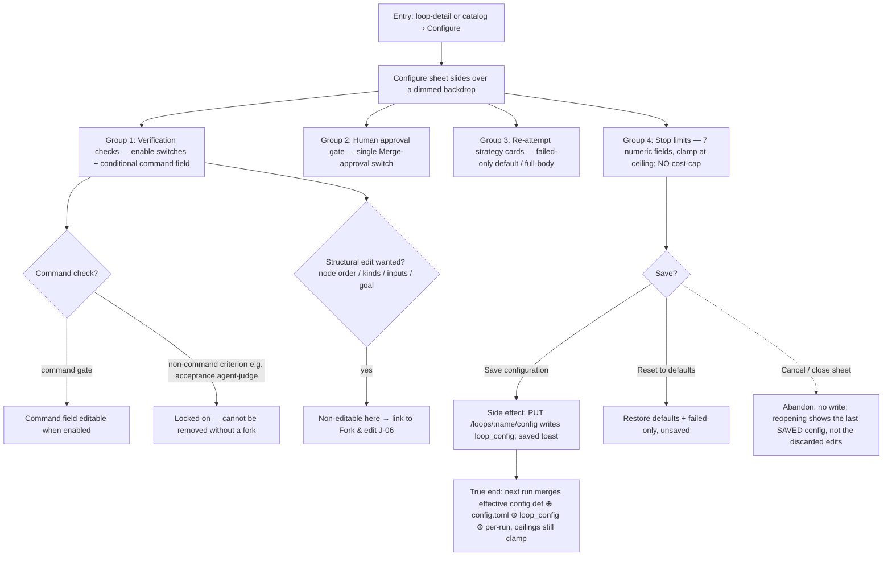

# J-05 — Configure a Loop without forking

The light power layer (PRD F11 layer 2, ADR-009/017 §9.6). An operator tweaks how a Loop runs — which verification checks are enabled, whether a human gate applies, the re-attempt granularity, and the per-loop stop-limit defaults — **without touching structure**. Configuration writes a per-loop `loop_config` store via `PUT /config`, distinct from a fork.



```yaml
journey:
  id: J-05
  name: "Configure a Loop's runtime behavior without forking its structure"
  value_statement: "An operator adjusts checks, the human gate, re-attempt strategy, and limits for a Loop without rebuilding it — and the next run honors those tweaks."
  personas: [Bruno, Sol]
  entry_points:
    - url: "web /loops/:name/configure (loop-configure sheet)"
      origin: in-app-nav
    - url: "CLI: agh loop configure --name <loop> ..."
      origin: direct
    - url: "native tool: agh__loop_configure"
      origin: in-app-nav
  actions:
    - step: 1
      verb: "Open the Configure sheet"
      expected_observable: "Right-side sheet over a dimmed loop-detail backdrop; 4 groups (checks, human gate, re-attempt, limits)"
    - step: 2
      verb: "Toggle checks, human gate, strategy; adjust limits"
      expected_observable: "Command checks expose a command field when enabled; non-command criteria are locked on; strategy cards select failed-only/full-body; limit fields clamp at the ceiling; NO cost-cap field"
    - step: 3
      verb: "Save configuration"
      expected_observable: "PUT /loops/:name/config persists loop_config; saved toast; structural fields were never editable (link to fork)"
  goal:
    observable: "The saved config persists and the NEXT run reflects the merged effective config, with ceilings still clamping every layer"
    side_effects: [loop_config-write]
  true_end_state: "Reopen the sheet: it shows the saved values (round-trip from loop_config), and a fresh run resolves the four-layer effective config (definition ⊕ [loops.defaults.*] ⊕ loop_config ⊕ per-run), clamped to ceilings."
  exit:
    natural: "Operator returns to the loop detail with the config saved."
  abandonment:
    - at_step: 2
      how: "Operator edits several fields then closes/cancels the sheet."
      resume: "No write; reopening shows the last SAVED config, not the discarded edits (no ghost state)."
    - at_step: 1
      how: "Operator wants to change node order/inputs/goal — a structural edit."
      resume: "Configure cannot do it; the sheet links to Fork & edit (J-06) — the configure≠fork boundary is explicit."
  crosses: [loop-configure-sheet, loop_config-store, effective-config-resolver, ceiling-clamp]

design_reference:
  screens:
    - "docs/design/opendesign/loop-configure.html (LOOPS-DESIGN-SPEC §4.7; ADR-017 §9.6)"
  truthful_ui_checks:
    - "Structural fields (node order/kinds, input declarations, terminal states/contract, goal/DoD) are NON-editable here and link to fork (§4.7 'What CANNOT change')."
    - "Non-command verification criteria (e.g. acceptance agent-judge) are locked on — cannot be removed without a fork."
    - "NO Cost cap (USD) input (cost is display-only, removed per ADR-017 §3)."
    - "Per-loop limit overrides clamp at the daemon ceiling; a value above the ceiling is clamped, not honored (inv12)."
    - "A11y (Sol): the sheet traps focus and is escapable; every switch/field is labelled; the dimmed backdrop is not a keyboard trap."

e2e_backbone:
  runtime: []
  web:
    - "E2E-web-11: toggle checks (conditional command field), toggle human gate, select re-attempt strategy, clamp per-loop overrides, Reset to defaults, Save → loop_config, structural fields non-editable."
  integration:
    - "Integration-7: persist a no-fork config via PUT /config to loop_config and reflect the merged effective config on a subsequent run with ceilings still clamping (ADR-017)."
  component:
    - "Web-unit-4 (clamp LimitOverridesGrid to ceiling + overrides-set badge)."
  followups:
    - "No effective-config GET endpoint exists (shared-memory open risk): the sheet's inherited-default placeholders and the 3 scalar toggles cannot be shown truthfully vs the operator [loops.defaults.*] layer — flag for qa-execution to verify save-then-run behavior end-to-end rather than trusting the placeholder. Candidate AB entry if it recurs."
```
