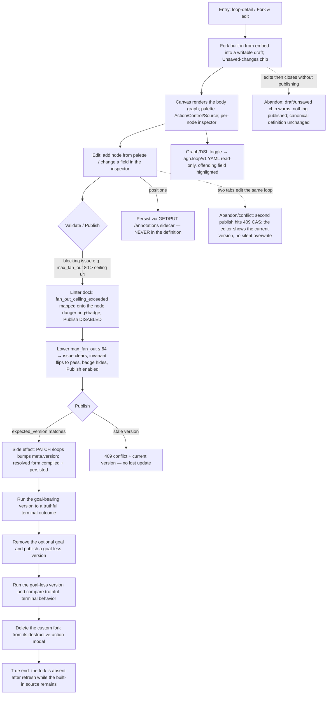

# J-06 — Fork and edit a Loop in the visual editor

The opt-in power ceiling (PRD F11 layer 3, ADR-008/015/020/023). An author forks a built-in or existing Loop, edits its body on a DAG canvas with a live shared-linter gate, and publishes a new version to run. The GUI never owns the invariants — the shared Go linter is the sole authority; positions are a sidecar, never part of the definition.



```yaml
journey:
  id: J-06
  name: "Fork a Loop and edit its body visually, then publish a new version"
  value_statement: "An author adapts a proven Loop's structure on a canvas — gated by the runtime's own validation — and publishes a runnable new version without rebuilding orchestration."
  personas: [Bruno]
  entry_points:
    - url: "web /loops/:name/editor (loop-editor)"
      origin: in-app-nav
    - url: "CLI/native: agh loop create / agh__loop_create (file + agent authoring converge on the same definition)"
      origin: direct
  actions:
    - step: 1
      verb: "Fork the built-in into an editable draft"
      expected_observable: "A writable copy opens; Unsaved-changes chip; version selector shows a draft"
    - step: 2
      verb: "Add/edit nodes via the palette and inspector"
      expected_observable: "Inspector fields render FROM the canonical DSL types (not an editor-local model); adding a node updates the canvas + graph"
    - step: 3
      verb: "Validate and resolve linter issues"
      expected_observable: "A blocking issue (e.g. fan_out_ceiling_exceeded) maps onto the node and disables Publish; resolving it clears the issue and enables Publish"
    - step: 4
      verb: "Publish and run with and without an optional goal"
      expected_observable: "PATCH /loops bumps the version under expected_version CAS (409 on stale); both goal-bearing and goal-less versions compile, persist, and run truthfully"
    - step: 5
      verb: "Delete the custom fork"
      expected_observable: "The destructive-action modal names the fork and requires an intentional confirmation; refresh removes only the custom fork while the built-in source remains"
  goal:
    observable: "A new version publishes only when the shared linter passes, and the forked Loop runs to a terminal outcome"
    side_effects: [writable-fs-definition, meta.version-bump, annotations-sidecar-write, resolved-form-compile]
  true_end_state: "Goal-bearing and goal-less versions both survive refresh and run truthfully; after intentional deletion the custom fork is absent from fresh catalog/detail reads while the built-in source remains."
  exit:
    natural: "Author lands on the published Loop / a run of the fork."
  abandonment:
    - at_step: 2
      how: "Author edits then closes without publishing."
      resume: "The Unsaved-changes chip warns; nothing is published; the canonical definition is unchanged."
    - at_step: 4
      how: "Two tabs edit the same Loop and both try to publish (lost-update race)."
      resume: "The second publish hits a 409 CAS conflict returning the current version — no silent overwrite; the editor re-syncs."
  crosses: [loop-editor, shared-go-linter, bijective-codec, annotations-sidecar, PATCH-CAS, resolved-form-compile]

design_reference:
  screens:
    - "docs/design/opendesign/loop-editor.html (LOOPS-DESIGN-SPEC §4.6; ADR-008/015/020/023)"
    - "docs/design/opendesign/loop-detail.html (LOOPS-DESIGN-SPEC §4.2 — Fork & edit entry)"
  truthful_ui_checks:
    - "The GUI never owns invariants: the 4 linter chips reflect the shared Go linter's verdict; Publish is disabled while any blocking issue exists (isValidConnection is only a self-loop hint)."
    - "Warnings never claim a 422; only real blocking codes gate publish."
    - "Node positions persist in the loop_ui_annotations sidecar via GET/PUT /annotations — NEVER inside the definition (positions absent from the DSL view)."
    - "Graph/DSL toggle renders the read-only agh.loop/v1 on disk with the offending field highlighted (bijective codec / FS-as-truth)."
    - "Publish is CAS-guarded (expected_version) → 409 on a stale version; no lost update."

e2e_backbone:
  runtime: []
  web:
    - "E2E-web-12: fork_from_name from an extension-provided Loop into a draft with the Unsaved-changes chip, add nodes, swap inspector on select, show the 4 linter invariant chips."
    - "E2E-web-13: clear the issue + enable Publish when fan-out ≤ ceiling; surface a 422 per-node error on a cycle; keep Publish disabled while issues exist."
    - "E2E-web-14: toggle Graph/DSL (offending field highlighted), preserve unknown fields through open→edit→publish, persist positions via the sidecar."
    - "E2E-web-15: draft/published version selector; write a new version on publish (diff deferred)."
    - "E2E-web-16: fork a dev-cycle Loop → edit → publish → run → land on the run page end-to-end."
  integration:
    - "Integration-13: 422 per-node {node_id, code, message, severity} on PATCH for a cycle, unreachable node, fan-out-ceiling violation."
    - "Integration-16: copy a forked extension Loop by name into a writable FS def; re-project an editor-published FS file on file-watch."
    - "Integration-12: round-trip editor positions via GET/PUT /annotations; forked same-name loop in another workspace has independent positions."
    - "§7-18: enforce expected_version CAS on PATCH /loops/:name (mismatch → 409 + current version) across HTTP/UDS/native-tool — the owning case for the LP-024 lost-update guard (ADR-023)."
  component:
    - "Web-unit-1 (@xyflow codec round-trip preserving unknown fields); Web-unit-7 (map 422 per-node lint errors onto the correct inspector nodes)."
  followups:
    - "AB-001 — real-daemon editor fork→publish→run in Playwright depends on the loop e2e seed harness; behavior asserted at component + integration until then."
```
