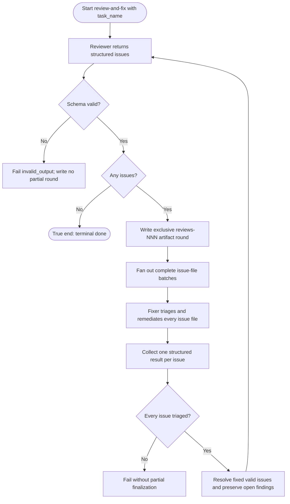

# J-08 — Review and remediate: an agent-authored review Loop

The identity case is the bundled `review-and-fix` Loop. A reviewer agent inspects a named task and
returns source-agnostic structured issues. The runtime writes those issues as inspectable artifacts,
fans complete file batches to the fixer, finalizes only fully triaged rounds, and asks the reviewer
again. A new clean review ends the run. No pull-request provider, external CLI, or watch event is
part of this journey.



```yaml
journey:
  id: J-08
  name: "Review a named task, remediate every finding, and prove the next review is clean"
  value_statement: "An agent-authored review becomes inspectable workspace evidence and bounded remediation without depending on a pull-request provider."
  personas: [Bruno, Marina]
  entry_points:
    - url: "web /loops review-and-fix > Run / web run detail"
      origin: in-app-nav
    - url: "CLI: compozy loop run --workspace <workspace-id> --name review-and-fix --input task_name=<task>"
      origin: direct
    - url: "HTTP/UDS Loop run routes; native compozy__loop_run and compozy__loop_status"
      origin: direct
  actions:
    - step: 1
      verb: "Start review-and-fix for a named task"
      expected_observable: "The run records the selected reviewer/fixer agents and begins with an isolated reviewer action; no CodeRabbit, gh, PR number, watch source, or push input exists"
    - step: 2
      verb: "Inspect the authored review round"
      expected_observable: "Each structured issue has one deterministic issue file under the next exclusive reviews-NNN directory; malformed output fails before any partial round"
    - step: 3
      verb: "Remediate complete artifact batches"
      expected_observable: "Every issue file receives valid or invalid triage; valid findings that cannot be fixed remain unresolved or blocked before the round finalizes"
    - step: 4
      verb: "Review the task again"
      expected_observable: "A non-empty result creates the next round; an empty issues array ends the run done"
  goal:
    observable: "The run ends done only after a fresh reviewer generation reports no issues"
    side_effects: [review-artifact-rounds, scoped-code-fixes, monotonic-finalization]
  true_end_state: "All prior issues are finalized, the latest reviewer output is empty, fresh CLI/HTTP/UDS/native/Web status and on-disk artifacts agree, and another workspace cannot list, read, or mutate the run or files."
  exit:
    natural: "The operator lands on a terminal done run with inspectable finalized review evidence."
  abandonment:
    - at_step: 2
      how: "The reviewer returns output that violates the declared schema."
      resume: "The run fails with invalid_output and no partial artifact round."
    - at_step: 3
      how: "A fixer omits a result or leaves an issue pending."
      resume: "The round remains unfinalized; correct the complete batch and start a new run."
  crosses: [run-agent, extension-tools, workspace-containment, fan-out/collect, loop-stop-contract]

design_reference:
  screens:
    - "docs/design/opendesign/run-detail.html (LOOPS-DESIGN-SPEC section 4.4 — generations timeline)"
    - "docs/design/opendesign/loops-catalog.html (bundled read-only Loop and declared inputs)"
  truthful_ui_checks:
    - "The catalog describes an agent-authored task review and never claims a pull-request provider prerequisite."
    - "The run timeline uses the executable node names: review, write_artifacts, fix_batch, collect_fixes, and finalize_round."
    - "A clean reviewer result ends done without displaying skipped remediation as completed work."
    - "Artifact and finalization counts shown by structured surfaces match the workspace files."

e2e_backbone:
  runtime:
    - "Task07 real daemon/CLI/ACP E2E: reviewer issues, deterministic artifacts, fixer batches, finalization, clean re-review, and two-workspace isolation."
    - "Task07 schema-failure E2E: invalid reviewer output fails safely without a partial artifact round."
  web:
    - "Loop catalog and run-page stories use the agent-authored graph, exact inputs, and truthful terminal states."
  integration:
    - "Spec-cycle artifact suites prove exclusive rounds, containment, one result per issue file, and monotonic finalization."
  unit:
    - "Coordinator branch/fan-out settlement covers the clean-review branch and the non-empty remediation path."
  followups:
    - "LP-agent-authored-review-run — start and observe the provider-free journey through agent-manageable surfaces."
    - "LP-review-artifact-inspection — inspect deterministic on-disk findings before remediation."
    - "LP-review-round-finalization — prove incomplete rounds cannot partially finalize."
```
