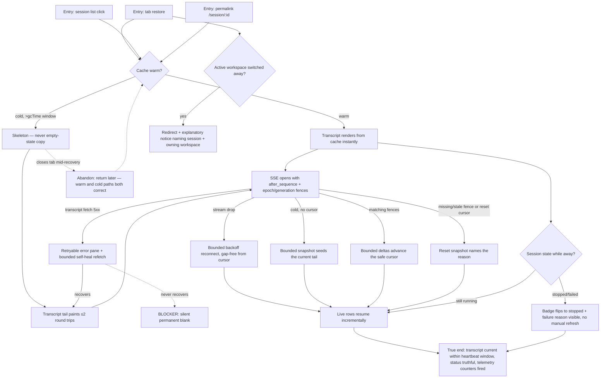

# J-11 — Return to a running session (blank-on-return HERO)

The program's headline path (session-improvements RC-1..6, `_qa.md` §3 J-A). An operator backgrounds a live agent session for minutes-to-hours, then returns — via tab restore, session-list click, or permalink — and must see their persisted conversation, current and truthful, with the live run resuming. A single blank "Start a conversation" pane on return is trust damage. This is the flow only real-scenario QA catches: the bug lives in the source-flip race and the silent-failure branches *between* the pages.



```yaml
journey:
  id: J-11
  name: "Return to a running session (blank-on-return hero)"
  value_statement: "My running work is still there, current, and truthful when I come back — never a blank thread, never a false status."
  personas: [Théo, Ada]
  entry_points:
    - url: "web /agents/:name/sessions/:id via browser tab restore"
      origin: direct
    - url: "web session list → open a running session"
      origin: in-app-nav
    - url: "web permalink /session/:id"
      origin: external-share
  actions:
    - step: 1
      verb: "Return to a session left running in the background"
      expected_observable: "Warm cache → transcript rows render immediately; cold (past the gcTime window) → a skeleton, never the 'Start a conversation' empty-state copy"
    - step: 2
      verb: "Wait for the live stream to attach"
      expected_observable: "SSE opens for the known workspace/session ids independent of the transcript fetch; a cold connection receives a bounded snapshot, while a warm reconnect sends `after_sequence`, `epoch`, and `generation` and receives bounded deltas or an explicit reset snapshot"
    - step: 3
      verb: "Observe the live run resume"
      expected_observable: "New rows apply incrementally from the safe cursor; empty deltas may advance that cursor, and a transient stream drop reconnects with bounded backoff using the matching fences"
    - step: 4
      verb: "Confirm the session's truthful state"
      expected_observable: "If it ended while away, the badge shows stopped/failed with the failure reason, without a manual refresh; if still running, the running pulse shows (reduced-motion honored)"
  goal:
    observable: "The persisted conversation is visible and current within the heartbeat window; the lifecycle badge matches reality; blank-thread telemetry never fires for this session"
    side_effects: [telemetry-counters-fired, sse-subscription-opened, transcript-snapshot-or-delta-served]
  true_end_state: "Reload the page: the transcript is still present (not optimistic UI), the badge state is truthful, and — for a transient 5xx — the thread self-healed to content rather than staying silently blank. Task 40 counters confirm the empty-while-active event never fired."
  exit:
    natural: "Operator lands on a live, current session thread and continues watching or steering (J-13)."
  abandonment:
    - at_step: 1
      how: "Cold return shows a slow skeleton; the operator closes the tab mid-recovery."
      resume: "Returns later warm or cold — both paths must render the transcript, never a blank pane; the run kept streaming server-side."
    - at_step: 2
      how: "The transcript fetch 5xx and the operator gives up, reading the error as data loss."
      resume: "The error pane is retryable and self-heals via the stream; the persisted history is intact on the next open — the finding is any window where the pane reads as permanent."
  crosses: [runtime-thread, transcript-read-model, use-session-live-tail, SSE-broadcaster, workspace-guard, session-lifecycle, telemetry]

design_reference:
  screens:
    - "web SessionThread + session-thread-states.tsx (skeleton / retryable-error / true-empty)"
    - "Storybook components-assistant-ui-sessionthread states (task 03)"
  truthful_ui_checks:
    - "Never `ThreadEmpty`/'Start a conversation' while persisted messages exist (source-flip race — RC-1)."
    - "Skeleton ≠ empty: a loading transcript must show a skeleton, not the empty-state copy (task 03/04)."
    - "The badge never shows `running` after a terminal event; the failure reason is surfaced without refresh (task 12/22)."
    - "A transient transcript 5xx surfaces a retryable error pane that self-heals — never a silent permanent blank (task 02)."
    - "A cold stream starts with a bounded snapshot; a warm reconnect carries `after_sequence`, `epoch`, and `generation`, and only an explicit `fence_missing`, `epoch_mismatch`, `generation_mismatch`, or `sequence_reset` snapshot may replace the cached tail (task 17)."
    - "Workspace switch away from an open session redirects WITH a notice naming the session + owning workspace (task 13)."

e2e_backbone:
  runtime:
    - "E2E-runtime 3: exercise cold bounded snapshots, matching-fence deltas, empty-delta cursor advancement, and each explicit reset reason on reconnect (task 17)."
    - "E2E-runtime 4: consistent state across list and detail through spawn → background → stop (task 22)."
  web:
    - "E2E-web 1: open a running session, navigate away, return with the transcript visible — never a blank thread (the hero case, task 01)."
    - "E2E-web 6: flip the badge to stopped when stopped while viewing, surfacing the failure reason without refresh (task 12)."
  manual:
    - "Manual §9.2: the blank-on-return hero walk is owned by this QA tail (tasks 42/43)."
    - "Manual §9.3: daemon-restart convergence — below-window redaction repair survives a restart on return."
    - "Manual §9.5: middle-gap reconnect — a long disconnect while the session streams past the client cursor returns no missing middle messages."
  telemetry:
    - "Task 40 web counters: empty-while-active, transcript-fetch-failure, SSE open/close/reconnect (+cursor), gap-recovery — verified as *fired and landed* during the return walk."
    - "Task 40 daemon slog/counters: active stream count, catch-up batch size, transcript assembly duration."
  followups:
    - "AB-005 — Playwright case for network-drop → reconnect on the hero path (unit-only today, task 09); the real-daemon browser E2E for the full background→return→reconnect flow is not yet automated."
```
