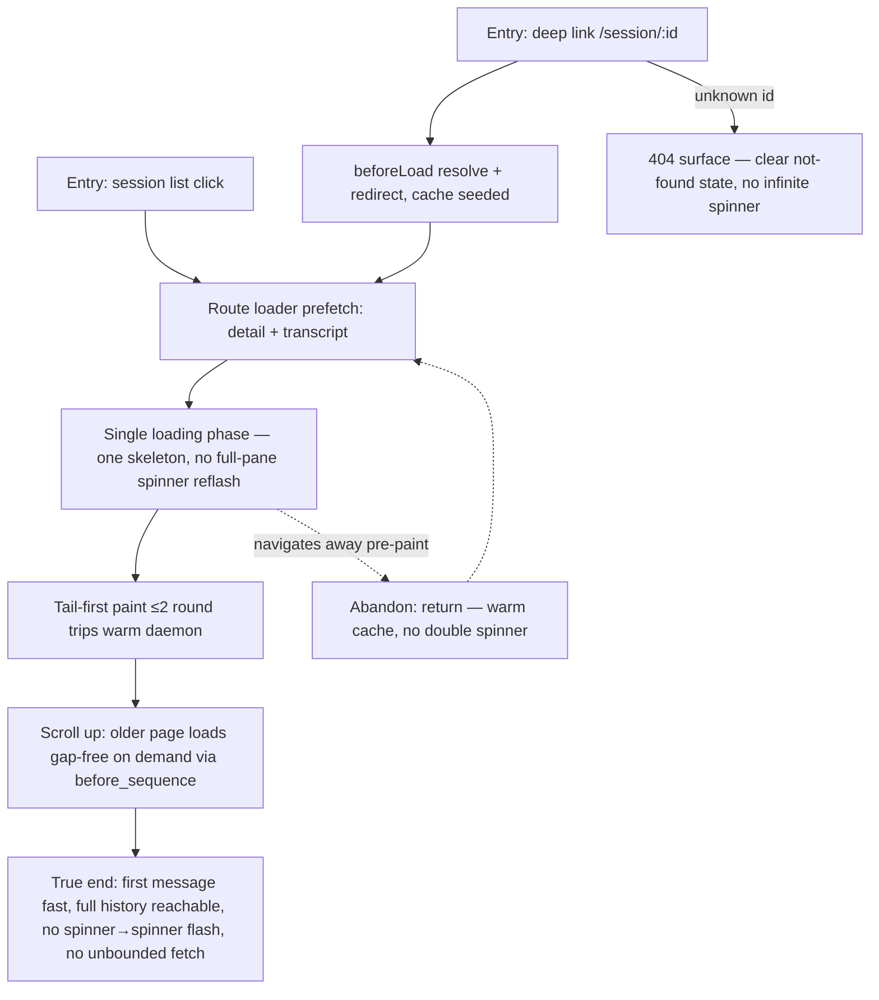

# J-12 — Open a session fast

Bug B — "messages take long to load" (`_qa.md` §3 J-B). Opening a session — from the list or a deep link — must feel instant even for a huge session: a single loading phase, ≤2 round trips to first-message paint, deep links that resolve once (no double flash), and tail-first rendering with older history paged on demand. The bug lives in the serial `GET /sessions` → detail → mount → transcript waterfall and the unbounded transcript replay.



```yaml
journey:
  id: J-12
  name: "Open a session fast (cold + deep link + warm remount)"
  value_statement: "Opening a session feels instant, even a huge one — one loading phase, full history reachable, never a double spinner."
  personas: [Nia, Rafa]
  entry_points:
    - url: "web session list → open a session"
      origin: in-app-nav
    - url: "web deep link /session/:id (permalink)"
      origin: external-share
  actions:
    - step: 1
      verb: "Click a session (or follow a deep link) cold"
      expected_observable: "The route loader prefetches detail + transcript; a deep link resolves in beforeLoad and seeds the cache, redirecting once to the canonical agent-scoped route"
    - step: 2
      verb: "Watch it paint"
      expected_observable: "Exactly one loading phase (a single skeleton), then the tail paints within ≤2 round trips on a warm daemon — no intermediate full-pane spinner re-flash"
    - step: 3
      verb: "Scroll up in a long session"
      expected_observable: "Older history loads on demand via `before_sequence` cursors, turn/message-aligned and gap-free; the read is never an unbounded full-history fetch"
    - step: 4
      verb: "Return to a recently opened session (warm remount)"
      expected_observable: "Cached transcript rows render immediately within the documented cache window — not evicted by the old 5-minute default, no full-pane spinner"
  goal:
    observable: "First message is visible fast after a single loading phase; the full history is reachable by scrolling; a deep link lands on the canonical route once"
    side_effects: [detail-prefetched, transcript-prefetched, cache-seeded]
  true_end_state: "Reload / re-open within the cache window: rows render immediately with no second spinner; an unknown id shows a clear not-found state, not an infinite spinner."
  exit:
    natural: "Operator is on a painted thread and reads or follows it (J-14 / J-13)."
  abandonment:
    - at_step: 2
      how: "The open stalls (double spinner or unbounded fetch); the viewer leaves in the first ten seconds."
      resume: "Returns warm — the cache renders immediately with no double spinner; the stall itself is the finding (open-fast must feel instant)."
    - at_step: 1
      how: "Deep link to a session the viewer can't resolve (unknown id)."
      resume: "A clear not-found surface, not a hanging spinner; the viewer knows the link is dead."
  crosses: [route-loader, beforeLoad-redirect, TanStack-Query-cache, transcript-pagination, bounded-transcript-read]

design_reference:
  screens:
    - "web /agents/:name/sessions/:id route loader + session permalink redirect (routes/_app/session.$id.tsx)"
    - "SessionThread tail-first render + scroll-up pagination"
  truthful_ui_checks:
    - "Exactly one loading phase — no intermediate full-pane spinner re-flash (task 05)."
    - "A deep link resolves in a single spinner phase — no double flash (task 10)."
    - "No unbounded full-history fetch on open; long sessions paint tail-first and page older history on demand (task 14/15)."
    - "Warm remount renders cached rows immediately within the documented cache window (task 06 — session detail/transcript cache is not evicted by the old 5-minute default)."

e2e_backbone:
  runtime:
    - "E2E-runtime 1: keep the long-session transcript read path under lane latency with the snapshot cache (task 14)."
  web:
    - "E2E-web 3: cold-open an existing session and paint messages without an intermediate full-pane spinner re-flash (task 05)."
    - "E2E-web 5: open a deep link with a single spinner phase — no double flash (task 10)."
    - "E2E-web 7: render a long session tail-first and load older history on scroll-up (task 15)."
  manual:
    - "Manual §9.7: scroll-up lazy-load — page older history below the bounded tail via `before_sequence`, turn/message-aligned and gap-free against the full `/transcript` read (tasks 42/43)."
  telemetry:
    - "Task 40 daemon: transcript assembly duration + catch-up batch size are the perf observables behind the open-fast budget."
  followups:
    - "AB-008 — session open-fast latency-budget E2E (cold first paint, ≤2 round trips, no /sessions waterfall, no full-pane reflash) is not yet a pinned automated assertion; perf rides §8 visual + component today."
```
