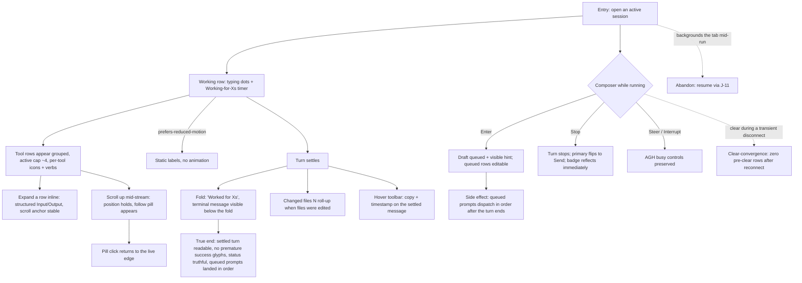

# J-13 — Follow a live run

Watch, steer, and trust a session while it streams (`_qa.md` §3 J-C). The operator follows a live turn — working indicators, grouped tool rows, inline inspection, scroll-follow with a return-to-live pill — and drives the composer (Enter=Queue, Send↔Stop, steer/interrupt) while the agent is busy. The bugs live in the streaming render (O(n²) re-validation, scroll yanks) and the composer queue semantics.



```yaml
journey:
  id: J-13
  name: "Follow a live run (stream, steer, queue)"
  value_statement: "I can watch, steer, and trust a live run — the stream is smooth, the composer honors queue semantics, and the settled turn tells the truth."
  personas: [Théo, Rafa]
  entry_points:
    - url: "web /agents/:name/sessions/:id on an active session"
      origin: in-app-nav
  actions:
    - step: 1
      verb: "Watch a live turn stream"
      expected_observable: "A working row shows typing dots + a 'Working for Xs' timer; tool rows appear grouped (active cap ~4) with per-tool icons + verbs; reduced-motion degrades to static labels"
    - step: 2
      verb: "Expand a tool row and scroll up mid-stream"
      expected_observable: "The row expands inline to structured Input/Output with a stable anchor; scrolling up holds position (no viewport yank) and shows a return-to-live pill; the pill restores follow"
    - step: 3
      verb: "Queue a prompt while the agent is busy"
      expected_observable: "Enter queues the draft with a visible hint and an editable queued row; the primary button is a Send↔Stop toggle; steer/interrupt controls remain"
    - step: 4
      verb: "Stop the turn (or let it settle)"
      expected_observable: "Stop flips the primary back to Send and reflects the badge immediately; on natural settle the turn folds behind 'Worked for Xs' with the terminal message below, a changed-files roll-up if files were edited, and a hover copy+timestamp toolbar"
  goal:
    observable: "The live turn is smooth to follow and steer; queued prompts dispatch in order after the turn ends; the settled turn is truthful (no premature success glyph)"
    side_effects: [queued-prompts-dispatched-in-order, tool-events-streamed, changed-files-rolled-up]
  true_end_state: "After the turn settles: the fold reads correctly, queued prompts ran in the order queued (verified at landing, not enqueue), and the status matches reality; clearing during a transient disconnect leaves zero pre-clear rows after reconnect."
  exit:
    natural: "Operator has a settled, readable turn and either follows the next turn or reads the finished transcript (J-14)."
  abandonment:
    - at_step: 1
      how: "The operator backgrounds the tab mid-run."
      resume: "Resumes via J-11 (return-to-running) — the run kept streaming; the transcript is current on return."
    - at_step: 3
      how: "Queues two prompts then leaves before the turn ends."
      resume: "Both queued prompts must still dispatch in order server-side; a lost or reordered prompt is the finding."
  crosses: [SSE-broadcaster, incremental-frame-apply, scroll-anchoring, composer-queue, transcript-epoch-reset, changed-files-rollup]

design_reference:
  screens:
    - "web SessionThread live rows (working row, grouped tool rows, folds, hover toolbar)"
    - "web composer (Send↔Stop toggle, queued-prompts strip) — Synara/T3Code visual baseline"
  truthful_ui_checks:
    - "Streaming applies frames incrementally — no full-transcript re-validate per event (no O(n²) stall) (task 04)."
    - "Scroll position holds while scrolling up during streaming; the follow pill restores live-edge follow (task 34)."
    - "Reduced-motion degrades the working/streaming pulse to static labels (task 30)."
    - "No premature success glyphs; the settled-turn status matches reality; changed-files roll-up is display-only (truthful UI, tasks 33/36)."
    - "Queued prompts dispatch in the order queued after the turn ends (task 35)."
    - "Neutral glaze hover, flat depth, no glass, signal palette = information only (DESIGN.md guardrails)."

e2e_backbone:
  runtime:
    - "E2E-runtime 2: stream a live session end-to-end gap-free under load via the broadcaster (task 16)."
    - "E2E-runtime 4: consistent state across list/detail through spawn → background → stop (task 22)."
  web:
    - "E2E-web 2: render a streaming turn on a 1k+ event session progressively without UI stalls (task 04)."
    - "E2E-web 8: hold scroll position while scrolling up during streaming; the pill restores follow (task 34)."
    - "E2E-web 9: queue two prompts during a running turn and dispatch both in order after it ends (task 35)."
    - "E2E-web 4: remove messages on clear-while-viewing AND keep them removed after reload (task 08)."
  manual:
    - "Manual §9.4: clear-convergence — clear during a transient disconnect / clear then daemon restart both leave zero pre-clear rows after reconnect (tasks 42/43)."
  telemetry:
    - "Task 40: active stream count + catch-up batch size + SSE lifecycle counters during the follow walk."
  followups:
    - "AB-006 — reduced-motion + streaming-smoothness E2E sweep over the redesigned live thread (unit-owned today, task 30); no real-daemon browser assertion for the full follow-and-steer flow yet."
```
