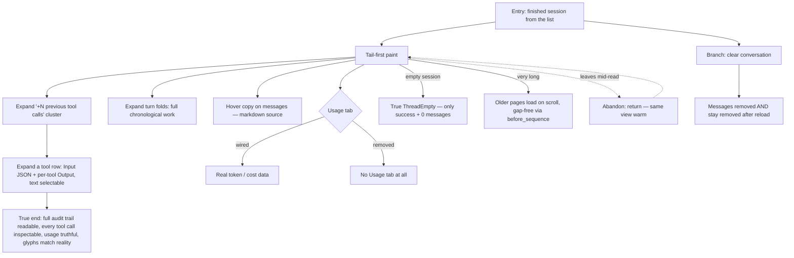

# J-14 — Read a finished transcript

Audit exactly what the agent did, tool call by tool call (`_qa.md` §3 J-D). A reviewer opens a finished session and works the transcript UI language rewrite (tasks 25–33, 36–37): grouped tool rows, inline structured Input/Output for any tool kind, turn folds, hover copy, a truthful usage surface, and gap-free paging on long sessions. The bugs live in the old 44px card bulk, hidden output, missing grouping, and a fake-empty Usage tab.



```yaml
journey:
  id: J-14
  name: "Read a finished transcript (audit tool-call by tool-call)"
  value_statement: "I can audit exactly what the agent did — every tool call inspectable, grouping legible, usage truthful — without wading through card bulk."
  personas: [Rafa, Nia]
  entry_points:
    - url: "web session list → open a finished session"
      origin: in-app-nav
    - url: "web permalink /session/:id to a finished session"
      origin: external-share
  actions:
    - step: 1
      verb: "Open a finished long session"
      expected_observable: "The tail paints first; consecutive tool calls are folded into one cluster with a '+N previous tool calls' toggle — one ~24–28px line per tool, not a 44px card"
    - step: 2
      verb: "Expand groups, turn folds, and a tool row"
      expected_observable: "The cluster expands to the full chronological work; a tool row expands inline to structured Input JSON + per-tool Output (selectable text) for any tool kind; settled turns fold behind 'Worked for Xs'"
    - step: 3
      verb: "Copy a message and check the Usage surface"
      expected_observable: "Hover reveals a copy+timestamp toolbar copying the markdown source; the inspector Usage tab shows real token/cost data — or does not exist at all (no permanently-empty metric surface)"
    - step: 4
      verb: "Scroll up in a very long session (and clear it)"
      expected_observable: "Older pages load gap-free on scroll via `before_sequence`; clearing removes the messages AND keeps them removed after reload; a truly-empty session shows a true ThreadEmpty (success + 0)"
  goal:
    observable: "The full audit trail is readable; every tool call is inspectable inline; usage is truthful; status glyphs match reality (no false success/danger)"
    side_effects: [transcript-paged, clear-persisted]
  true_end_state: "Reload the finished session: the same grouped view renders warm; expanded inspection round-trips; the Usage tab is either real or absent; a cleared session stays empty after reload."
  exit:
    natural: "Reviewer has audited the transcript and leaves, or copies evidence out."
  abandonment:
    - at_step: 2
      how: "Output is hidden behind default-closed chips or a lossy flattened blob; the reviewer can't inspect and gives up the audit."
      resume: "Returns — the same view is warm; the finding is any tool kind whose Input/Output is not inline-inspectable."
    - at_step: 4
      how: "Paging older history skips or duplicates messages; the reviewer loses trust in the audit trail."
      resume: "Pages must be turn/message-aligned and gap-free against the full `/transcript` read."
  crosses: [transcript-derive-layer, tool-call-row, turn-fold, usage-surface, transcript-pagination, clear-epoch]

design_reference:
  screens:
    - "web SessionThread grouped tool rows + inline disclosure (ToolCallRow primitive) — tasks 25–33"
    - "changed-files roll-up (task 36); reasoning left-rule (task 31); tool-state matrix (task 33)"
  compare_anchors:
    - ".resources/t3code/apps/web/src/components/chat/MessagesTimeline.tsx:1900-2036 (SimpleWorkEntryRow visual baseline)"
    - ".resources/synara/apps/web/src/components/chat/MessagesTimeline.tsx:2942-3374 (Synara row baseline)"
    - ".resources/synara/apps/web/src/components/chat/MessagesTimeline.logic.ts:226-590 (+N previous tool calls, settled-turn collapse)"
    - ".resources/t3code/apps/web/src/components/chat/MessagesTimeline.logic.test.ts (grouping/folds/structural-sharing invariants to spot-check)"
  truthful_ui_checks:
    - "Tool call = one ~24–28px line, never a 44px filled card; consecutive calls fold with '+N previous tool calls' (tasks 25/26)."
    - "Any tool kind's Input + Output is inspectable inline (structured, not a lossy blob) (task 27)."
    - "`ThreadEmpty` renders only for a truly-empty session (success + 0), never during load/error (task 03)."
    - "Usage tab shows real data or is removed — no fake/permanently-empty metric surface (task 37)."
    - "Status glyphs match reality; no premature/false success or danger; changed-files roll-up display-only (tasks 33/36)."

e2e_backbone:
  runtime:
    - "E2E-runtime 1: long-session transcript read path under lane latency with the snapshot cache (task 14)."
  web:
    - "E2E-web 4: remove messages on clear-while-viewing AND keep them removed after reload (task 08)."
    - "E2E-web 7: render a long session tail-first and load older history on scroll-up (task 15)."
  visual:
    - "Visual §8.2–§8.9 (agh-ui-screenshot): grouped 8×Read batch, expanded Bash/Edit/MCP I/O, three-turn fold, hover toolbar, working+reduced-motion, reasoning treatment, per-tool icons/verbs, tool-state matrix."
    - "Visual §8.11: changed-files roll-up collapsed + expanded (task 36)."
  telemetry:
    - "None specific — read-path perf rides the transcript assembly-duration counter (task 40) via J-12."
  followups:
    - "AB-007 — pure-logic grouping/fold regression (mirror MessagesTimeline.logic.test.ts: +N previous, settled-turn collapse, structural sharing) + an axe/a11y pass over the redesigned thread (row a11y unit-owned today, task 25)."
```
