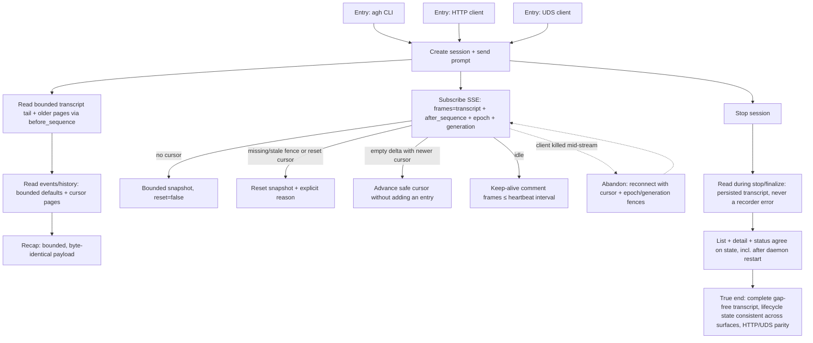

# J-15 — Operate a session via CLI / API

An agent drives and reads sessions deterministically over any surface (`_qa.md` §3 J-E). A headless actor creates a session, sends a prompt, reads the bounded transcript tail and older REST pages, follows `frames=transcript` with `after_sequence` plus `epoch`/`generation` fences, stops the session, and confirms list/detail/status agree — CLI ↔ HTTP ↔ UDS parity is the point (RT-042 canary). The bugs live in unbounded reads, stale fences, ignored reset reasons, dropped empty-delta cursors, keep-alive gaps, stop-race recorder errors, and lifecycle desync.



```yaml
journey:
  id: J-15
  name: "Operate a session via CLI / API (headless, cross-surface parity)"
  value_statement: "An agent can drive and read sessions deterministically over CLI, HTTP, or UDS — bounded REST history, fenced transcript deltas, explicit resets, keep-alive, gap-free reconnect, and identical lifecycle state everywhere."
  personas: [Ada]
  entry_points:
    - url: "CLI: agh session ... (create/prompt/events --follow/status/stop)"
      origin: direct
    - url: "HTTP: POST/GET /api/.../sessions/:id/{prompt,stream,transcript,events,recap,stop}"
      origin: direct
    - url: "UDS: same verb set over the CLI socket"
      origin: direct
  actions:
    - step: 1
      verb: "Create a session and send a prompt over a surface"
      expected_observable: "201 session; prompt streams Vercel-AI-UI SSE (`frames=transcript`) or byte-identical raw event rows (`frames=raw`) for CLI follow"
    - step: 2
      verb: "Subscribe to the stream and read bounded history"
      expected_observable: "Transcript REST returns a bounded tail and older pages via `before_sequence`; transcript SSE reconnects with `after_sequence`, `epoch`, and `generation`, emits bounded deltas for matching fences, emits an explicit reset snapshot for `fence_missing`, `epoch_mismatch`, `generation_mismatch`, or `sequence_reset`, and may advance the cursor with an empty delta; idle streams emit keep-alive comments ≤ heartbeat"
    - step: 3
      verb: "Stop the session and read during finalize"
      expected_observable: "Reads racing the stop return the persisted transcript, never a recorder-unavailable error; recap is byte-identical to the streamed payload"
    - step: 4
      verb: "Compare list, detail, and status across surfaces"
      expected_observable: "State is identical across `list`, `detail`, and `status` through spawn → background → stop (and after a daemon restart); HTTP and UDS agree byte-for-byte on the same inputs"
  goal:
    observable: "The agent reads a complete, gap-free transcript and drives the session to a terminal outcome deterministically, with lifecycle state consistent across every surface"
    side_effects: [session-created, prompt-streamed, session-stopped]
  true_end_state: "Older REST pages remain loaded; reconnect after killing the client resumes from `after_sequence` with matching `epoch`/`generation`, or replaces the bounded tail only on an explicit reset; empty deltas still advance the cursor; list/detail/status agree after a daemon restart; HTTP and UDS return identical structured output."
  exit:
    natural: "The agent has a terminal outcome + a complete transcript and hands off / records the result."
  abandonment:
    - at_step: 2
      how: "The client is killed mid-stream (crash, network)."
      resume: "Reconnect with `after_sequence`, `epoch`, and `generation`; matching fences resume with bounded deltas, while a reset snapshot names why the cached tail must be replaced; an empty delta still advances the safe cursor."
    - at_step: 3
      how: "A read races the stop and hits a recorder-unavailable error, so the agent aborts."
      resume: "Reads during stop/finalize must degrade to the persisted transcript; the finding is any recorder error surfaced to the caller."
  crosses: [CLI, HTTP, UDS, session-store, SSE-broadcaster, RT-042-parity-canary]

design_reference:
  screens:
    - "structured surface only — no web UI (Ada never sees the SPA)"
  truthful_ui_checks:
    - "`frames=raw` follow is byte-compatible with the pre-program CLI contract (task 44)."
    - "Older transcript entries come from bounded REST pages using `before_sequence`; forward changes come from `frames=transcript` SSE."
    - "Reconnects carry `after_sequence`, `epoch`, and `generation`; reset snapshots name `fence_missing`, `epoch_mismatch`, `generation_mismatch`, or `sequence_reset`."
    - "An empty `transcript_delta` may advance the safe cursor without adding a visible entry."
    - "Reads during stop/finalize return the persisted transcript, never a recorder error (task 21)."
    - "List/detail/status agree through spawn→background→stop→restart (task 22); HTTP↔UDS byte parity (RT-042)."

e2e_backbone:
  runtime:
    - "E2E-runtime 1: long-session bounded REST pagination under lane latency (task 14)."
    - "E2E-runtime 3: reconnect with matching and stale transcript fences, including explicit reset reasons and empty-delta cursor advancement (task 17)."
    - "E2E-runtime 4: consistent state across list and detail through spawn → background → stop (task 22)."
  manual:
    - "Manual §9.6: raw-stream contiguity — `agh session events --follow` against a busy session, disconnect during a large output burst, reconnect; the printed sequence is contiguous with no skipped `sequence` (tasks 42/43)."
  telemetry:
    - "Task 40 daemon slog/counters: stream open/close, catch-up batch size, transcript assembly duration — the agent-side observability of the same stream."
  followups:
    - "AB-008 — keep-alive proxy soak (environment-specific, task 20) has no automated assertion; the cross-surface parity harness (see AB-003 pattern for Loops) is not yet extended to the session verb set."
```
