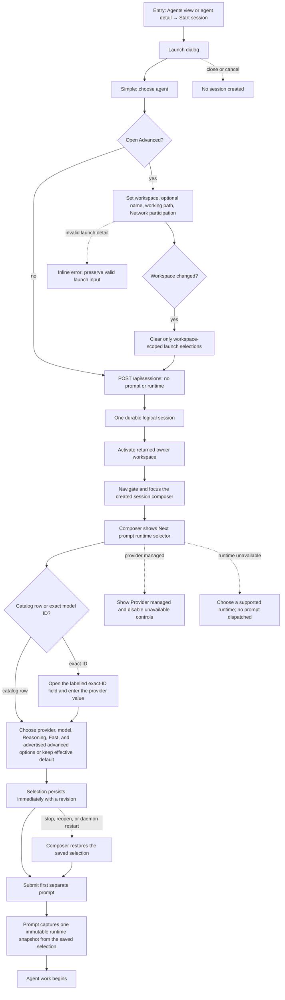

# J-17 — Launch a session, then choose its next-prompt runtime

Session creation is a lightweight, durable launch boundary. The operator chooses the agent and
optional launch details, creates one logical session, and lands in its composer. Runtime selection
and the first message are not creation fields: the composer owns one **Next prompt** selector whose
chosen provider, model, Reasoning, Fast, and typed ACP options persist immediately as the session
preference and apply when the next prompt is submitted.



```yaml
journey:
  id: J-17
  name: "Launch a session, then choose its next-prompt runtime"
  value_statement: "I can create a session quickly without losing control of its runtime: the thread composer always lets me choose what the next prompt uses."
  personas: [Bruno, Dora, Sol]
  entry_points:
    - url: "web Agents view → Start session"
      origin: in-app-nav
    - url: "web agent detail → New session"
      origin: in-app-nav
  actions:
    - step: 1
      verb: "Open Start session and choose an agent"
      expected_observable: "Simple shows agent selection only; it contains no first-message composer and no runtime selector."
    - step: 2
      verb: "Optionally open Advanced and choose launch details"
      expected_observable: "Workspace, optional name, working path, and Network participation are available in Advanced; changing workspace clears only workspace-scoped launch selections."
    - step: 3
      verb: "Create the session"
      expected_observable: "Create gives immediate truthful feedback, persists one durable logical session without queuing a prompt, activates the returned owner workspace, and navigates to the created session."
    - step: 4
      verb: "Choose the runtime for the next prompt in the composer"
      expected_observable: "The destination composer exposes one accessible Next prompt selector; catalog rows, Fast, advertised advanced options, and the clearly labelled exact-ID entry persist immediately and are captured by the next prompt. Provider-managed runtimes expose no fabricated controls."
  goal:
    observable: "A session launches once and its composer remains the durable place to choose or change the runtime for the next prompt."
    side_effects: [logical-session-created, owner-workspace-activated, session-runtime-selection-persisted, prompt-runtime-snapshotted-on-dispatch]
  true_end_state: "After Stop, reopen, and daemon restart, a fresh read restores the selected runtime, typed options, and revision; the next send uses that selection while earlier prompt history and the agent default remain unchanged."
  exit:
    natural: "Operator is in the created session composer and continues through J-13 to send, queue, or change prompt runtime."
  abandonment:
    - at_step: 2
      how: "Operator closes the launch dialog or presses Back before Create."
      resume: "No session is created and a later fresh launch starts from current valid defaults."
    - at_step: 4
      how: "The chosen provider or model is unavailable."
      resume: "The composer names the unavailable choice and lets the operator select a supported runtime; it never dispatches against a substituted runtime."
    - at_step: 4
      how: "The operator closes the app after choosing a runtime but before sending."
      resume: "Reopening the session restores the saved selection; clearing it explicitly returns to the effective default."
  crosses: [session-create, owner-workspace-activation, session-composer, runtime-selector, prompt-runtime-snapshot, workspace-providers]

design_reference:
  screens:
    - "web Start session dialog (Simple agent choice; Advanced launch details)"
    - "web session composer Next prompt RuntimeSelector"
  truthful_ui_checks:
    - "The launch dialog never offers a first-message composer or runtime selector; runtime selection is available after navigation in the session composer."
    - "Create yields one durable session and uses its returned workspace_id before navigation, so the destination is never redirected or silently scoped to the previous workspace."
    - "Workspace, name, working path, and Network participation are advanced launch details; changing workspace clears only selections whose scope changed."
    - "A chosen prompt runtime is not presented as an agent-default mutation or as a property of earlier prompts."
    - "Use an exact custom model ID opens a labelled field, keeps its provider target explicit, preserves case, and never disappears behind catalog loading."

e2e_backbone:
  web:
    - "Browser walk: Start session → Simple/Advanced launch → Create → owner workspace activation → destination composer → first prompt with selected runtime."
    - "Keyboard/a11y walk: one composer RuntimeSelector trigger, labelled popup, slider/keyboard operation, Escape restoring focus."
  runtime:
    - "HTTP and UDS create return one durable logical session without a queued prompt; the first prompt endpoint owns runtime binding and dispatch."
  manual:
    - "CH-session-launch-composer-handoff owns the launch-to-composer handoff."
    - "CH-prompt-bound-runtime-transition owns snapshots, live reconfiguration/replacement, and prompt-bound runtime changes."
```
