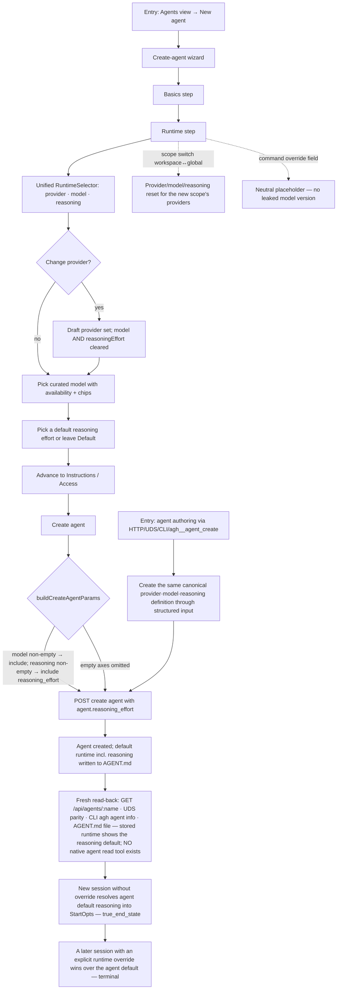

# J-18 — Author an agent whose runtime now carries reasoning

Agent-create's RuntimeStep was the weakest of the three old pickers: bare `model_id` strings, no availability, and **no reasoning at all** (`model-selector` _spec §1 defect 4, §6.2). The migration replaces its provider+model leaf selects with the unified `RuntimeSelector` and, for the first time, lets an agent definition carry a default `reasoning_effort` that resolves into `StartOpts` for sessions created without an explicit override. The regression risk is draft/params threading: reasoning must flow through `validateAgentCreateDraft`/`buildCreateAgentParams` exactly like model, be omitted when empty, and be cleared when the provider changes.



```yaml
journey:
  id: J-18
  name: "Author an agent whose runtime now carries reasoning"
  value_statement: "My agent definition can pin a default reasoning effort, not just a provider and model — and new sessions inherit it without me re-picking every time."
  personas: [Bruno, Ada]
  entry_points:
    - url: "web Agents view → New agent → Runtime step"
      origin: in-app-nav
    - url: "POST /api/agents over HTTP/UDS; agh agent create; agh__agent_create"
      origin: direct
  actions:
    - step: 1
      verb: "Reach the Runtime step of the create-agent wizard"
      expected_observable: "The step shows one RuntimeSelector (provider · model · reasoning) plus a Command override field — not two bare leaf selects; the model list is the curated view with availability and capability chips (no raw model_id strings)."
    - step: 2
      verb: "Pick a provider, model, and default reasoning effort"
      expected_observable: "Reasoning is selectable when the model advertises effort; changing the provider clears both model and reasoning; the Command field's placeholder carries no concrete model version (COPY.md)."
    - step: 3
      verb: "Complete the wizard and create the agent"
      expected_observable: "The create request's agent object includes reasoning_effort only when a non-empty effort was chosen (omitted otherwise), threaded like model through buildCreateAgentParams."
    - step: 4
      verb: "Start a session from that agent without overriding runtime"
      expected_observable: "The session resolves the agent's default reasoning_effort into StartOpts exactly like provider/model defaults."
  goal:
    observable: "An agent definition persists a provider·model·reasoning default; sessions created from it inherit the reasoning effort with no per-session picking."
    side_effects: [agent-created-with-reasoning-default, catalog-fetched-view-all]
  true_end_state: "Fresh-read the created definition through HTTP/UDS/CLI/web and its AGENT.md file: every surface shows the same stored reasoning default; a session started with no override applies it, while an explicit session override wins."
  exit:
    natural: "Operator has a reusable agent whose sessions reason at the chosen depth by default."
  abandonment:
    - at_step: 2
      how: "Operator switches wizard scope (workspace ↔ global) mid-pick."
      resume: "Provider/model/reasoning reset to the new scope's provider set; no stale cross-scope selection survives."
    - at_step: 3
      how: "Operator leaves reasoning at Default and creates the agent."
      resume: "No reasoning_effort is written; sessions fall back to the provider/adapter default (empty ≠ 'none')."
  crosses: [runtime-selector, agent-create-draft, agent-config-reasoning, model-catalog-view, start-opts-resolution]

design_reference:
  screens:
    - "docs/design/opendesign/provider-model-reasoning-selector.html (Agent config · 'now carries reasoning too')"
    - "Storybook systems/agent AgentCreateDialog runtime step"
  truthful_ui_checks:
    - "Reasoning control only appears when the model advertises effort; otherwise the model row shows the reasoning-on/none note, not a fake effort control."
    - "reasoning_effort is omitted from the create-agent params when empty; present (a canonical level) when chosen."
    - "Provider change clears model AND reasoning in the draft (no stale reasoning for a model the new provider doesn't offer)."
    - "Command placeholder shows no concrete/versioned model id (COPY.md claim standards)."

e2e_backbone:
  web:
    - "E2E-web (make test-e2e-web): agent-create wizard completes with a reasoning default selected."
  runtime:
    - "Unit/integration: agent config reasoning_effort default resolves into StartOpts for a session created without an explicit override (task 01 suite)."
  manual:
    - "Charter CH-029 (Bruno) walks the RuntimeStep reasoning add + draft/params threading + provider-change clear."
    - "Charter CH-036 (Ada) creates the same agent definition through HTTP/UDS/CLI/agh__agent_create, then fresh-reads it through the real read surfaces (there is no native agent read tool)."
```
