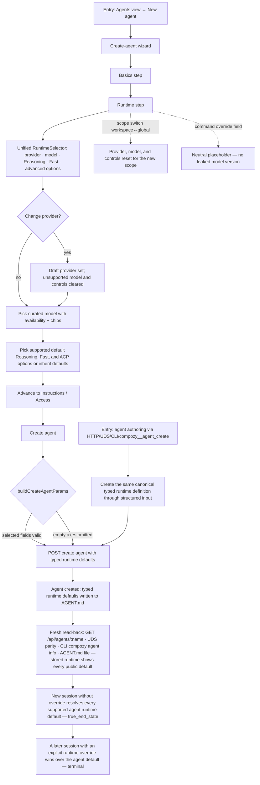

# J-18 — Author an agent with reusable runtime controls

Agent authoring uses the unified `RuntimeSelector` and persists reusable provider, logical model,
Reasoning, Fast, and typed ACP-option defaults. Sessions inherit those values unless a durable session
selection or prompt snapshot replaces them. The regression risk is cross-surface threading: every
authored value must round-trip through AGENT.md, API/UDS/CLI/native tools, and the web without exposing
private provider transport aliases.



```yaml
journey:
  id: J-18
  name: "Author an agent with reusable runtime controls"
  value_statement: "My agent definition can pin the supported runtime controls once, and new sessions inherit them without me re-picking every time."
  personas: [Bruno, Ada]
  entry_points:
    - url: "web Agents view → New agent → Runtime step"
      origin: in-app-nav
    - url: "POST /api/agents over HTTP/UDS; compozy agent create; compozy__agent_create"
      origin: direct
  actions:
    - step: 1
      verb: "Reach the Runtime step of the create-agent wizard"
      expected_observable: "The step shows one RuntimeSelector rather than separate leaf selects, uses curated model browsing with availability and capability chips, and includes provider, logical model, Reasoning, Fast, and advertised advanced options plus a Command override field; no raw or transport model alias is visible."
    - step: 2
      verb: "Pick a provider, model, Reasoning, Fast, and advertised advanced options"
      expected_observable: "Only valid controls and combinations are selectable; changing provider or model clears values the new descriptor cannot honor."
    - step: 3
      verb: "Complete the wizard and create the agent"
      expected_observable: "The create request carries speed and typed acp_options only when selected, with exactly one typed value per ACP option."
    - step: 4
      verb: "Start a session from that agent without overriding runtime"
      expected_observable: "The session resolves the agent's model, Reasoning, Fast, and ACP-option defaults before the first prompt; a later session or prompt override wins per field or option ID."
  goal:
    observable: "An agent definition persists supported runtime defaults; sessions created from it inherit them with no repeated picking."
    side_effects: [agent-created-with-runtime-defaults, catalog-fetched-view-all]
  true_end_state: "Fresh-read the created definition through HTTP/UDS/CLI/web and AGENT.md: every surface shows the same logical runtime defaults; a session started with no override applies them, while durable session and prompt overrides win per field or option ID."
  exit:
    natural: "Operator has a reusable agent whose sessions start with the chosen supported controls."
  abandonment:
    - at_step: 2
      how: "Operator switches wizard scope (workspace ↔ global) mid-pick."
      resume: "Provider, model, and unsupported controls reset to the new scope's catalog; no stale cross-scope selection survives."
    - at_step: 3
      how: "Operator leaves runtime controls at their inherited values and creates the agent."
      resume: "No explicit speed or ACP options are written; sessions continue through provider/project defaults."
  crosses: [runtime-selector, agent-create-draft, agent-runtime-options, model-catalog-view, start-opts-resolution]

design_reference:
  screens:
    - "docs/design/opendesign/provider-model-reasoning-selector.html (Agent config · 'now carries reasoning too')"
    - "Storybook systems/agent AgentCreateDialog runtime step"
  truthful_ui_checks:
    - "Reasoning, Fast, and advanced controls appear only when the model/provider descriptor supports them."
    - "Each ACP option emits exactly one select or boolean value; empty defaults are omitted."
    - "Provider or model changes clear every selection the new descriptor cannot honor."
    - "Command placeholder shows no concrete/versioned model id (COPY.md claim standards)."

e2e_backbone:
  web:
    - "Browser walk: agent creation completes with Fast and one advertised advanced option selected."
  runtime:
    - "Focused runtime integration: agent model, Reasoning, Fast, and ACP-option defaults resolve into StartOpts without an explicit override."
  manual:
    - "CH-provider-runtime-strategies walks Fast/options authoring, readback, inheritance, precedence, and invalidation."
```
