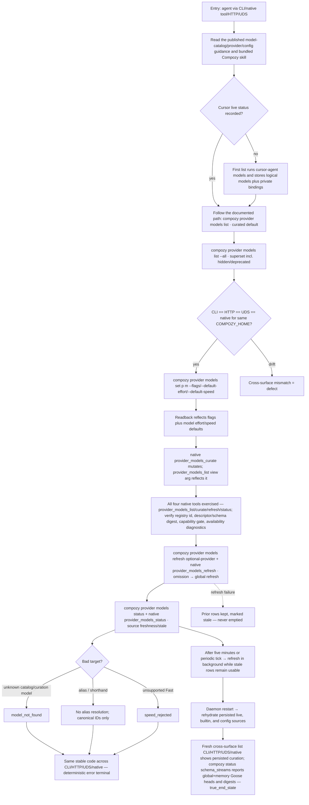

# J-20 — Curate the model catalog from structured agent surfaces

The agent-manageability spine of the program (`model-selector` _spec §11, §5.5, Compozy Impact Audit). An autonomous operator with no web UI curates and inspects the catalog entirely through structured output: `compozy provider models list/set/refresh/status`, the `view=curated|all` HTTP/UDS param, the `POST .../models/curate` facade, and the `provider_models_list`/`provider_models_curate` native tools. The catalog goes from stale-by-construction to curatable, and every surface must agree on the same persisted state and the same deterministic error codes.



```yaml
journey:
  id: J-20
  name: "Curate the model catalog from structured agent surfaces"
  value_statement: "I can list, curate, refresh, and inspect provider models entirely through structured tool output — every surface agrees on the same state, and bad targets fail with the same stable code."
  personas: [Ada]
  entry_points:
    - cli: "compozy provider models list [--all]; compozy provider models set <provider> <model> [--hidden|--featured|--deprecated|--default-effort|--default-speed]; compozy provider models refresh [provider]; compozy provider models status [provider]"
    - http: "GET /api/model-catalog/providers/{id}/models?view=curated|all; POST /api/model-catalog/providers/{provider_id}/models/curate"
    - uds: "same routes over the UDS transport (parity)"
    - native: "all four provider-model tools — provider_models_list (view arg), provider_models_curate, provider_models_refresh, provider_models_status; verify registered tool id, descriptor/schema digest, capability gate, and availability diagnostics"
    - docs: "published model-catalog, providers, and config.toml pages"
    - skill: "bundled skills/compozy guidance for provider-model catalog and reasoning diagnostics"
  actions:
    - step: 1
      verb: "Read and follow the public docs and bundled Compozy skill as an autonomous operator"
      expected_observable: "The guidance names the shipped CLI verbs, curated/all views, curation fields, reasoning apply values, and deterministic errors; following it reaches the real structured surfaces without undocumented repair steps."
    - step: 2
      verb: "List models curated-by-default, then the full set with --all / view=all"
      expected_observable: "Before any Cursor session, the first Cursor list runs cursor-agent models, groups its alias matrix into logical models with valid Reasoning/Fast/Thinking combinations, and keeps transport aliases private; the default list is curated, while --all / view=all returns the stored superset."
    - step: 3
      verb: "Compare the same persisted state across CLI, HTTP, UDS, and native tools (one COMPOZY_HOME)"
      expected_observable: "CLI structured output matches GET .../models for both curated and all views; UDS matches HTTP; the native tool reflects the same rows. Any drift is a defect."
    - step: 4
      verb: "Curate a model (set flags/default-effort/default-speed) via CLI, HTTP/UDS, and native provider_models_curate"
      expected_observable: "The readback reflects flags and model defaults; Fast is accepted only when the model advertises it; a request-only curation persists no merged enrichment; the change is visible on every surface."
    - step: 5
      verb: "Refresh with and without a provider, then read status"
      expected_observable: "A provider-scoped refresh refreshes that provider; omitting the provider routes to the global refresh/status endpoints; status reports source freshness. TTL and periodic refresh find newly advertised models without a code update, and failure keeps prior rows stale instead of emptying them."
    - step: 6
      verb: "Target an unknown or alias model id"
      expected_observable: "Catalog curation returns model_not_found for unknown IDs and speed_rejected for an explicitly unsupported Fast default; aliases/shorthands do not resolve; the same stable code appears across CLI/HTTP/UDS/native."
  goal:
    observable: "The catalog is curatable and inspectable from every agent surface with one truthful projection and shared deterministic error codes."
    side_effects: [config-curation-persisted, catalog-refreshed, source-status-reported]
  true_end_state: "After a curation write, a fresh list on any surface shows the new membership; a Cursor account catalog remains immediately available while read-triggered or periodic refresh runs; a daemon restart rehydrates persisted rows and private bindings so curation and valid option combinations survive."
  exit:
    natural: "The agent has a curated, current catalog it can drive sessions against without touching the web UI."
  abandonment:
    - at_step: 5
      how: "The refresh's upstream source is unreachable."
      resume: "Prior rows persist stale-marked; a later successful refresh clears staleness — no empty catalog window."
    - at_step: 4
      how: "The agent curates a model that isn't in any source."
      resume: "model_not_found is returned deterministically; no phantom row is created."
  crosses: [provider-models-cli, model-catalog-service, settings-provider-curate, native-provider-model-tools, curated-view-predicate, goose-schema-streams]

design_reference:
  screens:
    - "N/A — structured surfaces (CLI -o json / native tool descriptors); no web control for curation in MVP"
  truthful_ui_checks:
    - "Curated view = NOT hidden AND NOT deprecated AND (explicitly_curated OR featured); fallback to all-current-non-hidden-non-deprecated only when no explicit set exists (invariant §7.4)."
    - "One projection: settings and catalog surfaces serve the same merged rows; raw curated config never reaches a client (invariant §7.3)."
    - "Canonical IDs only: no alias resolution, no unknown→default fallback."
    - "Deterministic errors shared across surfaces: model_not_found, speed_rejected, model_unavailable, reasoning_option_missing, reasoning_effort_unsupported."

e2e_backbone:
  runtime:
    - "make test-e2e-runtime: acpmock matcher/fixture updates co-shipped; catalog+curation state exercised."
  integration:
    - "CLI list/set structured output matches HTTP state (cross-surface); native provider_models_curate mutates and provider_models_list reflects it."
  manual:
    - "Charter CH-031 (Ada) runs the full CLI/HTTP/UDS/native curation + parity + fail-loud comparison against one isolated COMPOZY_HOME."
```
