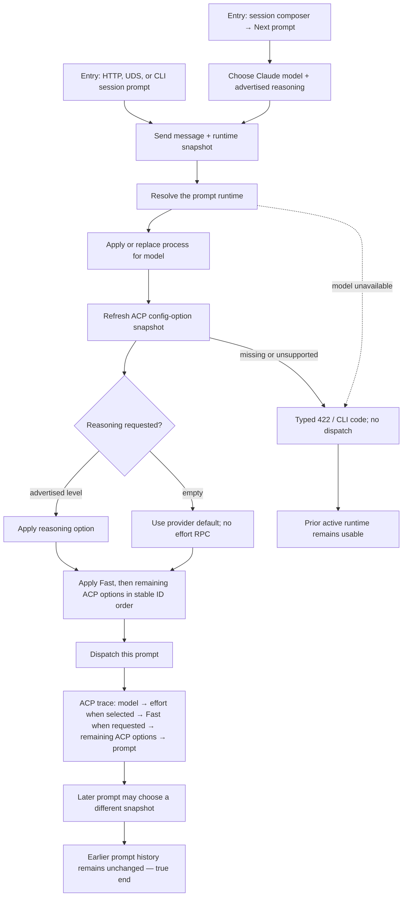

# J-21 — Apply Claude reasoning truthfully at a prompt boundary

Reasoning is a property of an individual prompt runtime, not of session creation. A user may create
a logical session without starting ACP work, choose a Claude model and advertised reasoning level in
the composer, then send a prompt. The runtime must apply model before reasoning and both before that
prompt; a later prompt may choose another runtime without rewriting earlier history. Structured
surfaces must fail loud before dispatch whenever a requested runtime cannot be honored.



```yaml
journey:
  id: J-21
  name: "Apply Claude reasoning truthfully at a prompt boundary"
  value_statement: "When I select Claude reasoning for a prompt, that exact prompt uses it or fails loudly before any work starts; switching later does not rewrite my history."
  personas: [Bruno, Ada]
  entry_points:
    - url: "web session composer → Next prompt RuntimeSelector"
      origin: in-app-nav
    - http: "POST /api/sessions/:id/prompt with message and runtime"
    - cli: "compozy session prompt with runtime flags"
  actions:
    - step: 1
      verb: "Choose a Claude model and an advertised reasoning level for the next prompt"
      expected_observable: "The composer exposes only advertised levels; choosing max is visibly scoped to the next submitted prompt."
    - step: 2
      verb: "Send the prompt"
      expected_observable: "ACP applies model, refreshes descriptors, applies Reasoning and Fast, then remaining options in stable ID order before dispatch; an omitted effort sends no effort RPC."
    - step: 3
      verb: "Send a later prompt with another runtime"
      expected_observable: "The new prompt receives its own snapshot while earlier transcript/runtime evidence remains unchanged."
    - step: 4
      verb: "Request an unavailable model or unapplyable reasoning through a structured prompt surface"
      expected_observable: "HTTP and UDS return 422 and CLI preserves the typed code before dispatch; the prior runtime remains available."
  goal:
    observable: "Each selected Claude reasoning level is applied in the correct order for exactly one prompt, or the request fails without a silent fallback."
    side_effects: [prompt-runtime-snapshotted, acp-set-config-option-effort, prompt-dispatched-or-rejected]
  true_end_state: "A fresh transcript and ACP trace agree that model preceded selected reasoning and both preceded only their prompt; later transitions did not mutate prior snapshots, and rejected transitions sent no prompt."
  exit:
    natural: "Operator continues the session with its current runtime or selects another Next prompt runtime."
  abandonment:
    - at_step: 1
      how: "Operator closes the selector without sending."
      resume: "No runtime transition or ACP work occurs; the existing session runtime remains unchanged."
    - at_step: 4
      how: "A requested effort is unavailable or unsupported."
      resume: "The user receives the typed error, chooses an advertised level or model, and can send a new prompt without recovering a partially dispatched one."
  crosses: [runtime-selector, prompt-runtime-snapshot, acp-config-options, live-reconfigure, process-replacement, runtime-rollback]

design_reference:
  screens:
    - "web session composer Next prompt RuntimeSelector"
  truthful_ui_checks:
    - "The selector exposes only levels the runtime can apply and labels the choice as next-prompt scope."
    - "A later runtime choice never changes the runtime shown by stored earlier prompt evidence."
    - "Failure names the unavailable model or reasoning issue and never reports a substituted provider default as success."

e2e_backbone:
  runtime:
    - "ACP trace records model → selected effort → prompt; omitted effort records no effort RPC."
    - "Live reconfiguration and process replacement both preserve transactional prompt dispatch and rollback the prior runtime on failure."
  structured:
    - "HTTP, UDS, and CLI session prompt return identical typed diagnostics for model_unavailable, reasoning_option_missing, and reasoning_effort_unsupported."
  manual:
    - "CH-prompt-bound-runtime-transition owns the browser and runtime transition walk."
    - "CH-prompt-runtime-fail-loud owns the structured negative-path walk."
```
