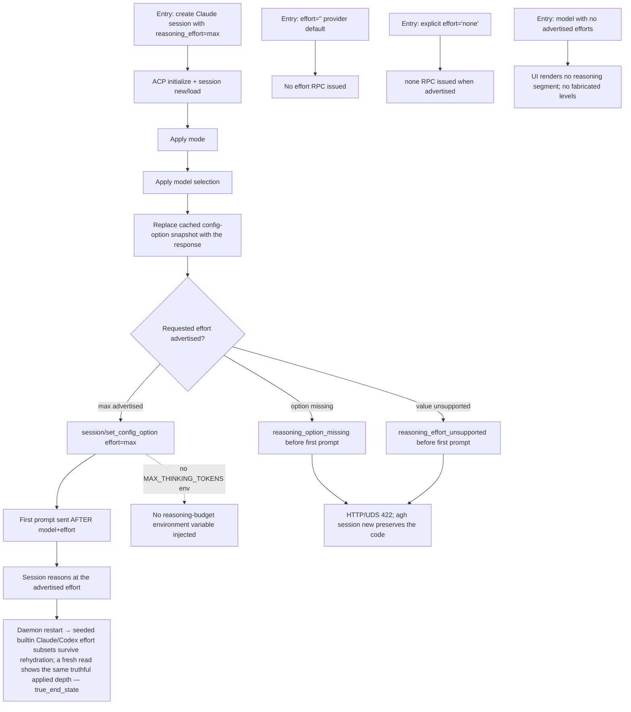

# J-21 — Claude reasoning applied truthfully, end to end

The defect this whole program exists to kill (`model-selector` _spec §1 defect 2, §5.2–§5.3, invariants §7.1/§7.5/§7.6). Reasoning selection was broken for Anthropic models — the daemon fabricated effort options via a name-prefix heuristic and silently no-oped when it couldn't honor the value. The fix deletes the heuristic and negotiates model + effort through the live ACP config options: initialize → session new → apply mode → apply model → replace the cached option snapshot → apply effort → first prompt. A requested effort the adapter can't honor now fails deterministically before any prompt is sent.



```yaml
journey:
  id: J-21
  name: "Claude reasoning applied truthfully, end to end"
  value_statement: "When I pick max reasoning for a Claude model, the runtime actually applies it before the first prompt — and if it can't, it tells me loudly instead of silently ignoring me."
  personas: [Bruno, Ada]
  entry_points:
    - url: "web session-create → Claude provider → model with efforts → max"
      origin: in-app-nav
    - http: "POST /api/sessions with provider=claude, model, reasoning_effort=max"
    - cli: "agh session create … --reasoning-effort max (structured)"
  actions:
    - step: 1
      verb: "Create a Claude session with reasoning_effort=max"
      expected_observable: "The adapter records model selection BEFORE the effort option, and both BEFORE the first prompt; session/set_config_option carries effort=max; the session reasons at max."
    - step: 2
      verb: "Create a session with an empty reasoning effort (provider default)"
      expected_observable: "No effort RPC is issued; empty means provider/adapter default, distinct from an explicit value."
    - step: 3
      verb: "Create a session with explicit reasoning_effort=none"
      expected_observable: "The 'none' RPC is issued when the adapter advertises it — none is a real selectable value, not the same as empty."
    - step: 4
      verb: "Select a model with no advertised efforts (e.g. a Claude model without a seeded set)"
      expected_observable: "The UI renders no reasoning segment/strip (supports-reasoning note or none note); the daemon fabricates no effort levels (heuristic deleted)."
    - step: 5
      verb: "Request an effort the adapter cannot honor"
      expected_observable: "A missing option returns reasoning_option_missing; an unsupported value returns reasoning_effort_unsupported — before the first prompt; HTTP/UDS map to 422 and `agh session new` preserves the code. No prompt is sent after either failure. AGH exposes no native session-create tool."
  goal:
    observable: "Reasoning is applied through the live ACP option in the correct order, or fails deterministically; no reasoning-budget environment variable is ever injected."
    side_effects: [acp-set-config-option-effort, session-started, no-max-thinking-tokens-env]
  true_end_state: "The acpmock/live adapter transcript shows model-before-effort-before-prompt; an empty effort issued no RPC; an explicit 'none' issued the RPC; an unapplyable effort returned its typed error and sent no prompt. Restart-safe: the seeded builtin Claude/Codex effort subsets survive rehydration."
  exit:
    natural: "The operator's chosen reasoning depth is truthfully in effect for the session's turns."
  abandonment:
    - at_step: 5
      how: "The operator requests max on a model whose adapter doesn't advertise it."
      resume: "Start fails with reasoning_effort_unsupported and no prompt is sent; the operator lowers the effort or picks another model — the session is never silently created at the wrong depth."
    - at_step: 1
      how: "The requested model itself is unavailable to the adapter."
      resume: "model_unavailable is returned before the first prompt (distinct from model_not_found for catalog/curation targets)."
  crosses: [acp-reasoning-apply, config-options-snapshot, modelcatalog-reasoning-profile, session-negotiation-order, provider-reasoning-config]

design_reference:
  screens:
    - "docs/design/opendesign/provider-model-reasoning-selector.html (reasoning footer ACP|catalog badge; supported-no-levels / none notes)"
  truthful_ui_checks:
    - "reasoning_efforts is non-empty only when the daemon has a working application strategy (invariant §7.1) — no name-heuristic levels."
    - "Fail loud: an unapplyable reasoning_effort at session start is a deterministic 422/CLI error, never a silent no-op (invariant §7.5)."
    - "Empty ('' provider default) is distinct from explicit 'none'; empty issues no RPC, none issues one when advertised."
    - "No MAX_THINKING_TOKENS or reasoning-budget env var; effort is applied only via session/set_config_option."

e2e_backbone:
  runtime:
    - "make test-e2e-runtime: session-create-with-effort scenario green; acpmock records ordering (model→effort→prompt)."
  integration:
    - "POST /api/sessions with codex/claude + effort applies via the live ACP option; unavailable model/missing option/unsupported effort return 422 with code + body asserted (task 01 suite)."
  manual:
    - "Charter CH-032 (Bruno) captures the happy-path ACP ordering (model→effort→prompt) + the browser-use max-reasoning walk on the web surface; Charter CH-035 (Ada) owns the fail-loud negotiation evidence (task 04)."
  telemetry:
    - "ACP transcript / slog confirms model-before-effort-before-prompt and the absence of a reasoning-budget env var."
```
