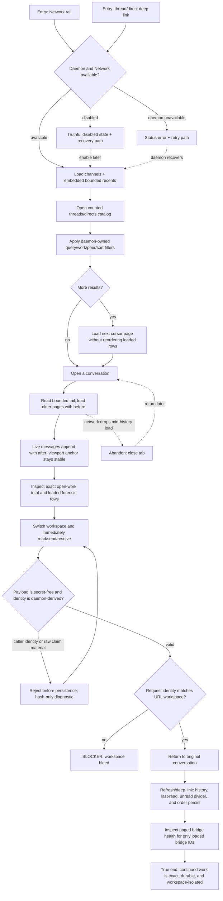

# J-23 — Return to Network work and continue safely

An operator returns to a busy workspace, resumes a thread or direct conversation, and acts without crossing workspace boundaries. The journey proves that the daemon owns order, filters, counts, and continuation while the browser preserves only workspace-scoped reading context. The true end is not a rendered list: it is a refreshed conversation whose history, live tail, unread state, work total, and immediate post-switch actions still belong to the workspace in the URL.



```yaml
journey:
  id: J-23
  name: "Return to Network work and continue safely"
  value_statement: "I can resume workspace conversations and act immediately without losing history, seeing partial totals as complete, or sending work to another workspace."
  personas: [Théo]
  entry_points:
    - url: "web Network rail"
      origin: in-app-nav
    - url: "web /network/:workspaceId/:channel/threads/:threadId or /directs/:directId"
      origin: direct
  actions:
    - step: 1
      verb: "Open Network and find the conversation to resume"
      expected_observable: "Channels arrive with bounded recents in one payload; thread/direct catalogs show daemon order, exact totals, filters, and explicit continuation"
    - step: 2
      verb: "Open the conversation and review earlier work"
      expected_observable: "A bounded chronological tail paints first; Load older preserves the first visible message by ID and offset while live messages may still append"
    - step: 3
      verb: "Inspect and change work from the conversation"
      expected_observable: "The exact open-work total is distinct from the loaded forensic rows; create/resolve/send actions use the workspace in the route; the native descriptor and CLI help explain how a valid first send opens a public thread"
    - step: 4
      verb: "Switch workspaces, act immediately, then return"
      expected_observable: "No request, last-read marker, unread divider, optimistic message, or cache entry bleeds between workspaces; caller-supplied identity and raw claim material are rejected before persistence with hash-only diagnostics; returning restores the original conversation"
    - step: 5
      verb: "Check the bridges that make the workspace reachable"
      expected_observable: "The bridge catalog exposes exact facets/total and the health stream subscribes only to the loaded bridge IDs in bounded chunks"
  goal:
    observable: "After refresh and deep-link, the same conversation remains ordered and complete for the loaded range, new messages are present once, totals are exact, and every action belongs to the route workspace."
    side_effects: [last-read-advanced-for-one-conversation, network-action-persisted, bridge-health-stream-scoped]
  true_end_state: "A fresh load through the original deep link shows the same persisted conversation and workspace-scoped read state; the independent list/detail surfaces agree on totals and latest activity."
  exit:
    natural: "The operator continues the conversation or returns to the Network rail with trustworthy recents."
  abandonment:
    - at_step: 2
      how: "The connection drops while older history is loading and the operator closes the tab."
      resume: "Returning through the deep link reloads a bounded tail, preserves persisted messages, and can continue paging older history without duplicates or a false empty state."
  crosses: [network-routes, network-projections, native-tools, cli, message-history, live-tail, workspace-cache, last-read, work-projection, bridges-health]
```
