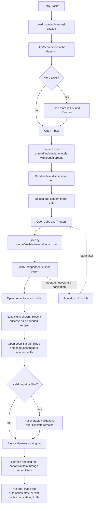

# J-24 — Triage work and manage automation at scale

A delivery operator moves from the task backlog to the actor-scoped Inbox and then to the automations that keep work moving. Every list is larger than one page on purpose. The journey proves that filters, order, totals, facets, and cursors come from the daemon; mutations survive reload; sampled run history is labelled as recent; and Loop-target bindings remain discoverable without inventing a catalog-wide badge.



```yaml
journey:
  id: J-24
  name: "Triage work and manage automation at scale"
  value_statement: "I can find, triage, and automate work in catalogs larger than one page without partial counts, client-side reordering, or lost mutations."
  personas: [Bruno]
  entry_points:
    - url: "web /tasks"
      origin: in-app-nav
    - url: "web /jobs or /triggers"
      origin: in-app-nav
  actions:
    - step: 1
      verb: "Filter and page the task backlog"
      expected_observable: "List and Kanban preserve the lean `{tasks,facets,page}` envelope, daemon order, exact total/facets, and explicit Load more"
    - step: 2
      verb: "Triage the actor-scoped Inbox"
      expected_observable: "Lane/unread/archive totals remain exact while loaded groups append by cursor; read/archive/dismiss survives refresh"
    - step: 3
      verb: "Find jobs and triggers across sources"
      expected_observable: "Jobs and triggers expose counted pages and daemon-owned `q/source/enabled/event/loop/scope` filters, including config, package, and dynamic sources"
    - step: 4
      verb: "Inspect run history and Loop bindings"
      expected_observable: "Recent metrics say `Runs shown` and `Recent success`; Loop detail pages jobs/triggers independently and never claims a sampled catalog badge is complete"
    - step: 5
      verb: "Save and rediscover a dynamic automation"
      expected_observable: "The mutation invalidates compatible infinite caches; reload and server filters return the canonical saved row exactly once"
  goal:
    observable: "The chosen task and automation are still findable after reload, their triage/config state is persisted, and every visible count or metric states its real completeness."
    side_effects: [task-triage-persisted, automation-definition-persisted, loop-binding-visible-in-detail]
  true_end_state: "Fresh task, Inbox, automation, and Loop-detail reads agree with the mutations while page totals/facets remain exact and no loaded page is silently discarded."
  exit:
    natural: "The operator returns to delivery work with the backlog triaged and the automation discoverable."
  abandonment:
    - at_step: 3
      how: "The operator closes the tab after loading several catalog pages."
      resume: "Returning may restart at the first page, but filters, canonical order, saved server state, and truthful totals remain intact; no stale plain-array cache may replace the paged result."
  crosses: [tasks-catalog, task-inbox, task-triage, automation-catalog, automation-detail, loop-bindings, route-preload, infinite-cache]
```
