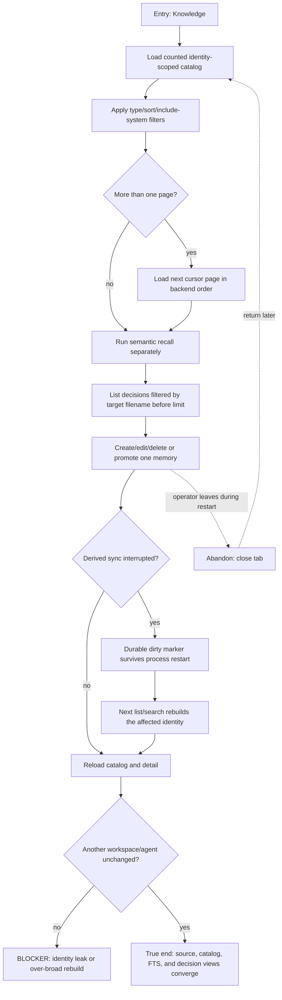

# J-25 — Browse and recover durable knowledge

A reviewer searches a knowledge catalog that is deliberately larger than 200 entries, inspects decisions, and returns after an interrupted mutation or derived-index failure. Markdown remains authoritative. The journey proves exact identity-scoped paging, backend order, a separate semantic-search path, filename filtering before the decision limit, and durable recovery that cannot leak or rebuild another workspace or agent identity.



```yaml
journey:
  id: J-25
  name: "Browse and recover durable knowledge"
  value_statement: "I can find every durable memory in my selected identity and trust the catalog to recover after interruption without losing, ghosting, or leaking knowledge."
  personas: [Rafa]
  entry_points:
    - url: "web /knowledge"
      origin: in-app-nav
    - url: "CLI/HTTP memory list, search, decisions, reindex, and reset"
      origin: direct
  actions:
    - step: 1
      verb: "Browse and page the selected knowledge identity"
      expected_observable: "The catalog returns `{memories,page}` with exact totals beyond 200, backend order, identity/type/sort/include-system filters, and explicit Load more"
    - step: 2
      verb: "Search for content and inspect decisions"
      expected_observable: "Semantic recall remains separate from catalog state; decision `filename` is applied before the limit and each row retains its `target_filename` identity"
    - step: 3
      verb: "Change a memory and return after an interruption"
      expected_observable: "Markdown remains authoritative; a failed derived sync leaves a durable dirty marker and the next list/search rebuilds exactly the affected identity"
    - step: 4
      verb: "Run reindex/reset and compare another identity"
      expected_observable: "Readiness is identity-specific, FTS is rebuilt, stale/ghost headers disappear, and another workspace/agent catalog is unchanged"
  goal:
    observable: "After restart and refresh, source files, catalog headers, semantic search, and decisions agree for the selected identity, including entries beyond the former 200-item boundary."
    side_effects: [memory-source-mutated, derived-catalog-rebuilt-if-dirty, identity-readiness-updated]
  true_end_state: "A fresh public list/search can find the changed item exactly once, the filename-filtered decision set is correct, and a control identity shows no leaked rows or unnecessary rebuild."
  exit:
    natural: "The reviewer leaves with the durable knowledge and its decision history readable through the same public surfaces."
  abandonment:
    - at_step: 3
      how: "The process exits after the source mutation but before derived synchronization completes."
      resume: "On the next public list/search, the dirty marker forces convergence before results are trusted; stale readiness alone cannot hide the interrupted write."
  crosses: [memory-files, memory-catalog, memory-fts, readiness, dirty-marker, decisions, identity-isolation, knowledge-web]
```
