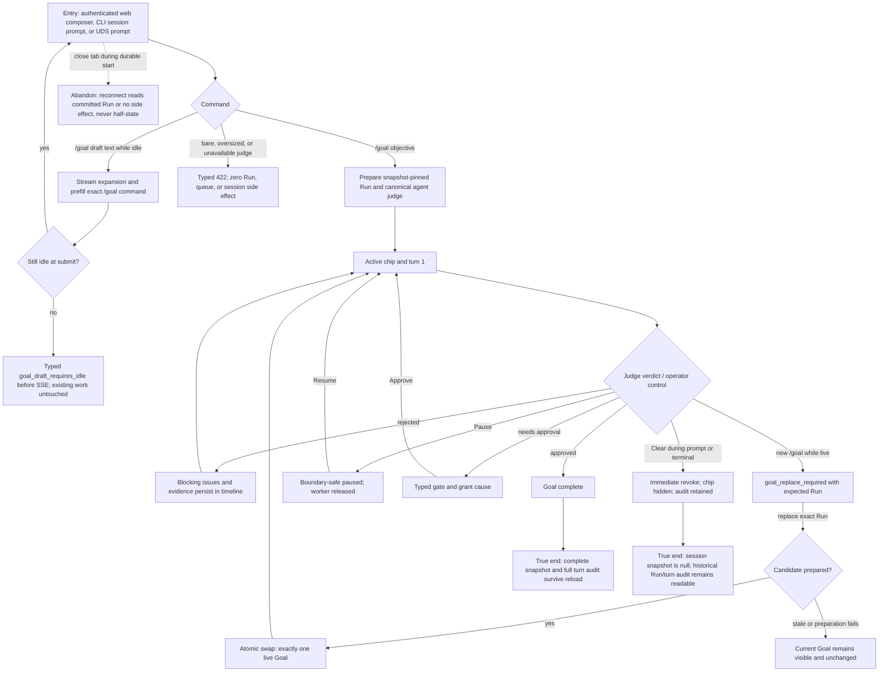

# J-26 — Start, converge, and control a conversational Goal

An operator turns one objective into a durable session-origin Goal, watches authoritative judge feedback drive successive turns, and controls the same checkpoint without losing history. This journey combines the QA seed's one-liner, pause/approve/clear, and safe replace/draft branches because they share one user value: safely changing what the current conversation is trying to accomplish.



```yaml
journey:
  id: J-26
  name: "Start, converge, and control a conversational Goal"
  value_statement: "An operator can state an objective once, see real judge feedback converge it, and safely pause, approve, replace, draft, or clear without losing the durable audit."
  personas: [Lea, Bruno]
  entry_points:
    - url: "web session composer"
      origin: in-app-nav
    - url: "CLI: agh session prompt"
      origin: direct
    - url: "UDS/HTTP session prompt route"
      origin: external-share
  actions:
    - step: 1
      verb: "Start a plain Goal or ask for a draft"
      expected_observable: "Start returns a direct 202 structured result and an active chip; an admitted draft streams and prefills without creating a Run."
    - step: 2
      verb: "Follow rejected turns and blocking issues"
      expected_observable: "Each turn, stop reason, nullable verdict, issue, and evidence appears once in total order."
    - step: 3
      verb: "Pause, resume or approve at the visible boundary"
      expected_observable: "The worker is released while paused/awaiting approval and exactly one successor continues the same checkpoint."
    - step: 4
      verb: "Replace or clear the current Goal"
      expected_observable: "Replacement uses the expected Run CAS; stale/failure preserves current state; clear hides only the newest snapshot and fences late effects."
  goal:
    observable: "The newest Goal reaches complete, or is intentionally cleared/replaced, with one coherent durable Run and turn audit."
    side_effects: [session-origin-run, goal-turn-ledger, goal-snapshot-events, control-grants]
  true_end_state: "A refresh shows the same complete/replaced Goal and turn history; after clear the chip stays absent while the historical Run remains queryable and no older Goal resurrects."
  exit:
    natural: "The operator remains in the origin session with a truthful chip or a deliberate null snapshot and links to the durable Run."
  abandonment:
    - at_step: 1
      how: "The client disconnects while the durable start is committing."
      resume: "A fresh public read shows either the committed Run or no side effect; it never exposes a half-created Goal."
    - at_step: 3
      how: "The operator leaves while paused or awaiting approval."
      resume: "Reload preserves the exact boundary and offers only the valid Resume or Approve action."
  crosses: [session-prompt, loop-runtime, judge, managed-session, web-composer, HTTP-UDS-CLI, SSE]

e2e_backbone:
  runtime: ["Goal E2E lifecycle, control, replace, disconnect, and restart cases from task 04"]
  web: ["_tests.md E2E-web 1-4 and 9"]
  integration: ["_tests.md integration 19-24 plus control/recovery cases"]
  scenarios: [GL-001, GL-002, GL-003, GL-004, GL-005, GL-006, GL-007, GL-008, GL-009, GL-010, GL-011, GL-012, GL-013]
```
