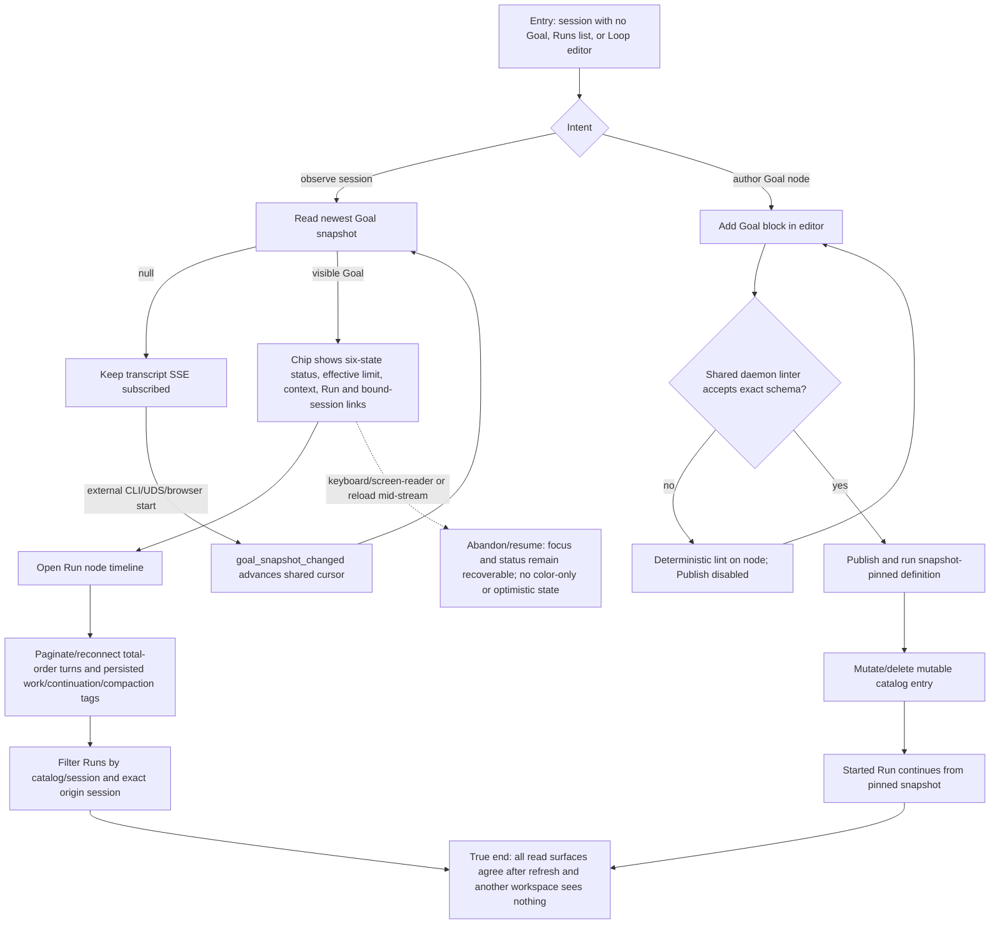

# J-27 — Observe Goal truth and author a snapshot-pinned Goal node

An evaluator follows a Goal across the session header, transcript, Run timeline, Runs filters, and visual editor. The journey ends only when the displayed status, context, turn audit, origin, and authored definition survive reload and still match the daemon-owned snapshot.



```yaml
journey:
  id: J-27
  name: "Observe Goal truth and author a snapshot-pinned Goal node"
  value_statement: "An evaluator can trust every Goal read surface, while a builder can author and run the same closed contract without the UI inventing state."
  personas: [Marina, Sol, Bruno]
  entry_points:
    - url: "web session thread and /loop-runs/:runId"
      origin: in-app-nav
    - url: "web /loops/:name/editor"
      origin: in-app-nav
    - url: "HTTP/UDS snapshot and turn routes; CLI loop turns/runs"
      origin: direct
  actions:
    - step: 1
      verb: "Observe the newest session Goal and external changes"
      expected_observable: "The chip discovers start/replace/clear/reseed without polling and never fabricates context or resurrects cleared history."
    - step: 2
      verb: "Inspect the Run turn timeline and transcript tags"
      expected_observable: "Run-wide sequence, stop reason, nullable verdict, issues, evidence, and prompt kind remain ordered and duplicate-free after reconnect."
    - step: 3
      verb: "Filter session-origin Runs"
      expected_observable: "Labels and route query reflect catalog/session origin and exact origin session without workspace leakage."
    - step: 4
      verb: "Author, lint, publish, and run a Goal block"
      expected_observable: "The editor exposes only the exact Goal schema, shared lint reasons, and preserves watch-event fields; the started Run survives catalog mutation."
  goal:
    observable: "Session, Run, transcript, Runs list, CLI/API, and editor-backed execution all tell the same durable Goal story."
    side_effects: [goal-snapshot-stream, run-turn-stream, published-loop-definition, pinned-executed-snapshot]
  true_end_state: "After refresh and catalog mutation, the Goal still renders from daemon truth, the timeline is complete, the editor-authored Run progresses, and another workspace cannot read it."
  exit:
    natural: "The evaluator can follow the Run or active bound session; the builder lands on a valid published definition and durable Run."
  abandonment:
    - at_step: 1
      how: "The page opens while the snapshot is null and an external surface starts a Goal before or during SSE connect."
      resume: "Snapshot replay/live merge discovers the Goal once and advances one monotonic cursor."
    - at_step: 4
      how: "The builder leaves after a lint error or catalog mutation."
      resume: "The draft preserves fields; a started Run continues from its immutable snapshot rather than mutable catalog state."
  crosses: [web-session, transcript-SSE, loop-SSE, HTTP-UDS-CLI, editor-linter, catalog-snapshot, workspace-isolation]

e2e_backbone:
  runtime: ["Snapshot pinning, session outbox, workspace isolation, and turn-pagination integration suites"]
  web: ["_tests.md E2E-web 2, 5-8, and 10; Task 05 deterministic captures"]
  integration: ["_tests.md integration 1-7, 14-17, and 19"]
  scenarios: [GL-014, GL-015, GL-016, GL-022, GL-023, GL-024, GL-033, GL-035]
```
