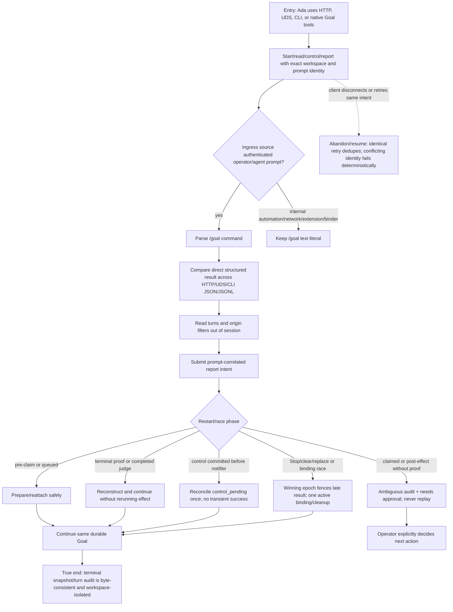

# J-29 — Operate and recover a Goal without UI-only shortcuts

An autonomous agent operates Goal through HTTP, UDS, CLI, and native tools while the runtime is restarted or raced at every durable effect boundary. The journey proves AGH's premise: public structured surfaces converge on one store/runtime path, internal prompt sources stay literal, and ambiguity escalates without automatic replay.



```yaml
journey:
  id: J-29
  name: "Operate and recover a Goal without UI-only shortcuts"
  value_statement: "An agent can manage and audit Goal entirely through structured surfaces, survive crashes/races, and trust that uncertain effects are never silently replayed."
  personas: [Ada, Bruno]
  entry_points:
    - url: "HTTP and UDS session prompt, Goal snapshot, turn, and Run-list routes"
      origin: external-share
    - url: "CLI: agh session prompt; agh loop turns; agh loop runs"
      origin: direct
    - url: "native: agh__goal_get, agh__goal_report, agh__loop_turns"
      origin: direct
  actions:
    - step: 1
      verb: "Run the same Goal operation across HTTP, UDS, CLI, and native tools"
      expected_observable: "Statuses, content types, reason codes, cursors, nullability, and JSON/JSONL meaning agree."
    - step: 2
      verb: "Send literal /goal text from every non-operator internal source"
      expected_observable: "Automation, network, extension, binder, and synthetic prompts do not invoke Goal dispatch."
    - step: 3
      verb: "Report complete/blocked from the current bound prompt"
      expected_observable: "Intent is durable, identical retries dedupe, stale/conflicting/revoked identities fail, and settlement consumes once."
    - step: 4
      verb: "Restart or race the runtime across claim, response, judge, control, replace, pause, and binding boundaries"
      expected_observable: "Known evidence resumes; unknown effects become ambiguity; no prompt/judge replays; one winner owns control and binding state."
  goal:
    observable: "Every public structured surface reconstructs the same terminal Goal while restart/race recovery performs no duplicate external effect."
    side_effects: [durable-report-intent, ambiguity-audit, control-reconciliation, binding-cleanup, session-outbox]
  true_end_state: "After restart and reconnect, HTTP/UDS/CLI/native reads agree on one workspace-scoped snapshot and ordered audit; an ambiguous effect is explicitly awaiting approval and was not replayed."
  exit:
    natural: "Ada can continue or audit the Goal without opening Web; Bruno can independently confirm the same state."
  abandonment:
    - at_step: 3
      how: "The client disconnects after a report or start commit and retries."
      resume: "The identical semantic identity dedupes; a conflicting identity returns a deterministic error without mutation."
    - at_step: 4
      how: "The daemon crashes after an external effect but before terminal proof."
      resume: "Recovery records one ambiguous audit row and waits for explicit approval; it never resubmits or re-evaluates automatically."
  crosses: [HTTP, UDS, CLI, native-tools, session-ingress, GlobalDB, daemon-recovery, workspace-isolation, cleanup-outbox]

e2e_backbone:
  runtime: ["_tests.md runtime cases 8 and 10 plus Task 04 Goal E2E and restart matrix"]
  web: ["_tests.md E2E-web 1, 9, and 10 as an adjacent canary"]
  integration: ["_tests.md integration 4, 6, 8-11, 15, 18, and 21-27"]
  scenarios: [GL-025, GL-026, GL-027, GL-028, GL-029, GL-030, GL-031, GL-032, GL-034, GL-036, GL-037, GL-039]
```
