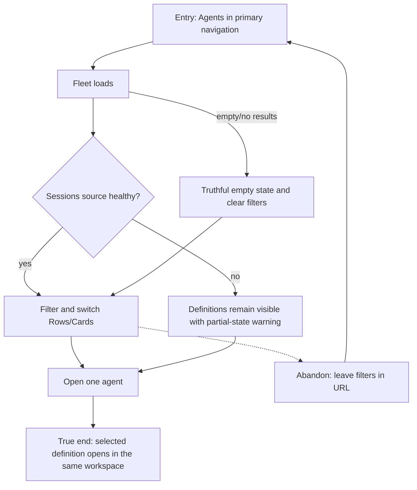

# J-30: Scan the agent fleet



```yaml
journey:
  id: J-30
  name: Scan the agent fleet
  value_statement: "An operator can find the right workspace-visible agent without trusting invented status."
  personas: [Bruno, Sol]
  entry_points:
    - url: /agents
      origin: in-app-nav
  actions:
    - step: 1
      verb: Scan, search, filter, and switch views
      expected_observable: Definitions remain truthful across loaded, empty, no-results, and partial states
    - step: 2
      verb: Open one result
      expected_observable: The chosen agent detail opens in the active workspace
  goal:
    observable: The selected effective definition is visible without cross-workspace leakage
    side_effects: []
  true_end_state: A fresh fleet load preserves URL filters and resolves the same agent
  exit:
    natural: Agent detail
  abandonment:
    - at_step: 1
      how: Leave while filters are active
      resume: The URL restores the same filter state
  crosses: [web, agent-api, sessions-api]
```
