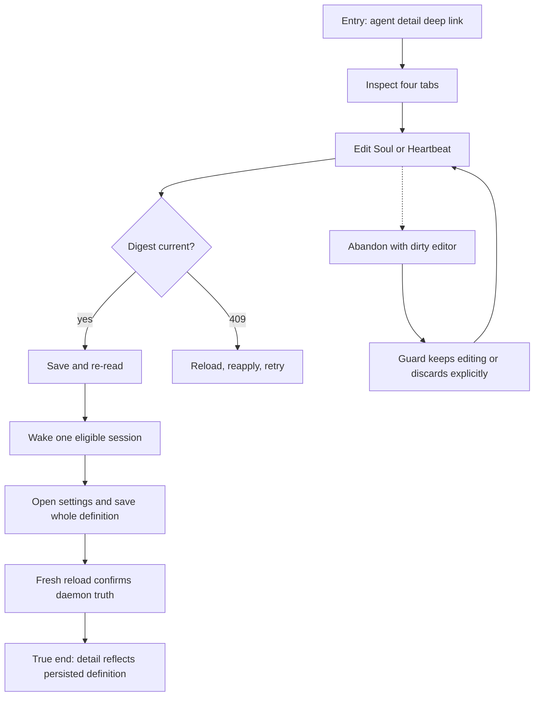

# J-31: Steward an agent definition



```yaml
journey:
  id: J-31
  name: Steward an agent definition
  value_statement: "An operator can inspect and safely edit definition-owned state without losing concurrent work."
  personas: [Bruno, Sol]
  entry_points:
    - url: /agents/$name?tab=instructions
      origin: direct
  actions:
    - step: 1
      verb: Inspect tabs and authored files
      expected_observable: Origin, runtime, configuration, sessions, diagnostics, and file state match daemon reads
    - step: 2
      verb: Edit authored context and settings
      expected_observable: CAS, validation, permission, and unsaved states are explicit and keyboard reachable
  goal:
    observable: Fresh reads show the saved definition and authored files
    side_effects: [definition-updated, authored-context-updated, optional-session-wake]
  true_end_state: Reloaded detail and structured reads agree on digest, origin, and values
  exit:
    natural: Agent overview
  abandonment:
    - at_step: 2
      how: Navigate away with unsaved changes
      resume: Guard offers Keep editing or explicit discard
  crosses: [web, agent-api, authored-context-api, sessions-api]
```
