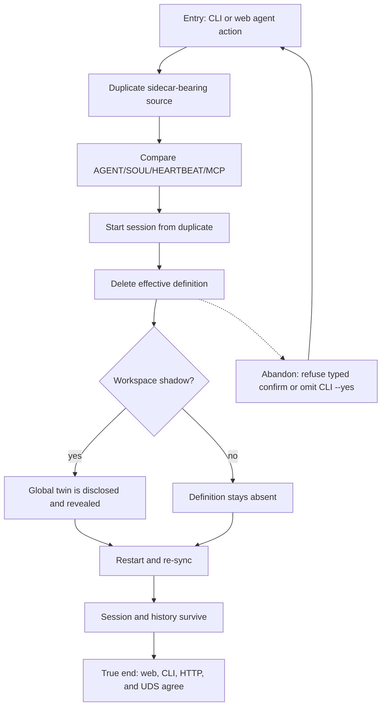

# J-32: Manage the agent lifecycle across surfaces



```yaml
journey:
  id: J-32
  name: Manage the agent lifecycle across surfaces
  value_statement: "Operators and agents get one durable lifecycle contract through every public surface."
  personas: [Ada, Bruno]
  entry_points:
    - url: agh agent duplicate|update|delete
      origin: direct
    - url: /agents/$name
      origin: in-app-nav
  actions:
    - step: 1
      verb: Duplicate and compare the complete authored directory
      expected_observable: Sidecars and secrets stay daemon-side while the clone remains faithful
    - step: 2
      verb: Delete with an active session and restart the daemon
      expected_observable: Definition deletion persists; session/history remain; any global twin is disclosed
  goal:
    observable: Every surface reports the same post-restart origin and lifecycle result
    side_effects: [agent-directory-copied, agent-directory-deleted, catalog-resynced]
  true_end_state: Post-restart structured reads and web views agree while the pre-delete session remains inspectable
  exit:
    natural: Fleet or revealed global definition
  abandonment:
    - at_step: 2
      how: Decline typed confirmation or omit --yes in non-interactive mode
      resume: No deletion occurred; retry with explicit confirmation
  crosses: [web, cli, http, uds, filesystem, catalog, sessions]
```
