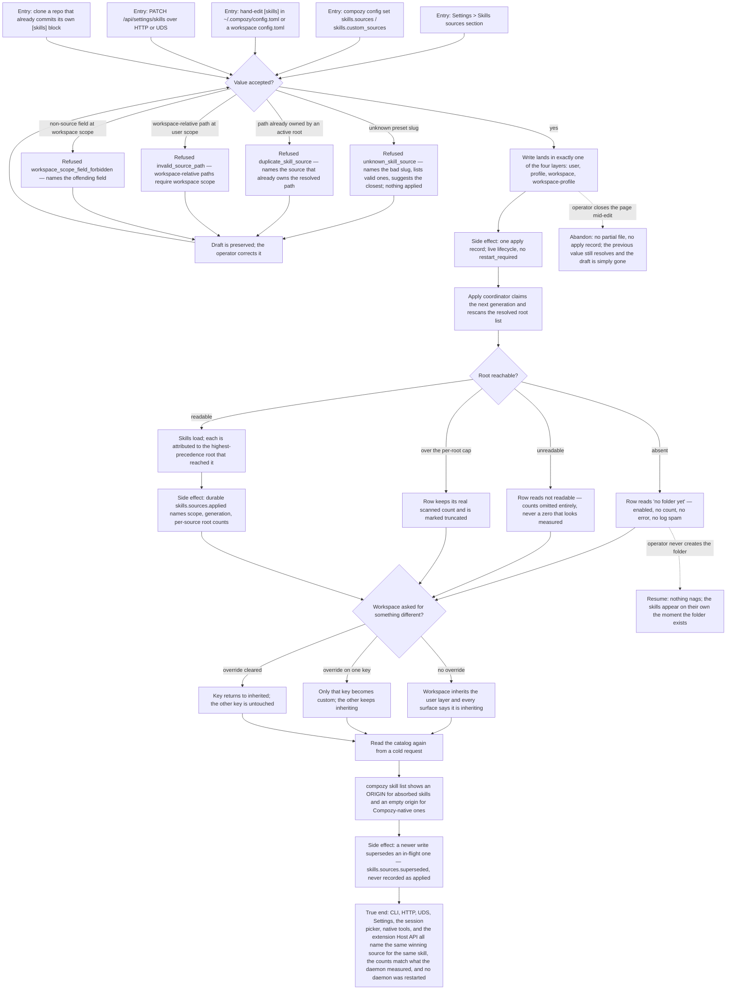

# J-absorb-skills-from-other-tools — Use the skills I already wrote for another tool

Someone already keeps skills in `~/.agents/skills`, `~/.claude/skills`, or a team folder. They point
CompozyOS at those folders — from Settings, from the CLI, or by editing the config file — and the
skills show up in Compozy's own catalog, labelled with where they came from. Nothing is copied,
nothing is restarted, and one workspace can decide differently from the rest without leaking that
choice anywhere else.



```yaml
journey:
  id: J-absorb-skills-from-other-tools
  name: "Use the skills I already wrote for another tool"
  value_statement: "The skills I keep in another tool's folder become usable in Compozy, labelled with where they came from, without copying them or restarting anything."
  personas: [Dora, Bruno, Ada]
  entry_points:
    - url: "Web: /settings/skills — sources section at user, profile, workspace, workspace-profile, and agent scope"
      origin: in-app-nav
    - url: "CLI: compozy config get|set|unset skills.sources|skills.custom_sources --scope user|profile|workspace"
      origin: direct
    - url: "CLI: compozy skill sources, compozy skill sources -o json, compozy skill list, compozy skill list --source <tier>"
      origin: direct
    - url: "Files: [skills] sources / custom_sources in ~/.compozy/config.toml, a profile config, or <ws>/.compozy/config.toml"
      origin: direct
    - url: "HTTP and UDS: GET /api/settings/skills, PATCH /api/settings/skills"
      origin: direct
    - url: "Native and extension: compozy__config_get|set|unset, compozy__skill_list, extension Host API skills/list"
      origin: agent
  actions:
    - step: 1
      verb: "Turn on a folder convention the machine already uses, or add a team directory"
      expected_observable: "The save reports that it applied immediately, and the source's skill count appears without a reload or a restart."
    - step: 2
      verb: "Submit a value the product cannot accept"
      expected_observable: "A named refusal — unknown_skill_source with the closest match, duplicate_skill_source naming the owning source, or invalid_source_path explaining the scope rule — with the draft preserved and nothing applied."
    - step: 3
      verb: "Point at a folder that is absent, unreadable, or enormous"
      expected_observable: "Absent reads as 'no folder yet', unreadable shows no count at all, and an over-cap root keeps its real scanned count beside an explicit partial-scan statement."
    - step: 4
      verb: "Give one workspace a different source list from the rest"
      expected_observable: "Only that workspace changes; the surfaces say per key whether it is inherited or overridden, and returning one key to inherited leaves the other untouched."
    - step: 5
      verb: "Open a repository that already commits its own source configuration"
      expected_observable: "Its skills load for anyone who opens that workspace with default personal settings, and nothing personal is written back into the repository."
    - step: 6
      verb: "Read the catalog back from every surface"
      expected_observable: "Every surface names the same winning source for the same skill; Compozy-native skills carry an explicit empty origin and never gain an invented provider label."
  goal:
    observable: "Skills from the operator's existing folders are in the Compozy catalog, attributed to the source that supplied them, under exactly the source policy that was written."
    side_effects: [config-file-written-in-one-layer, apply-record-created, skills-sources-applied-event, skills-sources-superseded-event, catalog-generation-swapped, session-command-revision-broadcast]
  true_end_state: "A cold read of CLI, HTTP, UDS, Settings, the session picker, native tools, and the extension Host API agrees on the same skills and the same winning origin for each; measured counts match the daemon's own measurement; the daemon was never restarted; and repository files are byte-identical unless the operator edited them."
  exit:
    natural: "The operator goes back to work in a session where their existing skills are simply available."
  abandonment:
    - at_step: 1
      how: "The operator starts editing the sources section, then navigates away or closes the page."
      resume: "No partial config file and no apply record; the previous value still resolves and the abandoned draft is gone rather than half-saved."
    - at_step: 3
      how: "The operator adds a folder that does not exist yet and never creates it."
      resume: "Nothing nags and nothing errors; the skills appear on the next refresh the moment the folder exists."
    - at_step: 4
      how: "The operator sets a workspace override and then forgets which workspace has it."
      resume: "Each workspace's surfaces state their own inheritance per key, so the answer is readable without remembering."
  crosses: [J-diagnose-skill-sources, J-use-absorbed-skills-in-a-session, J-operate-skill-sources-headless, J-layer-profile-resources, config-overlay, skill-scanner, resource-authority, CLI, HTTP, UDS, Web settings, native-tools, extension-host-api]
```
