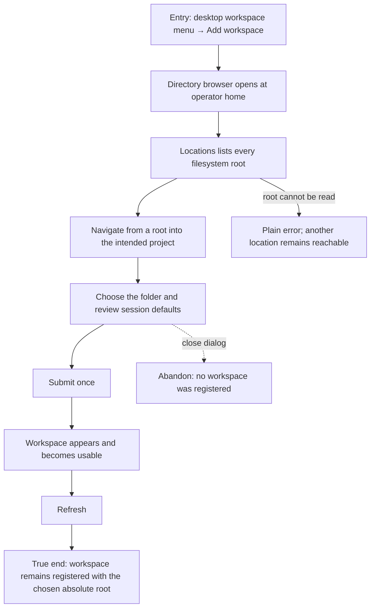

# J-add-workspace-by-browsing: Add a workspace from any local filesystem root



```yaml
journey:
  id: J-add-workspace-by-browsing
  name: "Add a workspace from any local filesystem root"
  value_statement: "A person can discover and register a project outside their home directory without knowing or typing its absolute path."
  personas: [Lea, Dora]
  entry_points:
    - url: "desktop workspace menu → Add workspace"
      origin: in-app-nav
    - url: "first-run workspace setup"
      origin: direct
  actions:
    - step: 1
      verb: "Open the workspace directory browser"
      expected_observable: "The current path, home action, and every filesystem root are visible."
    - step: 2
      verb: "Choose a filesystem root and navigate to a project"
      expected_observable: "The browser reads that absolute path and keeps other roots reachable."
    - step: 3
      verb: "Choose the project and submit"
      expected_observable: "One workspace is registered only after submit."
    - step: 4
      verb: "Refresh and return to the workspace"
      expected_observable: "The chosen absolute root remains registered and usable."
  goal:
    observable: "A project on any discoverable local root becomes one usable workspace."
    side_effects: [workspace-registered]
  true_end_state: "A fresh catalog read contains one workspace with the chosen root; closing before submit creates none."
  exit:
    natural: "The operator starts work in the registered workspace."
  abandonment:
    - at_step: 3
      how: "The operator closes the dialog after browsing."
      resume: "A later open starts from durable catalog state with no half-created workspace."
  crosses: [filesystem-browse, HTTP, UDS, onboarding, workspace-catalog]
```
