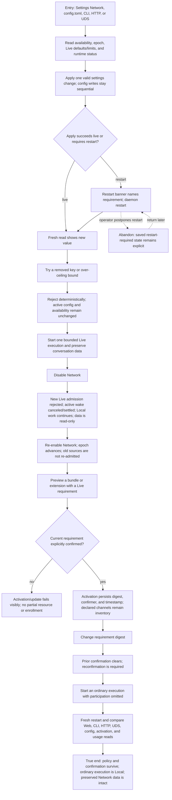

# Administer Network availability and Live policy without enrollment

An administrator changes availability and finite Live defaults/limits, observes a safe disable/re-enable transition, and activates Network-aware extension resources only after explicit confirmation. The true end is a fresh restart where every structured and visual surface agrees, preserved data remains readable, and an ordinary execution is still Local.



```yaml
journey:
  id: J-administer-network-live
  name: "Administer Network availability and Live policy without enrollment"
  value_statement: "An administrator can govern whether Live exists, bound its defaults, and confirm extension requirements without any setting or activation silently enrolling work."
  personas: [Bruno, Ada]
  entry_points:
    - url: "web /settings/network and bundle/extension activation surfaces"
      origin: in-app-nav
    - url: "config.toml; agh config/network/bundle verbs; HTTP/UDS settings, status, coordination, and bundle endpoints"
      origin: direct
  actions:
    - step: 1
      verb: "Inspect and update finite Live defaults/limits"
      expected_observable: "Supported values round-trip through Web, config, CLI, HTTP, and UDS; restart-required changes are explicit; removed keys and over-ceiling bounds fail without partial apply"
    - step: 2
      verb: "Disable and re-enable Network around active and Local work"
      expected_observable: "New Live requests fail clearly, in-flight provider work cancels and settles truthfully, Local work continues, preserved data stays readable, and re-enable does not replay old sources"
    - step: 3
      verb: "Preview and activate a Network-aware bundle or extension"
      expected_observable: "A current Live requirement needs explicit confirmation; decline or stale digest fails visibly without partial activation, while declared channels never select participation"
    - step: 4
      verb: "Compare all status and persistence surfaces after restart"
      expected_observable: "Availability epoch, disabled/ready/active state, settings, confirmation evidence, and usage agree; an omitted participation request still resolves Local"
  goal:
    observable: "Administrative policy and extension confirmation are durable, consistent, bounded, and never act as enrollment"
    side_effects: [network-availability-epoch-advanced, active-wake-settled, live-policy-persisted, activation-confirmation-persisted]
  true_end_state: "After a daemon restart, Web, CLI, HTTP, UDS, and config reads agree on availability and finite bounds; preserved conversation data remains intact; stale requirement confirmation is not accepted; and a new ordinary execution is Local with zero Network usage."
  exit:
    natural: "The administrator leaves Network ready or disabled with the state and consequences visible."
  abandonment:
    - at_step: 1
      how: "A restart-required settings change is saved but the administrator postpones restart."
      resume: "The banner remains visible, current runtime state stays truthful, and restarting later applies exactly the saved values once."
  crosses: [settings-web, config-lifecycle, status, availability-store, live-admission, provider-cancellation, usage-ledger, extensions, bundles, hooks, native-tools, cli-http-uds-parity]
```
