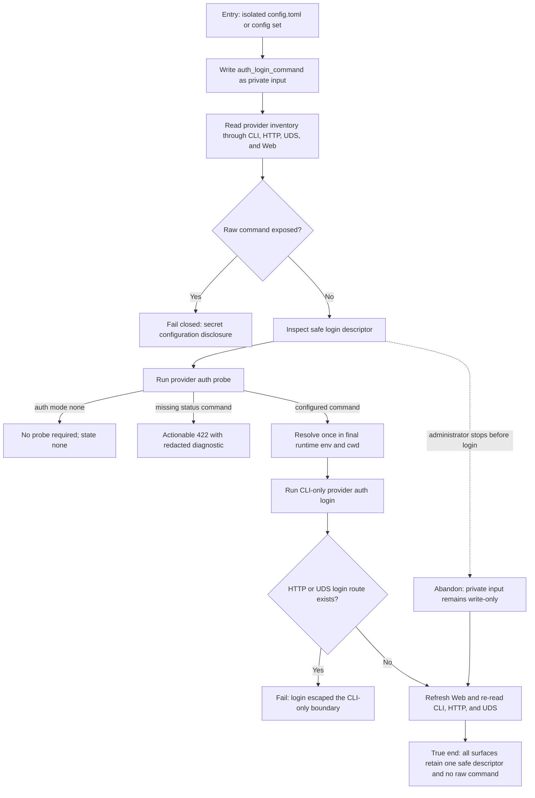

# J-administer-provider-auth — Configure and verify provider authentication safely

This journey follows a runtime administrator from a private provider login configuration through
public inventory, status probing, and the CLI-only login action. It ends only when every read surface
agrees on the safe descriptor and no route, command output, or refreshed Web view exposes the private
command, its arguments, environment prefix, or resolved executable path.



```yaml
journey:
  id: J-administer-provider-auth
  name: "Configure and verify provider authentication safely"
  value_statement: "A runtime administrator can configure, inspect, probe, and run provider authentication without exposing the private login command."
  personas: [Dora]
  entry_points:
    - url: "CLI: compozy config set and compozy provider status/doctor/auth login"
      origin: direct
    - url: "HTTP and UDS provider inventory and auth probe routes"
      origin: direct
    - url: "Web Settings > Providers"
      origin: in-app-nav
  actions:
    - step: 1
      verb: "Configure a provider login command as write-only input"
      expected_observable: "The mutation succeeds without echoing the command, arguments, environment prefix, or resolved path."
    - step: 2
      verb: "Inspect provider inventory and detail through every read surface"
      expected_observable: "Each surface shows only configured state, source, executable basename, presence, and recommended action; unknown providers return actionable not-found guidance."
    - step: 3
      verb: "Probe provider authentication"
      expected_observable: "The exact prepared runtime resolves once and returns a redacted terminal classification; auth mode none needs no subprocess and a missing status command returns 422."
    - step: 4
      verb: "Run the provider login action from the CLI"
      expected_observable: "The CLI executes the configured action internally with only supported control flags and never prints the private command."
    - step: 5
      verb: "Refresh and compare independent read paths"
      expected_observable: "Web, CLI, HTTP, and UDS still agree on the safe descriptor, and HTTP/UDS expose no login endpoint."
  goal:
    observable: "Provider authentication is operable while the private login command remains write-only across every public read path."
    side_effects: [private-provider-config-updated, provider-auth-probe-run, cli-login-action-run]
  true_end_state: "After a Web refresh and fresh CLI, HTTP, and UDS reads, every surface agrees on one safe descriptor, the raw command remains absent, and login remains CLI-only."
  exit:
    natural: "The administrator leaves the provider detail with truthful readiness and a safe next action."
  abandonment:
    - at_step: 4
      how: "The administrator chooses not to execute the interactive login action."
      resume: "A later status/detail read still shows only the safe descriptor and recommended action; the private command remains configured but unreadable."
  crosses: [config-lifecycle, provider-runtime, prepared-launcher, cli, http, uds, web-settings]
```
