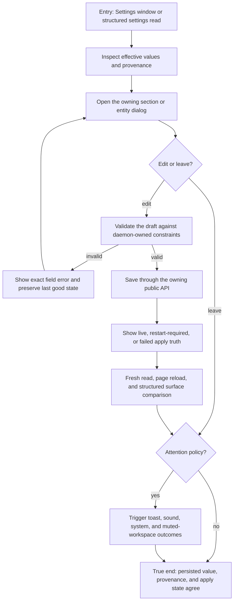

# J-administer-runtime-settings — Inspect and change runtime settings safely

A runtime administrator moves between settings sections, understands the effective value and apply
lifecycle, changes one bounded field, and proves that save, cancel, validation, and reload preserve
daemon truth.



```yaml
journey:
  id: J-administer-runtime-settings
  name: "Inspect and change runtime settings safely"
  value_statement: "I can change runtime policy without guessing which value is active, whether it applied, or whether cancel wrote anything."
  personas: [Dora]
  entry_points:
    - url: "web Settings window"
      origin: in-app-nav
    - url: "CLI, HTTP, UDS, and native configuration surfaces"
      origin: direct
    - url: "config.toml [attention]; compozy config get/set attention.*; GET/PATCH /api/settings/attention over HTTP or UDS"
      origin: direct
  actions:
    - step: 1
      verb: "Inspect a settings section and its effective provenance"
      expected_observable: "The UI and structured read agree on value, scope, source, and editable ownership"
    - step: 2
      verb: "Edit one field, exercise validation, then cancel"
      expected_observable: "Invalid input names the field; cancel leaves persisted and effective state unchanged"
    - step: 3
      verb: "Save a valid change"
      expected_observable: "The owning API reports the truthful apply lifecycle and never implies an unsupported live apply"
    - step: 4
      verb: "Reload and compare structured output"
      expected_observable: "Persisted value, active value, and restart requirement still agree"
    - step: 5
      verb: "Exercise each attention channel and workspace mute"
      expected_observable: "Toast, sound, system permission, and mute behavior reflect the persisted live policy without claiming unavailable delivery"
  goal:
    observable: "The intended setting is durable and its runtime apply state is explicit across Web and agent-manageable surfaces"
    side_effects: [config-persisted, runtime-apply-attempted]
  true_end_state: "After a fresh read, only the intended scope changed and the daemon reports the same effective value and apply state the Web renders."
  exit:
    natural: "The administrator returns to the settings index with a truthful saved state."
  abandonment:
    - at_step: 2
      how: "Close the dialog or navigate away before saving."
      resume: "Reopen the section; the prior effective configuration remains authoritative."
  crosses: [settings-web, config-lifecycle, HTTP, UDS, CLI, native-tools, observability]
```

design_reference:
  locked_root: "docs/design/opendesign/herdr-parity/"
  visual_contracts:
    - "task_03 VC-21..VC-23 — herdr-parity-settings-attention.html"
  judgment_rule: "Judge the Attention section against the locked board while daemon values and real browser permission state remain authoritative."
