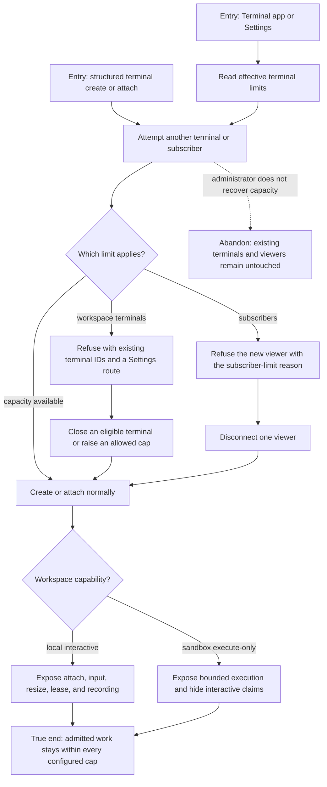

# J-administer-terminal-capacity — Recover from terminal limits without false capability claims

An administrator reaches each configured terminal limit, sees the exact bounded resource and safe
recovery action, and can distinguish a full local terminal from sandbox execute-only behavior.



```yaml
journey:
  id: J-administer-terminal-capacity
  name: "Recover from terminal limits without false capability claims"
  value_statement: "I know exactly which terminal resource is full, how to recover it safely, and which controls the current workspace can truly support."
  personas: [Dora]
  entry_points:
    - url: "Terminal app, terminal Settings, CLI, HTTP, UDS, and native terminal surfaces"
      origin: direct
  actions:
    - step: 1
      verb: "Reach the workspace terminal limit"
      expected_observable: "Creation refuses with the blocking cap, existing terminal IDs, and a safe recovery route."
    - step: 2
      verb: "Reach the subscriber limit"
      expected_observable: "Only the excess viewer is refused and existing subscribers keep their streams."
    - step: 3
      verb: "Recover capacity and retry"
      expected_observable: "The next operation succeeds without evicting or mutating unrelated terminal work."
    - step: 4
      verb: "Compare local and sandbox workspaces"
      expected_observable: "Local work advertises interactive features; sandbox work advertises only bounded execution."
  goal:
    observable: "Limits fail closed with actionable reasons and capability surfaces never promise an unsupported terminal mode."
    side_effects: [limit-rejection-emitted, capacity-released, terminal-operation-admitted]
  true_end_state: "After recovery, admitted terminal and subscriber counts match the effective policy, while sandbox surfaces remain execute-only."
  exit:
    natural: "The administrator resumes work after freeing or validly increasing capacity."
  abandonment:
    - at_step: 3
      how: "Leave the refusal without closing a terminal or viewer."
      resume: "The next attempt re-reads current capacity and gives the same truthful refusal until space exists."
  crosses: [terminal-config, admission-control, subscriber-cap, capabilities, sandbox, settings]
```
