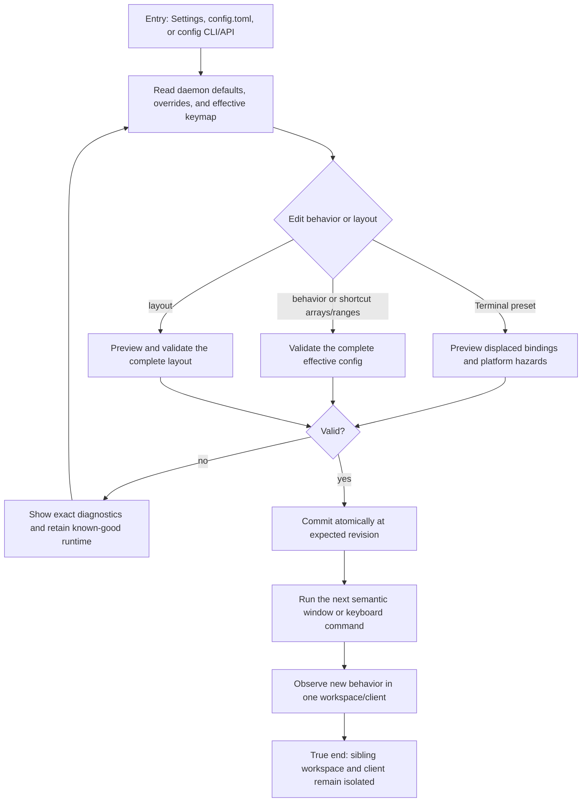

# J-administer-window-manager — Tune window behavior without partial state

An operator edits global window-manager behavior and a workspace layout, validates both before
commit, and confirms accepted values affect the next semantic command while invalid values retain the
known-good runtime.



```yaml
journey:
  id: J-administer-window-manager
  name: "Tune window behavior without partial state"
  value_statement: "An operator can customize snapping, layout, focus, gaps, shortcuts, and edge bindings while preserving one validated runtime authority."
  personas: [Bruno, Ada]
  entry_points:
    - url: "Settings / Window Management"
      origin: direct
    - url: "config.toml [window_manager]"
      origin: direct
    - url: "compozy config get/set window_manager.shortcuts; GET/PATCH /api/settings/window-manager over HTTP or UDS"
      origin: direct
    - url: "compozy layout export|validate|apply"
      origin: direct
  actions:
    - step: 1
      verb: "Read behavior defaults, overrides, effective shortcuts, and the workspace layout"
      expected_observable: "Settings, CLI, HTTP, UDS, and the daemon snapshot expose the same supported values, effective bindings, and revision."
    - step: 2
      verb: "Edit snapping, gaps, focus, shortcut arrays or ranges, bindings, a preset, or a declarative layout"
      expected_observable: "The UI keeps the draft local and exposes conflict, platform-hazard, preset, or layout validation before commit."
    - step: 3
      verb: "Submit an invalid draft"
      expected_observable: "Stable diagnostics name each invalid path; no runtime value, topology, revision, event, or history entry changes."
    - step: 4
      verb: "Correct and save the complete draft"
      expected_observable: "The configuration, exact pre-preset state, or layout commits once and the next semantic command uses it without daemon restart."
    - step: 5
      verb: "Observe a sibling workspace and second client"
      expected_observable: "Global defaults apply as documented, workspace overrides do not leak, and client presentation remains independent."
  goal:
    observable: "Only a complete valid configuration becomes active, and its scope is visible on the next command."
    side_effects: [config-persisted, runtime-hot-applied, layout-revision-advanced]
  true_end_state: "The accepted behavior is active, the prior valid state is recoverable, and unrelated workspace/client state is unchanged."
  exit:
    natural: "The operator returns to the desktop with validated behavior active."
  abandonment:
    - at_step: 2
      how: "The operator discards the draft."
      resume: "The active configuration and topology remain unchanged."
    - at_step: 3
      how: "Validation blocks the save."
      resume: "The exact diagnostic path identifies the correction without a partial apply."
  crosses: [settings, config-lifecycle, window-manager, resources, workspace-isolation]
```

design_reference:
  locked_root: "docs/design/opendesign/herdr-parity/"
  visual_contracts:
    - "task_05 VC-01..VC-06 — herdr-parity-settings-shortcuts.html"
  judgment_rule: "Judge the shortcut table, diagnostics, and Terminal preset against the locked board; the daemon effective keymap owns every rendered chord."
