# J-adopt-extension-profiles — Install a working context and choose where it is switched on

An operator installs an extension that ships a whole working context: it declares a profile, places
some resources into it, leaves others machine-wide, and asks for the credentials it needs. The
install summary says all of that before anything happens. Afterwards the operator decides, per
profile, what is on — extensions and notification presets alike — and the extension never undoes
that decision.

```mermaid
flowchart TD
  A1[Entry: marketplace extension page] --> B[Read the install preview]
  A2[Entry: compozy extension install] --> B
  A3[Entry: POST /api/extensions/preview-install] --> B
  B --> C[Preview names each declared profile as create or bind, its credential asks, and each resource's placement]
  C --> D{Confirm?}
  D -->|no| X1[Abandon: nothing installed, no profile created, no marker written]
  D -->|yes| E{Declared name already exists?}
  E -->|yes| E1[Bind only — identity, defaults, and credential asks are never seeded onto an operator-owned profile]
  E -->|no| E2[Create exactly once, without activating it, from the accepted seed snapshot]
  E1 --> F
  E2 --> F[Side effect: create-once marker per installed instance and name; needs-setup requirements recorded durably]
  F --> G{Credential asks filled?}
  G -->|no| G1[Profile is flagged needs-setup on list, detail, and the palette row; use fails closed with a plain message]
  G -->|yes| H
  G1 --> G2[Operator sets the profile secret in the vault] --> H[Resources publish where their placement says]
  H --> I{Placement names a profile that does not exist?}
  I -->|yes| I1[Dormant: hidden from the active catalog, shown as dormant in detail and preview with a create action]
  I1 --> I2[Operator creates that name] --> J
  I -->|no| J[Effective visibility = enabled in this profile AND placement matches]
  J --> K{Change what is on here?}
  K -->|extension enable / disable| K1[One exception row for this profile only; other profiles keep their state]
  K -->|notification preset enable / disable| K2[Same shape: shared library, per-profile exception rows]
  K1 --> L
  K2 --> L[Side effect: enablement event, palette catalog revision invalidated, delivery skips the preset only where it is off]
  L --> M{Extension updated, daemon restarted, or extension disabled?}
  M -->|any of them| M1[No declared profile is re-created; an update introducing a new declared profile creates only that one]
  M --> N{Operator archived or deleted the declared profile?}
  N -->|yes| N1[Never resurrected by boot, update, enable, or repair]
  N -->|no| O
  M1 --> O
  N1 --> O{Uninstall?}
  O -->|yes| O1[The profile, its work, its config, and its credentials stay; needs-setup requirements stay because they describe the profile]
  O -->|no| Z
  O1 --> Z[True end: the operator's per-profile decisions survive every extension lifecycle event, and CLI, HTTP, UDS, native tools, web detail, inventory, and the palette all report the same effective state]
  G1 -.->|operator never fills the credential| X2[Resume: the profile stays usable for everything else and needs-setup keeps pointing at the exact vault path]
```



```yaml
journey:
  id: J-adopt-extension-profiles
  name: "Install a working context and choose where it is switched on"
  value_statement: "An extension can hand me a ready-made working context, and I stay the one who decides which of my contexts it applies to — permanently."
  personas: [Bruno, Vera, Ada]
  entry_points:
    - url: "Web marketplace extension page, install confirmation, and extension detail"
      origin: in-app-nav
    - url: "CLI: compozy extension install|enable|disable|list, compozy profile create"
      origin: direct
    - url: "CLI: compozy notification-preset list|enable|disable"
      origin: direct
    - url: "HTTP and UDS: POST /api/extensions/preview-install, POST /api/extensions, GET|PUT /api/extensions/{name}/enablement, GET /api/notifications/presets, PUT /api/notifications/presets/{name}/enablement"
      origin: direct
    - url: "Web Settings → Hooks, Notification presets panel"
      origin: in-app-nav
    - url: "Native: compozy__extensions_enable|disable and the palette catalog inside a session"
      origin: agent
  actions:
    - step: 1
      verb: "Read the install preview"
      expected_observable: "It names every declared profile as create or bind, the credentials each will ask for, and where each resource lands — and changes no state."
    - step: 2
      verb: "Confirm the install"
      expected_observable: "Missing declared profiles are created exactly once without activating anything, an existing name is bound and never modified, and the summary names what was created."
    - step: 3
      verb: "Look at a created profile before filling its credentials"
      expected_observable: "It is flagged needs-setup on list, detail, and the palette row, and the flag names the exact vault path that clears it."
    - step: 4
      verb: "Set the asked-for secret"
      expected_observable: "Needs-setup clears and stays cleared across restart, extension update, and uninstall."
    - step: 5
      verb: "Adopt a dormant placement"
      expected_observable: "A resource placed in an absent profile is hidden and shown as dormant with a create action; creating that name publishes it there and changes no other profile."
    - step: 6
      verb: "Turn the extension off in one profile"
      expected_observable: "Only that profile loses its resources and palette contributions; the others keep them, one exception row is stored, and every surface reports the same effective state."
    - step: 7
      verb: "Turn a notification preset off in one profile"
      expected_observable: "The shared preset library is unchanged, only that profile stores the exception, and delivery skips the preset only there."
    - step: 8
      verb: "Update, restart, disable, and finally uninstall the extension"
      expected_observable: "No declared profile is ever re-created or mutated, an archived or deleted one is never resurrected, and uninstall leaves the profile with its work, config, and credentials."
  goal:
    observable: "Declared profiles are created once and only once, placements and enablement decide visibility together, and the operator's lifecycle decisions always win over the extension's."
    side_effects: [profile-created-from-seed-snapshot, create-once-marker-written, credential-requirements-recorded, enablement-exception-row-written, palette-catalog-revision-invalidated, extension-profile-created-event]
  true_end_state: "After the full extension lifecycle, the operator's per-profile enablement and preset decisions still hold, needs-setup reflects the vault truth, and CLI, HTTP, UDS, native tools, web detail, inventory, and the palette all agree."
  exit:
    natural: "The operator works in the profile the extension set up, with only the resources they chose to keep on."
  abandonment:
    - at_step: 2
      how: "The operator declines the install confirmation."
      resume: "Nothing is installed, no profile is created, and no marker exists — a later install still offers to create it."
    - at_step: 3
      how: "The operator never fills the declared credential."
      resume: "The profile stays usable for everything else and needs-setup keeps naming the exact vault path."
    - at_step: 5
      how: "The operator ignores a dormant placement."
      resume: "It stays hidden with no nagging and publishes the moment a profile with that name exists."
  crosses: [J-operate-profiles, J-layer-profile-resources, J-command-profiles-from-palette, J-extension-distribution, J-extension-kit-lifecycle, extension-manifest-chain, install-pipeline, kit-publish, vault, notifications, cmdpalette-projection, CLI, HTTP, UDS, Web, native-tools]
```
