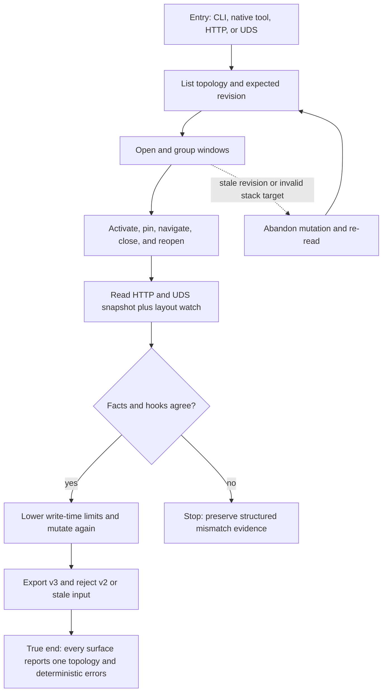

# J-agent-manage-window-tabs — Manage tab topology through structured surfaces

An autonomous agent discovers the current revision, applies the tab lifecycle through CLI or native
tools, verifies HTTP/UDS parity and hooks, and recovers deterministically from invalid or stale
commands.



```yaml
journey:
  id: J-agent-manage-window-tabs
  name: "Manage tab topology through structured surfaces"
  value_statement: "An agent can manage tabs without the web UI and can trust every public surface to expose one deterministic contract."
  personas: [Ada]
  entry_points:
    - url: "compozy window list|group|activate|pin|unpin|navigate|close|reopen"
      origin: direct
    - url: "compozy__window_manager native tools"
      origin: direct
    - url: "/api/workspaces/{workspace_id}/window-manager over HTTP and UDS"
      origin: direct
    - url: "skills/compozy/references/window-management.md and configuration docs"
      origin: direct
  actions:
    - step: 1
      verb: "Read the topology, client view, and current revision"
      expected_observable: "Structured output exposes stack identity, order, active member, pins, navigation depth, and closed-entry count."
    - step: 2
      verb: "Apply the tab lifecycle at the expected revision"
      expected_observable: "Each command commits once and CLI, HTTP, UDS, native tools, stream frames, and hooks converge."
    - step: 3
      verb: "Submit not-stacked, pinned-close, and stale-revision commands"
      expected_observable: "Stable reason codes reject the command without topology, history, or hook side effects."
    - step: 4
      verb: "Change write-time limits and exercise raw-layout recovery"
      expected_observable: "New mutations enforce the live limits; v3 round-trips and v2 is rejected without compatibility fallback."
  goal:
    observable: "All structured surfaces report the same committed topology and the same deterministic failures."
    side_effects: [tab-hooks-emitted, config-hot-applied, v3-layout-exported]
  true_end_state: "The agent can re-read the authoritative state, explain every rejection, and continue at the newest revision."
  exit:
    natural: "The agent releases the topology after confirming HTTP/UDS/CLI/native parity."
  abandonment:
    - at_step: 3
      how: "A stale revision rejects the mutation."
      resume: "The agent re-lists state, recomputes intent, and retries once at the new revision."
  crosses: [cli, http, uds, native-tools, hooks, config-lifecycle, docs, workspace-isolation]
```
