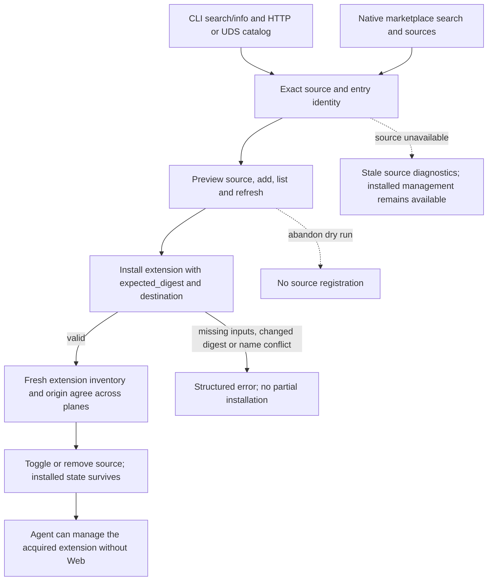

# J-agent-marketplace-parity: Manage sources and acquire extensions through structured surfaces

Current Marketplace hard-cut journey. Final execution and visual evidence belong to task_10; historical run reports remain unchanged.



```yaml
journey:
  id: J-agent-marketplace-parity
  name: Manage sources and acquire extensions through structured surfaces
  value_statement: "Acquire and manage one extension with an explicit origin and truthful installed state."
  personas: [Ada]
  entry_points:
    - url: "compozy marketplace search [query] -o json; compozy marketplace info <entry_id> [--source <name>] -o json"
      origin: direct
    - url: "compozy marketplace sources list|add|remove|refresh -o json; compozy marketplace refresh -o json"
      origin: direct
    - url: "GET /api/marketplace; GET /api/marketplace/entries/{entry_id}; POST /api/marketplace/refresh over HTTP and UDS"
      origin: direct
    - url: "GET/POST /api/marketplace/sources; PATCH/DELETE /api/marketplace/sources/{name}; POST /api/marketplace/sources/{name}/refresh over HTTP and UDS"
      origin: direct
    - url: "compozy__marketplace_search; compozy__marketplace_sources"
      origin: direct
  actions:
    - step: 1
      verb: "Read catalog and sources through supported planes"
      expected_observable: "CLI, HTTP, UDS and native read tools expose the same daemon state and experimental source metadata."
    - step: 2
      verb: "Add and manage a fixture source"
      expected_observable: "Dry-run does not persist; errors retain code, suggested_name, retained_by and checked paths; config set toggles immediately."
    - step: 3
      verb: "Install with the approved digest"
      expected_observable: "CLI uses extension install; HTTP/UDS use POST /api/extensions; missing inputs or changed digest write no partial installation."
    - step: 4
      verb: "Compare fresh state and remove registration"
      expected_observable: "Inventory and origin agree; removing a source preserves installed extensions and rejects takeover of retained source names."
  goal:
    observable: "An agent-acquired extension is indistinguishable from a Web-acquired extension in current management reads. Retired Marketplace kind and MCP-install routes do not dispatch acquisition."
    side_effects: [source-registration, extension-installed, scoped-input-bindings]
  true_end_state: "An agent-acquired extension is indistinguishable from a Web-acquired extension in current management reads. Retired Marketplace kind and MCP-install routes do not dispatch acquisition."
  exit:
    natural: Return to the interrupted session
  abandonment:
    - at_step: 2
      how: Close source preview before Add
      resume: No registration; preview the ref again
    - at_step: 3
      how: Cancel install confirmation
      resume: No installed instance; reopen the exact source entry
  crosses: [cli, httpapi, udsapi, native-tools, marketplace-api, settings-api, vault, workspaces, extensions]
```

Coverage: happy path, exact identity and parity, degraded/off/empty sources, validation and digest races, cancellation, destination isolation, keyboard access and narrow windows. Human visual coverage uses Bruno/Marina; Ada owns deterministic structured output. Retired per-kind acquisition is outside the current contract.
