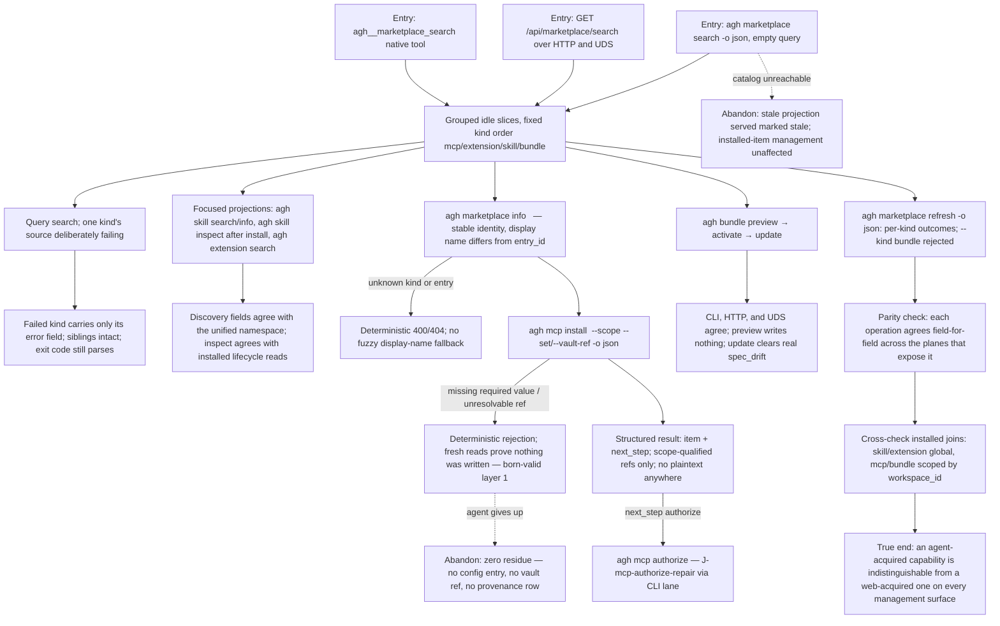

# J-agent-marketplace-parity: Acquire capabilities entirely through structured surfaces

The ADR-009/SD-011 promise walked as one journey: an agent (Ada — non-human ACP actor) discovers, inspects, installs, and refreshes marketplace capabilities with no web UI, no TTY, and no browser. CLI structured output, HTTP, and UDS cover the lifecycle operations; the read-only `agh__marketplace_search` native tool covers discovery. Parity is the goal observable: **each supported plane reports the same daemon-owned state**, and every error is deterministic and parseable. The born-valid metric anchor applies on this plane identically: an incomplete install request writes nothing.



```yaml
journey:
  id: J-agent-marketplace-parity
  name: Acquire capabilities entirely through structured surfaces
  value_statement: "As an agent I discover and acquire exactly what a human can, in one structured call per step, with deterministic errors and no hidden web-only state."
  personas: [Ada]
  entry_points:
    - url: agh marketplace search|info|refresh -o json
      origin: direct
    - url: GET /api/marketplace/search|/{kind}|/{kind}/{entry_id} (HTTP + UDS)
      origin: direct
    - url: agh mcp install <entry> -o json
      origin: direct
    - url: agh skill search <query> -o json; agh skill info <entry_id> -o json; agh skill inspect <installed-name> -o json
      origin: direct
    - url: agh extension search <query> -o json
      origin: direct
    - url: agh bundle preview|activate|update -o json
      origin: direct
    - url: agh__marketplace_search (native tool)
      origin: direct
    - url: agh.network/runtime/core/marketplace
      origin: external-share
  actions:
    - step: 1
      verb: Discover across kinds with one structured call, idle and queried
      expected_observable: Fixed kind order, truthful totals only where the source reports them, per-kind error isolation, jsonl support
    - step: 2
      verb: Resolve detail by stable entry_id
      expected_observable: Identical typed detail across CLI, HTTP, UDS; deterministic 400/404 for invalid identity; never display-name resolution
    - step: 3
      verb: Exercise the focused skill and extension projections
      expected_observable: agh skill search/info and agh extension search preserve their documented fields from the unified namespace; agh skill inspect reads the installed skill lifecycle after acquisition
    - step: 4
      verb: Install a curated MCP entry with typed and vault-ref values
      expected_observable: Feed-locked template fields rejected on override; required-value gaps rejected with nothing written; success returns item + next_step
    - step: 5
      verb: Preview, activate, and update a bundle
      expected_observable: Preview is read-only; activation scope and inventory agree across CLI, HTTP, and UDS; a real spec_drift clears only after update re-apply
    - step: 6
      verb: Refresh feeds and read status
      expected_observable: Per-kind structured outcomes; bundle refresh deterministically rejected; stale state reported honestly
    - step: 7
      verb: Compare planes
      expected_observable: CLI structured output equals HTTP and UDS payloads for search, browse, detail, install result, auth status, and bundle lifecycle on one daemon state; native output matches search only
  goal:
    observable: Field-level parity across every supported plane — CLI/HTTP/UDS for lifecycle operations and CLI/HTTP/UDS/native for marketplace search
    side_effects: [capability-installed, marketplace-events-emitted, scoped-vault-refs-created]
  true_end_state: An agent-acquired capability reads identically to a web-acquired one on every management surface, and every rejected attempt provably wrote nothing (config, vault, provenance all clean on fresh reads)
  exit:
    natural: Structured management reads confirming the acquired capability
  abandonment:
    - at_step: 1
      how: Catalog source unreachable
      resume: Stale projection served and marked stale; installed-item management unaffected; a later refresh recovers
    - at_step: 3
      how: Agent abandons after a validation rejection
      resume: Zero residue; the same install request can be replayed after supplying the missing value
  crosses: [cli, httpapi, udsapi, native-tools, marketplace-api, settings-api, vault, workspaces, skills, extensions, bundles]
```

## Coverage notes (Task 10 planning)

- Taxonomy sweep: journeys (full structured acquisition), functional (payload equality, exit codes, identity resolution), edge/error/empty (kind failure isolation, invalid identity, empty results, stale catalog), cross-cutting (supported-plane parity; four-plane search plus CLI/HTTP/UDS lifecycle; workspace-scoped installed joins).
- Deliberate skip: experiential lenses — Ada is a non-human actor; determinism and parseability stand in for experience (consistent with her persona definition). Human experiential coverage of the same surfaces lives in J-marketplace-acquisition.
- ET-049 keeps its grandfathered J-20 link; the parity charter may settle it because `agh__marketplace_search` is in scope here.
