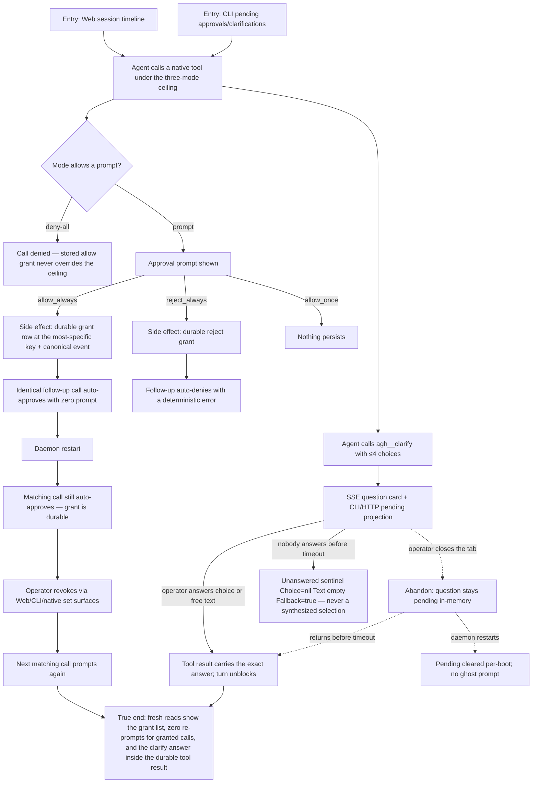

# J-answer-agent-requests — Answer an agent's requests once

An operator supervising a live session answers a native-tool approval prompt or an agent question
exactly once and is never asked the same thing again: `allow_always`/`reject_always` persist a
durable grant that survives daemon restart and is revocable, and `agh__clarify` blocks the agent
until the operator answers (or the timeout resolves the explicit unanswered sentinel). Covers
US-001 (D1, ADR-001) and US-002 (D7, ADR-001).



```yaml
journey:
  id: J-answer-agent-requests
  name: "Answer an agent's requests once"
  value_statement: "A decision I already made — approval or answer — is remembered, revocable, and never re-asked; an agent question blocks until I answer instead of dead-ending."
  personas: [Théo, Ada]
  entry_points:
    - url: "web session timeline (approval prompt / clarify question card via SSE)"
      origin: in-app-nav
    - url: "CLI: agh tool approvals set|list|revoke; agh session clarify pending|answer"
      origin: direct
    - url: "HTTP/UDS: /api/tool-approval-grants; /api/workspaces/:workspace_id/sessions/:session_id/clarifications"
      origin: direct
  actions:
    - step: 1
      verb: "Answer a native-tool approval prompt with allow_always"
      expected_observable: "A durable grant persists at the most-specific key (workspace+agent+tool+input_digest); the identical follow-up call runs with zero prompt round-trip"
    - step: 2
      verb: "Restart the daemon and repeat the call"
      expected_observable: "The grant still auto-approves; a non-matching agent or workspace still prompts; deny-all mode still denies"
    - step: 3
      verb: "Set one explicit agent-wide and one tool-wide decision, then revoke"
      expected_observable: "Wider grants exist only through explicit set surfaces (no input_digest), list identically across Web/CLI/HTTP/UDS/native, and revocation restores prompting"
    - step: 4
      verb: "Answer a live agh__clarify question"
      expected_observable: "The card shows the exact question and ≤4 choices; the answer lands in the tool result and unblocks the turn; a timeout resolves the unanswered sentinel"
  goal:
    observable: "Zero re-prompts for remembered decisions; the clarify answer is inside the durable tool result"
    side_effects: [approval-grant-persisted, canonical-grant-events, clarify-session-events]
  true_end_state: "After restart and fresh reads: the grant list matches on every surface, a matching call runs unprompted, a revoked key prompts again, and resolved/timeout clarify receipts remain in the transcript without leaking into another workspace."
  exit:
    natural: "The operator returns to watching the session; the agent continues with the approved tool or the answered question."
  abandonment:
    - at_step: 4
      how: "The operator never answers the clarify question."
      resume: "The configured timeout resolves the explicit unanswered sentinel (never a synthesized choice); pending state is per-boot, so a restart clears it without ghost prompts."
  crosses: [tool-approval-bridge, three-mode-policy, GlobalDB-grants, clarify-broker, SSE, Web-settings, CLI, HTTP, UDS, native-tools]
```
