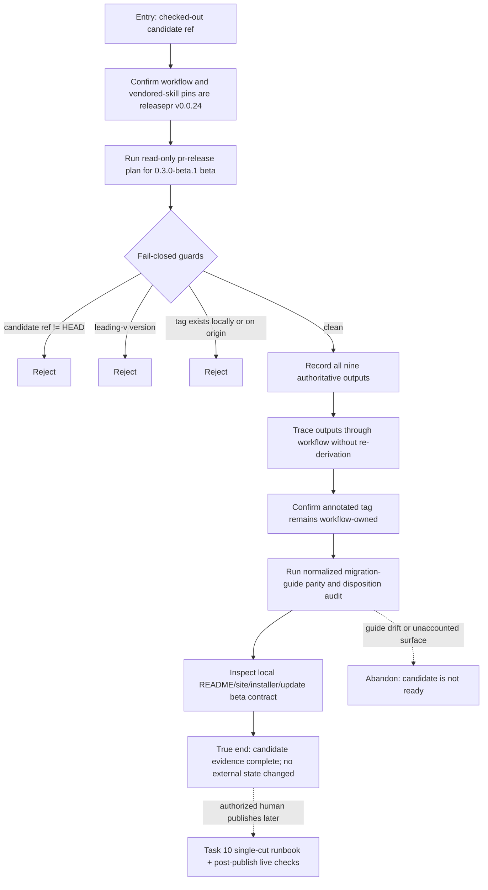

# J-approve-compozy-beta-candidate — Approve a read-only beta candidate without publishing

A release administrator validates the exact checked-out commit, normalized migration guidance, and
locally inspectable beta-channel contract. The planner is the sole policy authority; the workflow
owns tag creation. The journey ends before any tag push, registry upload, cosign acceptance, DNS
change, or live installer request.



```yaml
journey:
  id: J-approve-compozy-beta-candidate
  name: "Approve a read-only beta candidate without publishing"
  value_statement: "A release administrator can prove which commit, version, channel, and policy would ship while leaving every irreversible action untouched."
  personas: [Dora, Ada]
  entry_points:
    - url: ".github/workflows/release.yml; .agents/skills/releasepr/**"
      origin: direct
    - url: "pr-release plan --ref <candidate> --version 0.3.0-beta.1 --channel beta"
      origin: direct
    - url: "MIGRATION_GUIDE.md; packages/site/content/runtime/migration/**; make migration-guide-check"
      origin: direct
    - url: "README and locally built packages/site install/release surfaces"
      origin: in-app-nav
  actions:
    - step: 1
      verb: "Resolve both planner pins and validate the explicit candidate ref"
      expected_observable: "Both pins are github.com/compozy/releasepr@v0.0.24 and release_commit equals checked-out HEAD"
    - step: 2
      verb: "Exercise the planner's version and tag collision guards"
      expected_observable: "Leading-v input plus local and origin tag collisions fail before any tag or publication side effect"
    - step: 3
      verb: "Capture and trace the planner outputs"
      expected_observable: "release_ref, release_commit, release_version, release_tag, release_channel, github_prerelease, github_make_latest, npm_tag, and homebrew_skip_upload flow downstream without inference or recomputation"
    - step: 4
      verb: "Compare both migration guides and inspect the local beta install contract"
      expected_observable: "All eight normalized sections match, every audited legacy surface has a disposition, and local copy consistently offers the hosted beta, npm beta, and pinned Go paths without Homebrew"
  goal:
    observable: "A finite evidence set proves the exact pre-publish candidate and its truthful guide/install contract"
    side_effects: []
  true_end_state: "The candidate commit, planner outputs, workflow consumption, guide parity, and local beta-channel copy are recorded, while no tag, release, package, installer, signature, or DNS state was created or changed."
  exit:
    natural: "Hand the green pre-publish evidence to Task 10's authorized single-cut runbook."
  abandonment:
    - at_step: 2
      how: "The candidate ref, version, or tag state fails a planner guard."
      resume: "Resolve the candidate state and start a fresh read-only plan; never bypass the guard."
    - at_step: 4
      how: "Guide parity or the disposition ledger is incomplete."
      resume: "Correct the authoritative documentation before requesting another candidate session."
  crosses: [release-workflow, releasepr-skill, git-ref-policy, migration-guides, disposition-ledger, README, site, installer-contract, self-update-contract]
```

## Coverage contract

- Safety invariants: 10 and 15. Invariant 11 is documented as deferred, not executed.
- ADRs: ADR-005 and ADR-006.
- External boundary: Task 10 alone owns the later publish and post-publish registry, installer,
  Sigstore, and DNS checks.

