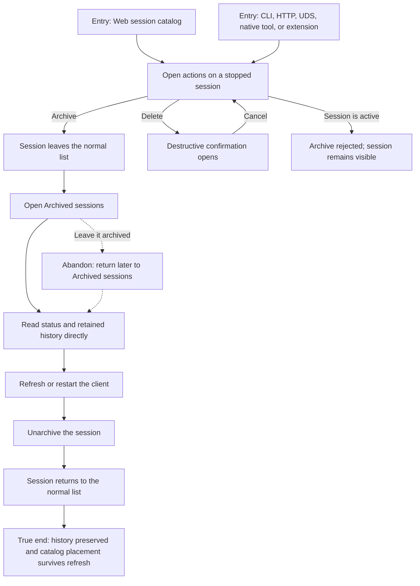

# J-archive-session-without-deleting — Hide a session without losing its history



```yaml
journey:
  id: J-archive-session-without-deleting
  name: "Archive a session without deleting it"
  value_statement: "I can remove finished work from my everyday session list, recover it later, and trust that none of its history was deleted."
  personas: [Théo, Cora, Ada]
  entry_points:
    - url: "Web session catalog or agent session list"
      origin: in-app-nav
    - url: "CLI, HTTP, UDS, native session tool, or extension Host API"
      origin: direct
  actions:
    - step: 1
      verb: "Open the actions menu for a stopped session and archive it"
      expected_observable: "The menu action completes without opening the session; the row leaves the normal list and appears under Archived"
    - step: 2
      verb: "Read the archived session and refresh the catalog"
      expected_observable: "Direct status and history reads still work; the archived placement survives a fresh read"
    - step: 3
      verb: "Unarchive the session"
      expected_observable: "The same session returns to the normal list with its lifecycle state and history unchanged"
    - step: 4
      verb: "Try to archive an active session and cancel a delete from the row menu"
      expected_observable: "Archive is rejected without moving the active row; canceling deletion preserves the session and catalog placement"
  goal:
    observable: "Normal and archived lists agree with durable catalog truth across every management surface"
    side_effects: [archive-marker-written, catalog-wake-emitted, workspace-cache-refetched]
  true_end_state: "After refresh, the unarchived session is back in the normal list with the same id and history; archived sessions remain recoverable and deleted sessions are the only sessions whose history disappears."
  exit:
    natural: "The operator continues from a quieter normal catalog or reopens the recovered session."
  abandonment:
    - at_step: 2
      how: "The operator leaves the session archived and closes Compozy."
      resume: "On return, the normal list still excludes it and Archived still exposes it with intact history."
  crosses: [GlobalDB, session-manager, HTTP, UDS, CLI, native-tools, extension-host-api, catalog-SSE, Web-cache, session-lists]
```

Taxonomy note: the journey covers the functional round trip, active-session error branch, delete
abandonment, refresh continuity, workspace isolation, keyboard-accessible row actions, and compact
layout. Provider execution is deliberately excluded because archive is valid only after a session is
stopped.
