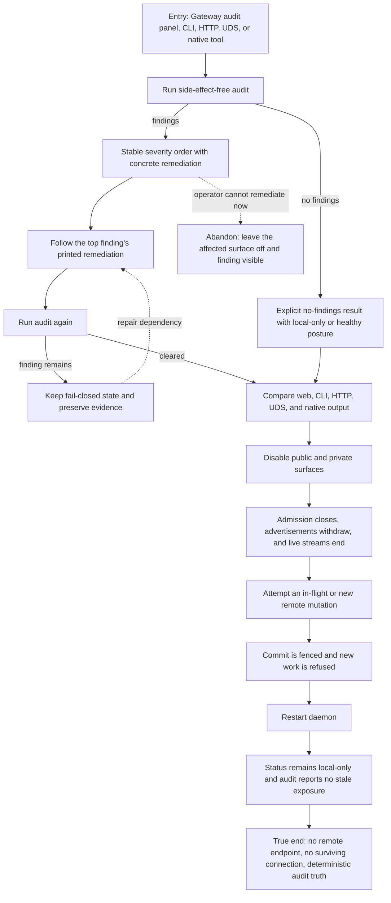

# J-audit-and-teardown-gateway: Audit and tear down gateway exposure

An operator asks every public control plane the same safety question, follows one finding's own remediation, then removes remote exposure and proves the daemon stayed local-only after restart.



```yaml
journey:
  id: J-audit-and-teardown-gateway
  name: Audit and tear down gateway exposure
  value_statement: "I can answer whether my daemon is safely exposed, repair it from the finding itself, and remove every remote path without trusting a stale green status."
  personas: [Dora, Ada, Iris]
  entry_points:
    - url: /settings/gateway
      origin: in-app-nav
    - url: compozy gateway audit -o json
      origin: direct
    - url: GET /api/gateway/audit over HTTP or UDS
      origin: direct
    - url: compozy__gateway action=audit
      origin: direct
  actions:
    - step: 1
      verb: Run the self-audit through each control plane
      expected_observable: All planes return the same stable ranking or explicit no-findings result without changing desired or observed state
    - step: 2
      verb: Follow one finding's printed remediation
      expected_observable: The remediation names an available operator or agent action and the next audit clears only when runtime truth changed
    - step: 3
      verb: Disable every exposed surface
      expected_observable: Admission closes and addresses withdraw immediately; public consent is not retained for a future enable
    - step: 4
      verb: Observe active remote work during teardown
      expected_observable: Streams terminate, an in-flight mutation cannot commit after revocation or withdrawal, and a new remote operation is refused
    - step: 5
      verb: Restart and inspect again
      expected_observable: Disabled intent survives restart, no endpoint is advertised, and audit contains no stale provider or surface claim
  goal:
    observable: Every structured surface agrees that no remote exposure remains and the last audit reflects the post-teardown runtime
    side_effects: [finding-remediated, exposure-intent-disabled, endpoints-withdrawn, streams-closed, audit-events-appended]
  true_end_state: After restart, fresh status and audit reads show local-only posture, no advertised address, no accepted remote connection, and no credential or pairing artifact in any output
  exit:
    natural: The operator leaves Gateway settings in a local-only, audited state
  abandonment:
    - at_step: 2
      how: The remediation depends on an unavailable provider account or external permission
      resume: Keep the affected surface off, retain the finding as visible posture, and retry only after the dependency is available
    - at_step: 3
      how: Teardown exceeds its bound or a provider refuses to stop
      resume: Admission remains closed and the audit reports degraded state; repair the provider before any re-enable
    - at_step: 5
      how: Restart cannot complete
      resume: Preserve the isolated home and logs, reap the lab processes, and resume from a fresh bootstrap rather than claiming teardown passed
  crosses: [web, cli, http, uds, native-tools, gateway-policy, connectivity-provider, connection-registry, events]
```

## Coverage notes

- Taxonomy sweep: journey and functional coverage compares all control planes, finding remediation, withdrawal, restart, and mutation fencing; experiential coverage requires actionable severity and no false green; edge coverage includes unavailable remediation, provider teardown failure, and restart interruption; cross-cutting coverage includes permission gates, actor attribution, and secret containment.
- Deliberate skip: responsive layout is owned by the Gateway settings journey; this cycle still checks the audit panel on the primary desktop viewport and through the screen-reader path in its owning charter.

