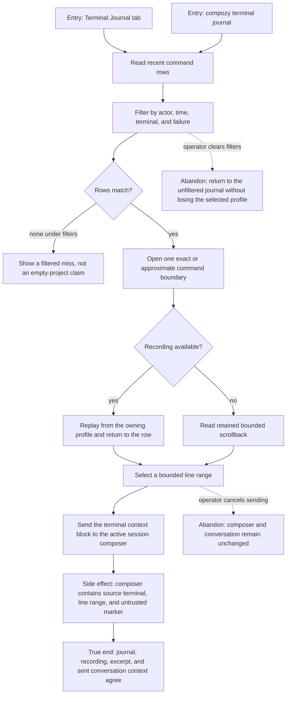

# J-audit-terminal-work — Trace terminal work and send trustworthy evidence to a conversation

An operator filters command history, understands approximate boundaries, replays a recording, and
sends a bounded terminal excerpt to a session without losing its source identity.



```yaml
journey:
  id: J-audit-terminal-work
  name: "Trace terminal work and send trustworthy evidence to a conversation"
  value_statement: "I can find what ran, replay what happened, and share the exact relevant lines with an agent while keeping the source clear."
  personas: [Dora, Marina]
  entry_points:
    - url: "Terminal Journal tab and recording player"
      origin: in-app-nav
    - url: "compozy terminal journal and compozy terminal quote"
      origin: direct
  actions:
    - step: 1
      verb: "Filter terminal history"
      expected_observable: "The server query changes, approximate boundaries are labeled, and a filtered miss is distinct from no history."
    - step: 2
      verb: "Replay a retained recording"
      expected_observable: "Playback uses the owning profile, states its retention, and returns to the same journal row."
    - step: 3
      verb: "Select bounded terminal lines"
      expected_observable: "The selection records a stable terminal id and inclusive human line range."
    - step: 4
      verb: "Send the excerpt to the active conversation"
      expected_observable: "The composer receives one removable terminal_context block whose source and untrusted status survive send."
  goal:
    observable: "History, replay, CLI output, and conversation evidence point to the same terminal command and owner."
    side_effects: [journal-query-issued, recording-read, terminal-context-staged, conversation-message-sent]
  true_end_state: "The sent conversation contains the exact bounded terminal evidence with its source identity, while the journal and recording remain independently re-readable."
  exit:
    natural: "The operator continues the conversation with the terminal evidence attached."
  abandonment:
    - at_step: 4
      how: "Remove the staged quote or leave the session before sending."
      resume: "The conversation remains unchanged; select and stage the terminal range again."
  crosses: [journal, recordings, profile-scope, terminal-scrollback, session-composer, CLI]
```
