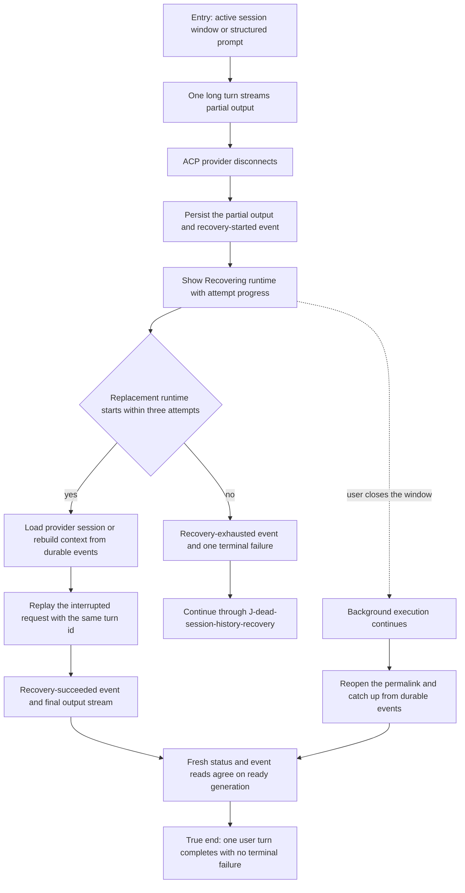

# J-automatic-runtime-recovery — Continue a turn after the provider disconnects

A returning session user keeps a long agent run open while the ACP provider process disconnects.
Compozy preserves the partial answer, replaces the provider runtime, restores the durable context,
and completes the same turn without asking the user to resend anything.



```yaml
journey:
  id: J-automatic-runtime-recovery
  name: "Continue a turn after the provider disconnects"
  value_statement: "A long agent run survives a provider disconnect without losing partial work or making me resend the request."
  personas: [Théo, Ada]
  entry_points:
    - url: "web session permalink or active session window"
      origin: return-visit
    - url: "CLI: compozy session prompt <session-id> -o jsonl"
      origin: direct
    - url: "native: compozy__session_prompt, compozy__session_status, compozy__session_events"
      origin: direct
  actions:
    - step: 1
      verb: "Start one long turn and leave it running"
      expected_observable: "Partial assistant output appears once and remains readable."
    - step: 2
      verb: "Let the provider disconnect during the response"
      expected_observable: "The session reports recovering with an attempt number while the composer remains tied to the same turn."
    - step: 3
      verb: "Wait without resending the request"
      expected_observable: "Compozy replaces the runtime, restores durable context, and continues the interrupted request with the same turn id."
    - step: 4
      verb: "Read the final transcript, events, and status again"
      expected_observable: "Partial and recovered output are durable; started and succeeded occur once; status is ready on a newer generation; no terminal failure appears."
  goal:
    observable: "The original turn reaches normal completion after automatic recovery."
    side_effects: [partial-output-persisted, runtime-replaced, interrupted-turn-replayed, prompt-completed]
  true_end_state: "After a fresh permalink load and structured readback, one user message owns the partial and final output under one turn id, the runtime is ready on the replacement generation, and no terminal provider-failure marker exists."
  exit:
    natural: "The user reads the completed answer and continues in the same session."
  abandonment:
    - at_step: 2
      how: "The user closes or backgrounds the session during recovery."
      resume: "Reopen the same permalink; durable events catch up to the recovered completion without a second prompt."
    - at_step: 3
      how: "All three replacement attempts fail."
      resume: "The original remains readable and the user follows J-dead-session-history-recovery."
  crosses: [web, CLI, HTTP, UDS, native-tools, ACP-subprocess, session-store, transcript-projection, hooks]
```
