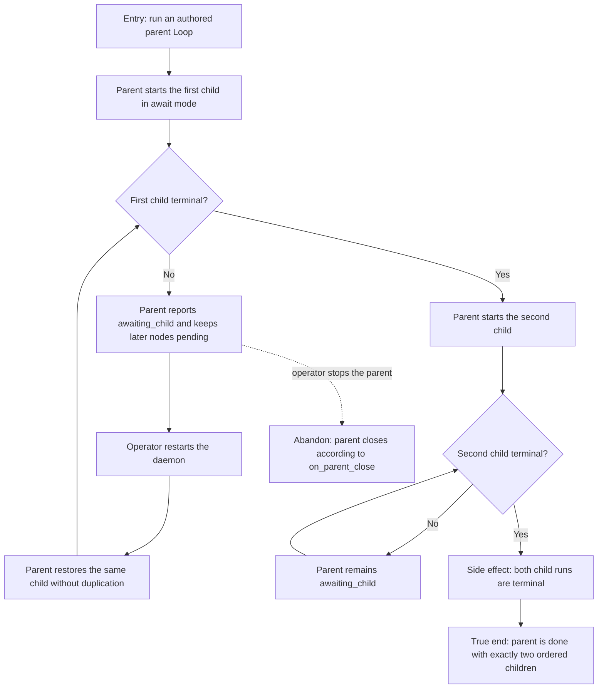

# J-await-child-loop — Run ordered child Loops to completion



```yaml
journey:
  id: J-await-child-loop
  name: "Run ordered child Loops to completion"
  value_statement: "A Loop author can compose durable child work without the parent skipping ahead or duplicating work after restart."
  personas: [Bruno, Ada]
  entry_points:
    - url: "CLI: compozy loop run --workspace <workspace-id> --name <parent>"
      origin: direct
    - url: "HTTP/UDS Loop run and run-detail routes"
      origin: direct
  actions:
    - step: 1
      verb: "Start a parent Loop with ordered run-loop nodes in await mode"
      expected_observable: "The first parent node reports awaiting_child and exactly one child run exists"
    - step: 2
      verb: "Restart the daemon while the first child is live"
      expected_observable: "The same child id remains attached, no duplicate child appears, and the second parent node stays pending"
    - step: 3
      verb: "Resume the first child"
      expected_observable: "The first parent node succeeds and the second child starts only afterward"
    - step: 4
      verb: "Resume the second child"
      expected_observable: "Both child runs and the parent reach done"
  goal:
    observable: "The parent reaches done only after both ordered child runs reach terminal success"
    side_effects: [two-child-runs-created, parent-child-identities-persisted]
  true_end_state: "Fresh CLI and HTTP/UDS reads agree that the parent is done, both child runs are terminal, and exactly two child identities were created in order."
  exit:
    natural: "The operator sees a terminal parent run whose child history matches the authored order."
  abandonment:
    - at_step: 2
      how: "The operator stops the parent while its child is live."
      resume: "The child follows the authored on_parent_close policy and the parent does not report false success."
  crosses: [loop-coordinator, durable-run-state, daemon-restart, cli-http-uds-parity]
```
