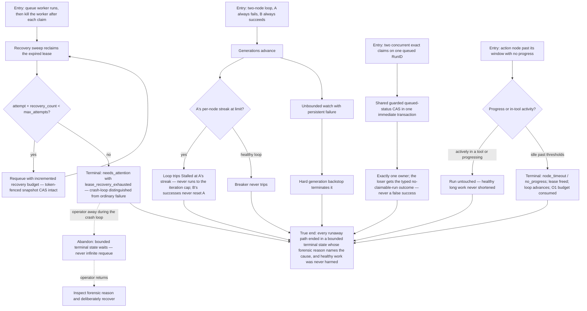

# J-bound-runaway-work — Runaway or wedged work is bounded and explained

An autonomy operator trusts the orchestration kernel to bound failure instead of looping forever:
crash-looping workers exhaust a durable attempt budget (O1), one persistently failing loop node
trips the breaker even while siblings succeed (O2), two concurrent exact claims yield exactly one
owner (O3), and a wedged-but-heartbeating action times out while healthy long work is untouched
(O4). Every terminal state carries a forensic reason. Covers US-012, US-013, US-014, US-015
(TechSpec §3.10; Safety Invariants 21–25).



```yaml
journey:
  id: J-bound-runaway-work
  name: "Runaway or wedged work is bounded and explained"
  value_statement: "Failure is bounded by budgets, breakers, and liveness — the kernel never loops forever, never double-owns a run, and never kills healthy long work."
  personas: [Ada, Bruno]
  entry_points:
    - url: "CLI: agh task next --wait -o json; agh task inspect <run-id> -o json; agh loop runs show <run-id> -o json"
      origin: direct
    - url: "HTTP/UDS: POST /api/agent/tasks/claim-next; task-run and loop-run listings"
      origin: direct
    - url: "config: task.orchestration.action_run_timeout; max_attempts"
      origin: direct
  actions:
    - step: 1
      verb: "Crash-loop a worker (claim, kill, expire) repeatedly"
      expected_observable: "Each recovery consumes the durable budget; the run terminalizes at max_attempts with lease_recovery_exhausted — distinguishable from ordinary failure"
    - step: 2
      verb: "Advance a loop with one failing and one succeeding node"
      expected_observable: "The loop trips Stalled at the failing node's per-node streak regardless of terminal order; an unbounded failing watch hits the hard backstop; a healthy loop never false-stalls"
    - step: 3
      verb: "Race two exact claims on the same queued run"
      expected_observable: "Exactly one claim succeeds; the other receives the typed no-claimable-run outcome; exact and next-work selection share one CAS"
    - step: 4
      verb: "Wedge one action and run one healthy long tool"
      expected_observable: "The wedged run terminalizes node_timeout/no_progress, frees its lease, and consumes the attempt budget; the healthy in-tool run survives its idle window"
  goal:
    observable: "Every injected failure ends in a bounded, forensically-explained terminal state"
    side_effects: [needs-attention-escalations, loop-stalled-record, terminal-reason-rows]
  true_end_state: "Fresh run listings show the terminal reasons (lease_recovery_exhausted, Stalled, node_timeout/no_progress), exactly one owner per contested run, and the healthy control run completed normally."
  exit:
    natural: "The operator recovers parked work deliberately after reading the forensic reason."
  abandonment:
    - at_step: 1
      how: "The operator is away while the worker crash-loops."
      resume: "The budget bounds the loop autonomously; the parked needs_attention row with its reason waits durably for deliberate recovery — no unbounded requeue ever ran."
  crosses: [task-runs-queue, ClaimNextRun-CAS, lease-recovery, loop-coordinator, generation-outputs, scheduler-sweep, CLI, HTTP, UDS]
```

Taxonomy note: structured kernel journey with no Web surface. Functional, failure, concurrency,
abandon/resume, and cross-surface consistency in scope; responsive/visual checks not applicable.
