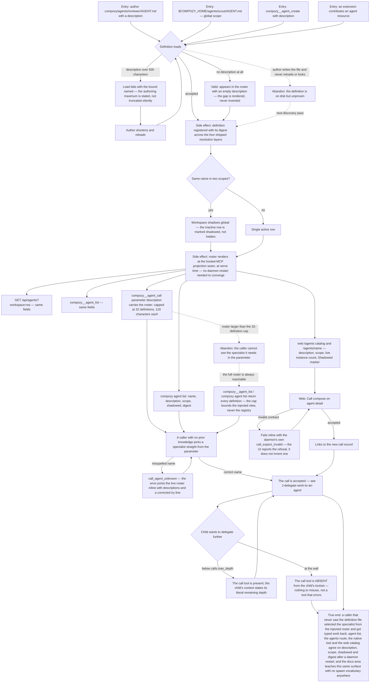

# J-build-a-subagent-roster — Describe a specialist so other agents can find and use it

Subagents ride the agent-definition registry that already exists. What is new is the
`description` field in `AGENT.md`: it is what *other agents* read when choosing a specialist. The
call surface carries the roster — name plus description — inside the tool parameter itself, so
selection costs zero extra turns, and an unknown name fails with the live roster printed in the
error rather than a bare "not found".

This journey is the author's side of delegation: write the definition, watch it appear everywhere
the roster is rendered (native tool parameter, `compozy agent list`, the HTTP agents route, the web
catalog and agent detail), and confirm the documentation teaches the same feature the runtime
actually ships. It ends when someone who has never seen the definition can pick it and get work back.

Covers ADR-007 (explicit registry-name invocation, injected roster, the `description` field, batch
fan-out) and ADR-008's visible half — at the depth wall the call tool is **absent** from the child's
toolset and the child's context states its literal remaining depth.



```yaml
journey:
  id: J-build-a-subagent-roster
  name: "Describe a specialist and make it discoverable"
  value_statement: "I describe an agent once, and every other agent can find it, understand what it is for, and delegate to it by name without a lookup turn or a guess."
  personas: [Bruno, Ada]
  entry_points:
    - url: "authoring: .compozy/agents/<name>/AGENT.md (workspace) or $COMPOZY_HOME/agents/<name>/AGENT.md (global) with the description field"
      origin: direct
    - url: "CLI: compozy agent list [-o human|json|jsonl|toon]"
      origin: direct
    - url: "HTTP/UDS: GET /api/agents?workspace={workspace_id}"
      origin: direct
    - url: "native: compozy__agent_list; compozy__agent_create; the compozy__agent_call agent parameter description (injected roster)"
      origin: direct
    - url: "web: /agents (catalog) and /agents/{name} (agent detail with the Call compose)"
      origin: in-app-nav
    - url: "docs: /docs/agent-comms (index, calls, mailbox, subagents, budgets-and-safety) and skills/compozy references"
      origin: search
  actions:
    - step: 1
      verb: "Author a workspace definition with a description, and one without"
      expected_observable: "Both load; the described one carries its text everywhere the roster renders, and the undescribed one appears with an empty description rather than an invented one; a description over the 500-character authoring maximum fails the load with the bound named"
    - step: 2
      verb: "Create a global definition with the same name as a workspace one"
      expected_observable: "The workspace definition wins and the global row is marked shadowed rather than hidden; scope and digest are visible on every surface"
    - step: 3
      verb: "Read the roster from CLI, HTTP, UDS, the native tool and the web catalog"
      expected_observable: "All five report identical name, description, scope, shadowed and digest; the injected tool-parameter view caps at 32 definitions and 120 characters per description while the full roster stays reachable through agent list"
    - step: 4
      verb: "Delegate by picking a name straight out of the injected roster, then misspell one"
      expected_observable: "The correct name is accepted with no lookup turn; the misspelling returns call_agent_unknown with the live roster and descriptions printed inline and a corrected try line"
    - step: 5
      verb: "Use the Call compose on web agent detail, first with an invalid contract"
      expected_observable: "The invalid contract fails inline with the daemon's own call_expect_invalid code; the accepted call links straight to its new call record; a zero instance count renders nothing at all rather than a decorative zero"
    - step: 6
      verb: "Delegate recursively down to the configured depth wall"
      expected_observable: "Below the wall the child's context states its literal remaining depth; at the wall the call tool is absent from the child's toolset entirely — there is no tool that exists only to refuse"
    - step: 7
      verb: "Read the shipped documentation and the official skill for this area"
      expected_observable: "The agent-comms docs area and skills/compozy references describe the roster, description field and call surface exactly as the runtime behaves, with no spawn vocabulary surviving anywhere"
  goal:
    observable: "A caller with no prior knowledge of the definition selects it from the roster and gets typed work back"
    side_effects: [definition-registered-with-digest, roster-rendered-at-serve-time, shadowed-row-marked, call-record-created-from-compose]
  true_end_state: "After a daemon restart and fresh reads: description, scope, shadowed and digest match across compozy agent list, GET /agents, compozy__agent_list, the compozy__agent_call parameter and the web catalog; a newly added description converges without a restart because rendering happens at serve time; the depth wall still removes the tool rather than refusing it; and the published docs teach the same surface."
  exit:
    natural: "The author moves on to using the specialist — or writing the next one."
  abandonment:
    - at_step: 3
      how: "The workspace has more definitions than the injected roster's 32-definition cap, so the caller cannot see the specialist it needs inside the tool parameter."
      resume: "The cap bounds the injected view, never the registry — compozy agent list and compozy__agent_list return every definition, and the caller selects by explicit name from there."
    - at_step: 1
      how: "The author writes AGENT.md and never checks whether it loaded."
      resume: "The next discovery pass picks it up; an over-limit description surfaces as a named load failure rather than a silently truncated roster entry."
  crosses: [agent-definition-registry, profile-and-workspace-resolution-layers, hosted-MCP-projection-seam, native-tools, CLI, HTTP, UDS, web-agents-app, packages/site-docs, skills/compozy]
```
