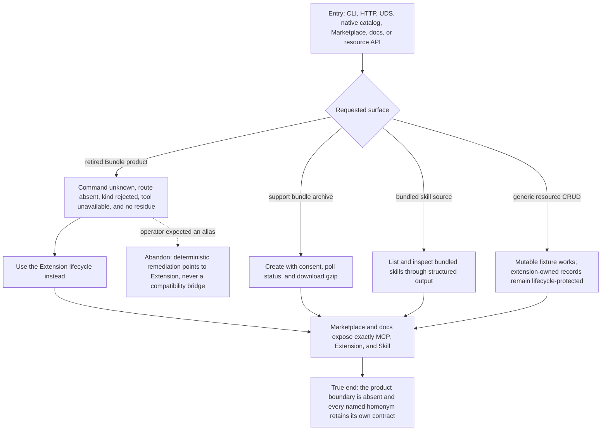

# J-bundle-product-boundary: Cross the retired Bundle boundary without collateral damage

An operator or agent probes every former Bundle entry point and receives a clean absence instead of
an alias, fallback, or partial compatibility path. During the same walk, the unrelated support
archive and bundled-skill vocabulary continue to work, proving the hard cut did not delete homonyms.



```yaml
journey:
  id: J-bundle-product-boundary
  name: Cross the retired Bundle boundary without collateral damage
  value_statement: "I see one extension-kit product model, while support archives and bundled skills keep their unrelated behavior."
  personas: [Ada, Dora]
  entry_points:
    - url: compozy bundle; /api/bundles/* over HTTP and UDS; compozy__bundles_*; marketplace kind bundle
      origin: direct
    - url: /marketplace/bundles and /docs/api/bundles or /docs/cli/bundle
      origin: direct
    - url: compozy support bundle --yes [--output <path>] and /api/support/bundles/*
      origin: direct
    - url: compozy skill list --source bundled -o json|jsonl|toon
      origin: direct
    - url: /docs/resources and /api/resources/:kind/:id
      origin: external-share
  actions:
    - step: 1
      verb: Probe every retired product entry point
      expected_observable: No Bundle command, route, kind, tool, capability, docs navigation, Web route, resource kind, or stored projection remains; no alias accepts the request
    - step: 2
      verb: Inspect the surviving Marketplace and extension surfaces
      expected_observable: Exactly MCP, Extension, and Skill remain, and Extension owns the complete kit lifecycle
    - step: 3
      verb: Exercise the support archive and bundled-skill homonyms
      expected_observable: The one CLI command completes create, poll, and download while the API stages remain independently readable; the bundled source filter returns runtime-bundled skills in every structured output mode
    - step: 4
      verb: Follow the resource guide
      expected_observable: Generic optimistic CRUD works only for a mutable registered kind, while extension-owned resources remain protected by their owning lifecycle
  goal:
    observable: The retired product is unreachable across every public plane and unrelated homonyms remain fully functional
    side_effects: [support-archive-created, support-archive-downloaded]
  true_end_state: Fresh catalogs, routes, docs, tool descriptors, and storage agree on the extension-only model; support and bundled-skill reads still succeed
  exit:
    natural: Continue through Extension or the surviving homonym surface without ambiguity
  abandonment:
    - at_step: 1
      how: A caller expected an old command alias
      resume: The deterministic error and current docs direct the caller to the Extension lifecycle; no state was written
  crosses: [cli, httpapi, udsapi, native-tools, marketplace, web, public-docs, resources, support, skills, storage]
```

## Coverage notes

- The removed product and the surviving homonyms are one boundary walk, not separate feature cases.
- Locale and mobile are deliberately skipped: these probes are contract and navigation boundaries;
  human Web presentation is covered by the adjacent Marketplace canary.
