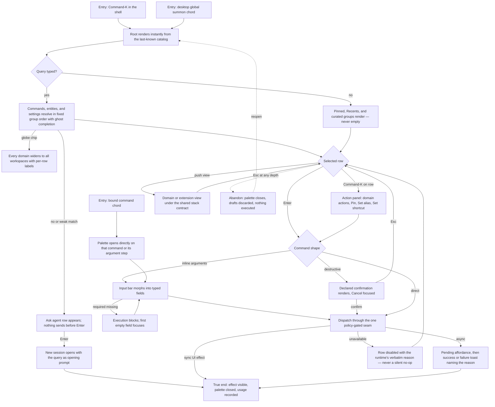

# J-command-os-from-palette — Command the whole OS from ⌘K

A keyboard-first operator reaches every action, app, live entity, and settings destination from the
command palette, executes it under honest availability and confirmation rules, and bends the
surface to their own habits — pins, aliases, shortcuts, and learned ranking — without the palette
ever lying about what is possible right now.



```yaml
journey:
  id: J-command-os-from-palette
  name: "Command the whole OS from the palette"
  value_statement: "Every OS capability is a few keystrokes away, executes honestly, and the surface learns my habits without ever inventing state."
  personas: [Bruno, Sol, Cora]
  entry_points:
    - url: "web ⌘K / ⌘⇧P (palette.open)"
      origin: in-app-nav
    - url: "desktop global summon chord (default meta+shift+Space, desktop shell only)"
      origin: direct
    - url: "bound command chord (opens the command or its argument step directly)"
      origin: direct
    - url: "menubar palette affordance; menubar Go/Window/Session/Help menus (registry projections)"
      origin: in-app-nav
  actions:
    - step: 1
      verb: "Open the palette and read the rest state"
      expected_observable: "Root renders instantly from the last-known catalog: Pinned, Recents, then curated groups; first run shows curated defaults, never an empty pane"
    - step: 2
      verb: "Type a few characters for a command, entity, or setting"
      expected_observable: "Typo-tolerant matches render in fixed group order with a ghost completion tail; entity sections fill asynchronously without stealing selection; the globe widens every domain together with workspace labels"
    - step: 3
      verb: "Push a domain or extension view and navigate the stack"
      expected_observable: "Per-level search, breadcrumb ≤ 3, ⌫-pops-on-empty, Esc-closes-all hold for List, Detail, Form, and Grid alike; live refresh never steals selection"
    - step: 4
      verb: "Execute — directly, with inline arguments, or through a declared confirmation"
      expected_observable: "Required arguments block with the first empty field focused; destructive commands render their declared confirmation with Cancel focused; feedback reports real success or failure by name"
    - step: 5
      verb: "Make it mine from the action panel"
      expected_observable: "Pin/Unpin, Set alias…, and Set shortcut… apply live; the new chord, alias, and pin appear on palette rows, menubar, cheatsheet, and settings without reload"
    - step: 6
      verb: "Type a query nothing matches"
      expected_observable: "A visually distinct 'Ask agent' row appears; nothing is transmitted before Enter; Enter opens a new session with the query as the opening prompt"
  goal:
    observable: "The selected capability executed (or honestly refused with the runtime's reason) and the palette closed with the effect visible"
    side_effects: [usage-recorded, personalization-updated, session-created-on-fallback]
  true_end_state: "Reopening the palette shows the executed command in Recents, the personalization ranks it higher for the same query, and every surface (row, menubar, cheatsheet, settings) shows identical id, label, and chord."
  exit:
    natural: "The operator continues in the window, app route, or new session the command landed on."
  abandonment:
    - at_step: 4
      how: "Esc during argument entry or on the confirmation step"
      resume: "Palette closes with drafts discarded and nothing executed; reopening starts at root with no half-entered state"
    - at_step: 2
      how: "Daemon connection drops while the palette is open"
      resume: "Rows degrade to disabled-with-reason ('runtime unavailable'); availability-exempt commands keep working; recovery re-enables rows without reopening"
  crosses: [cmdpalette-registry, windowmanager, tools-policy, extensions, personalization-store, desktop-shell, settings, SSE, sessions-landing]
```

## Coverage notes

- Derived scenarios: `ET-palette-registry-driven-root`, `ET-palette-action-panel`,
  `ET-palette-inline-args-confirmation`, `ET-palette-agent-fallback`, `ET-palette-domain-views`,
  `ET-palette-personalization-lifecycle`, `ET-desktop-global-summon`; the shared stack semantics
  stay owned by `ET-palette-nested-views` (J-operate-desktop-shell) and the Sessions exemplar by
  `ET-palette-sessions-view-switch`.
- The agent-side mirror of this journey is `J-operate-command-palette` (structured surfaces, no UI).
- Taxonomy sweep (this cycle): journeys + functional ride the derived scenarios; experiential =
  keyboard/a11y combobox contract (CH-palette-domain-views-grammar, persona Sol); edge/error/empty =
  daemon-loss, weak-match, empty-filter states inside the scenarios; cross-cutting regression =
  CH-palette-sessions-landing-canary (BR-20). Responsiveness (mobile viewports) deliberately
  skipped: the palette is a desktop-shell surface (personas.md records the mobile-lens policy).
