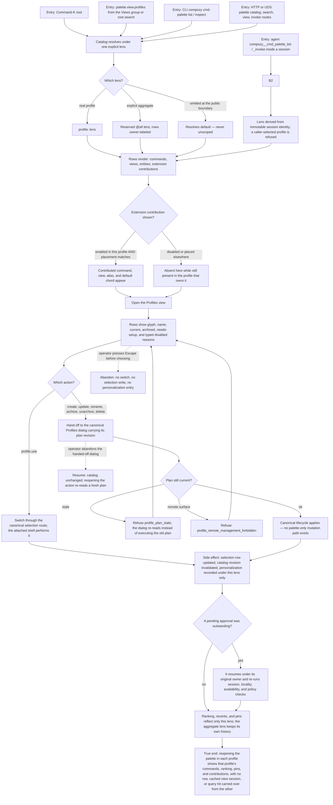

# J-command-profiles-from-palette — Reach and switch profiles from the launcher without a second lifecycle

An operator opens the command palette, finds the Profiles view, switches context, and starts a
lifecycle action that hands off to the canonical dialog rather than mutating through a palette-only
path. Everything the palette shows — catalog, search results, domain views, ranking, pins,
extension contributions, pending approvals — carries one explicit profile lens, and nothing from
another lens ever appears.



```yaml
journey:
  id: J-command-profiles-from-palette
  name: "Reach and switch profiles from the launcher without a second lifecycle"
  value_statement: "The launcher can switch and manage my contexts as fast as anything else, while every result it shows belongs to the context I am actually in."
  personas: [Bruno, Ada, Sol]
  entry_points:
    - url: "Command-K root, Views group, and root search results"
      origin: in-app-nav
    - url: "palette.view.profiles and the profile.use|create|update|rename|archive|unarchive|delete actions"
      origin: in-app-nav
    - url: "CLI: compozy cmd-palette list|inspect|bind|alias|pin|personalization"
      origin: direct
    - url: "HTTP and UDS: palette catalog, search, views, view-sessions, invoke, and SSE routes"
      origin: direct
    - url: "Native: compozy__cmd_palette_list and compozy__cmd_palette_invoke inside a session"
      origin: agent
  actions:
    - step: 1
      verb: "Open the palette and read the catalog"
      expected_observable: "Rows resolve under one real profile or the explicit aggregate lens; omitting the lens at a public boundary resolves default rather than returning everything."
    - step: 2
      verb: "Open the Profiles view"
      expected_observable: "Rows show glyph, name, and state — current, archived, needs-setup — and an unavailable profile is visibly disabled with the runtime's own reason."
    - step: 3
      verb: "Switch profile from the palette"
      expected_observable: "The switch goes through the canonical selection route, the attached shell performs it, and listings re-fence without a reload."
    - step: 4
      verb: "Start a lifecycle action from the palette"
      expected_observable: "The canonical Profiles dialog opens and executes through its plan revision; a stale plan is refused and re-read, and a remote surface is refused outright."
    - step: 5
      verb: "Use the palette in two profiles in turn"
      expected_observable: "Ranking, recents, pins, query hits, and cached view sessions are partitioned per lens; the aggregate lens keeps its own history and cannot read or mutate a real profile's."
    - step: 6
      verb: "Enable an extension in one profile only"
      expected_observable: "Its commands, views, aliases, and default chords appear in that profile and are absent in the other, and the catalog revision invalidates when enablement changes."
    - step: 7
      verb: "Leave a tool approval pending, switch profile, then resolve it"
      expected_observable: "The approval resumes under the profile that created it, not the current one, and re-runs the session, locality, availability, and policy checks."
  goal:
    observable: "Every palette seam — catalog, search, providers, views, view sessions, invoke, events, caches, personalization — carries one real profile or the labeled aggregate, and lifecycle runs only through the canonical path."
    side_effects: [selection-row-updated, catalog-revision-invalidated, personalization-recorded-under-one-lens, view-session-created-per-client, approval-owner-preserved]
  true_end_state: "Reopening the palette in each profile shows that profile's commands, ranking, pins, and extension contributions, and nothing — row, cached view session, query hit, or pending approval — carried over from the other lens."
  exit:
    natural: "The operator lands on the command or profile they wanted, in the context they meant."
  abandonment:
    - at_step: 2
      how: "The operator presses Escape in the Profiles view before choosing anything."
      resume: "No switch, no selection write, and no personalization entry; the next open starts from the daemon catalog."
    - at_step: 4
      how: "The operator abandons the handed-off lifecycle dialog."
      resume: "The catalog is unchanged and reopening the action re-reads a fresh plan rather than reusing the abandoned revision."
    - at_step: 7
      how: "The operator closes the client while an approval is pending."
      resume: "The approval keeps its original owner and its guards re-run when it is resolved from any surface."
  crosses: [J-operate-profiles, J-scope-work-by-profile, J-adopt-extension-profiles, J-command-os-from-palette, J-operate-command-palette, cmdpalette-service, palette-personalization, tool-approvals, extension-projection, Web palette caches, CLI, HTTP, UDS, native-tools]
```
