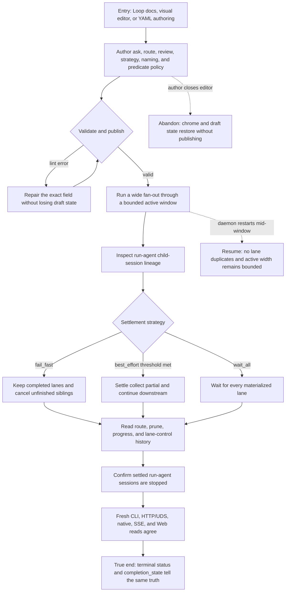

# J-complete-partial-loop — Author and complete a routed partial Loop



```yaml
journey:
  id: J-complete-partial-loop
  name: "Author and complete a routed partial Loop"
  value_statement: "A Loop author can express routing and partial fan-out policy, run it at wide width, and trust every surface to distinguish partial success from complete success."
  personas: [Bruno]
  entry_points:
    - url: "web /loops/:name/editor and /loop-runs/:runId"
      origin: in-app-nav
    - url: "CLI: compozy loop validate|create|run|status|runs and node verbs"
      origin: direct
    - url: "HTTP/UDS Loop definition, run, node-control, and event routes"
      origin: direct
    - url: "native tools in compozy__loops"
      origin: direct
  actions:
    - step: 1
      verb: "Author and validate the graph grammar"
      expected_observable: "Ask, route, review, strategy, bind_as/index_as, progress, stop_when object, and on_eval_error round-trip with deterministic lint."
    - step: 2
      verb: "Run a wide fan-out and interrupt it mid-window"
      expected_observable: "At most the declared width is active, restart does not duplicate a lane, and per-lane controls affect only the addressed item."
    - step: 3
      verb: "Let fail_fast or best_effort settle the collect"
      expected_observable: "Completed work is preserved, unfinished work is canceled by cause, oversized action results fail without leaking their lease, progress is truthful, run-agent child sessions stop at terminal settlement, and partial coverage remains first-class."
    - step: 4
      verb: "Refresh and compare terminal projections"
      expected_observable: "Run status, completion_state, collect counts, route causes, and bounded history agree across all public surfaces."
  goal:
    observable: "The graph reaches its declared terminal path with exact partiality, route, and lane provenance."
    side_effects: [route-decision, bounded-window-materialization, strategy-cancellation, completion-state-event]
  true_end_state: "After refresh, the editor still round-trips the definition and every run surface reports the same complete or partial outcome with no duplicate lane."
  exit:
    natural: "Author lands on a terminal run whose story and Inspect data explain how the graph settled."
  abandonment:
    - at_step: 1
      how: "The author closes the editor with an unpublished draft."
      resume: "Editor chrome and draft state restore; the published definition is unchanged."
    - at_step: 2
      how: "The daemon restarts while only part of the fan-out window is materialized."
      resume: "Recovery advances the same window without exceeding width or executing a lane twice."
  crosses: [DSL-and-linter, editor-codec, coordinator-routing, fanout-window, config-lifecycle, CLI, HTTP, UDS, native-tools, SSE, web-run-story]
```
