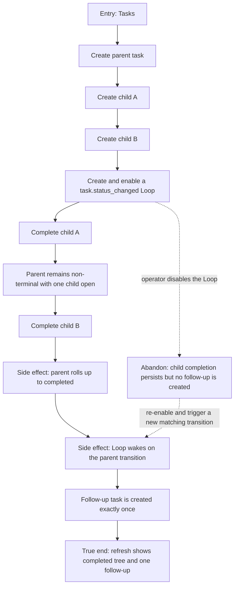

# J-complete-task-tree — Complete a task tree and fire its follow-up Loop

An operator creates one parent task with two child tasks, arms a Loop for the
tree's terminal transition, and completes the children. The parent rolls up
deterministically and the Loop creates the follow-up task exactly once.



```yaml
journey:
  id: J-complete-task-tree
  name: "Complete a task tree and fire its follow-up Loop"
  value_statement: "I can finish delegated child work and trust the parent plus its automation to settle without manual cleanup."
  personas: [Bruno, Ada]
  entry_points:
    - url: "web /tasks"
      origin: in-app-nav
  actions:
    - step: 1
      verb: "Create a parent and two children"
      expected_observable: "The tree renders the exact hierarchy after refresh"
    - step: 2
      verb: "Create and enable a Loop watching parent task status changes"
      expected_observable: "The Loop names its event/filter and reports an enabled watching state"
    - step: 3
      verb: "Complete the first child"
      expected_observable: "The first child completes while the parent remains non-terminal"
    - step: 4
      verb: "Complete the final child"
      expected_observable: "The parent rolls up to completed and emits one agent-visible status transition"
    - step: 5
      verb: "Observe the follow-up"
      expected_observable: "The watching Loop wakes and creates one follow-up task; refresh does not duplicate it"
  goal:
    observable: "Parent, children, Loop run, and follow-up task agree after a fresh read"
    side_effects: [parent-task-completed, task-status-event-emitted, loop-woken, follow-up-task-created]
  true_end_state: "A refreshed task tree is fully completed and exactly one follow-up task links to the triggering Loop run."
  exit:
    natural: "The operator continues with the automatically created follow-up."
  abandonment:
    - at_step: 2
      how: "The operator disables the Loop before completing the children."
      resume: "The task tree still rolls up; no follow-up appears until a later matching transition occurs while enabled."
  crosses: [tasks, task-tree, task-status-events, loops, triggers, loop-runs, workspace-isolation]
```
