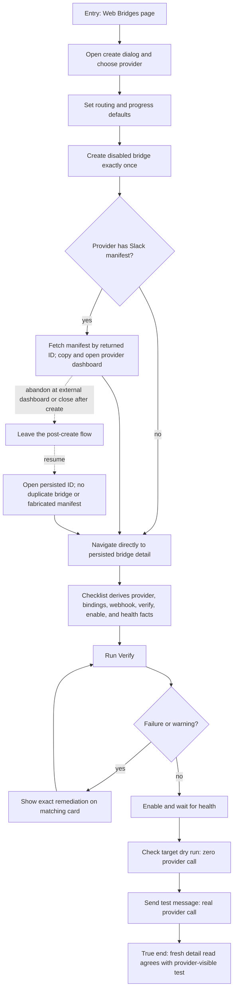

# J-complete-web-bridge-setup — Complete bridge setup in the Web

A browser-first operator creates a disabled bridge, completes the provider handoff, follows a
daemon-derived checklist, repairs verification, distinguishes dry-run target resolution from a real
send, and finishes on a freshly read healthy detail surface.



```yaml
journey:
id: J-complete-web-bridge-setup
  name: "Complete bridge setup in the Web"
  value_statement: "I can finish provider setup from one truthful Web orchestration path without losing the created bridge or mistaking a dry run for a real send."
  personas: [Tessa]
  entry_points:
    - url: "web /bridges create dialog"
      origin: in-app-nav
    - url: "web /bridges/:id detail"
      origin: direct
  actions:
    - step: 1
      verb: "Create a disabled bridge and complete any post-create manifest handoff"
      expected_observable: "Exactly one bridge is persisted; only Slack fetches a manifest and only by the returned ID"
    - step: 2
      verb: "Follow the setup checklist"
      expected_observable: "Every item corresponds to provider discovery, bindings, config, current verify/register evidence, lifecycle, or health"
    - step: 3
      verb: "Fail verification, repair the named input, and verify again"
      expected_observable: "Remediation stays attached to the correct secret card and stale evidence clears after config or binding changes"
    - step: 4
      verb: "Run a target dry run and a real send-test"
      expected_observable: "Labels, pending state, endpoints, and results make the no-send/send distinction unmistakable"
    - step: 5
      verb: "Refresh the detail route"
      expected_observable: "Persisted daemon facts remain; transient evidence is never fabricated as durable truth"
  goal:
    observable: "The refreshed detail checklist agrees with the daemon and one real provider test message is visible at the selected target."
    side_effects: [bridge-created-disabled, manifest-fetched-conditionally, bindings-updated, bridge-enabled, provider-test-message-sent]
  true_end_state: "After refresh, the Web and structured bridge read agree on lifecycle/config/health, and the provider displays the real send-test result."
  exit:
    natural: "The operator leaves the configured bridge detail page."
  abandonment:
    - at_step: 1
      how: "The operator closes the flow after bridge creation while working in an external provider dashboard."
      resume: "Returning to the persisted bridge ID resumes from daemon-derived checklist state without creating a second instance."
  crosses: [web-create, manifest-api, setup-projection, secret-bindings, verify-api, lifecycle, dry-run, send-test, provider-dashboard]
```

Automated backbone: `_tests.md` E2E Web 7.1–7.3 and Web unit 8.1–8.5. Task 10 adds real
browser evidence and an independent structured read-back.
